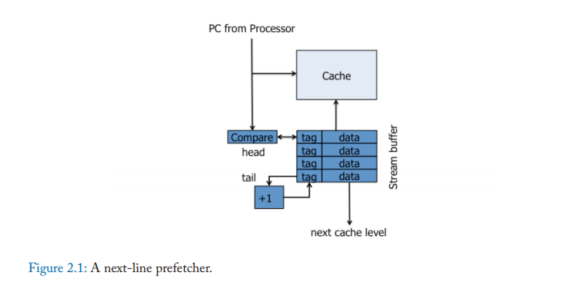
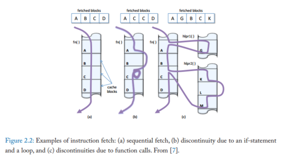
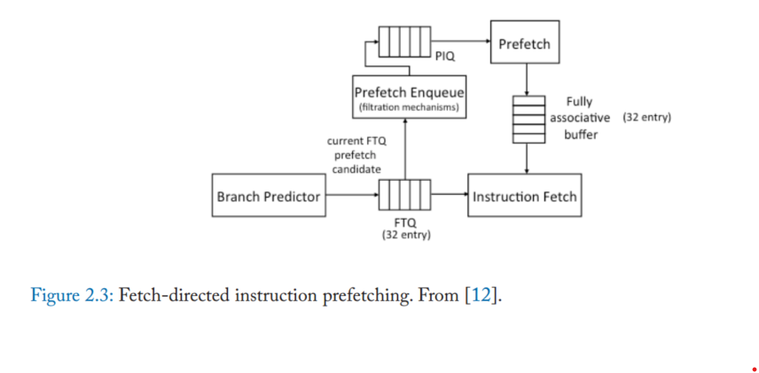
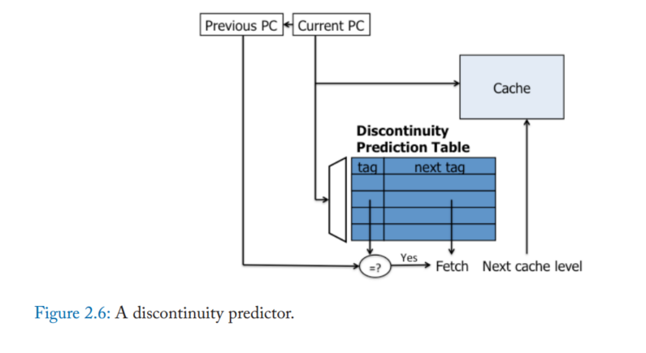
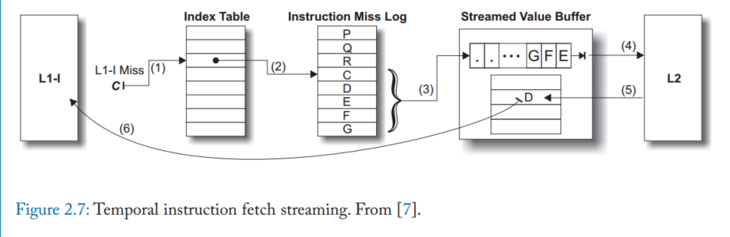
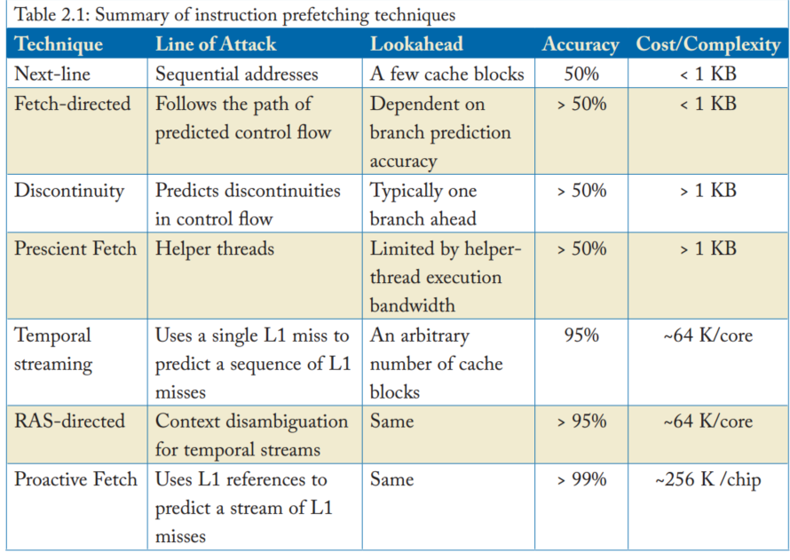
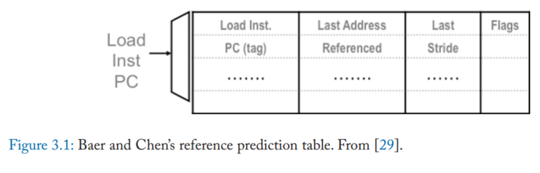
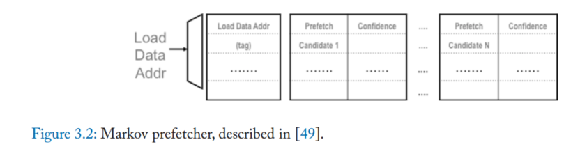
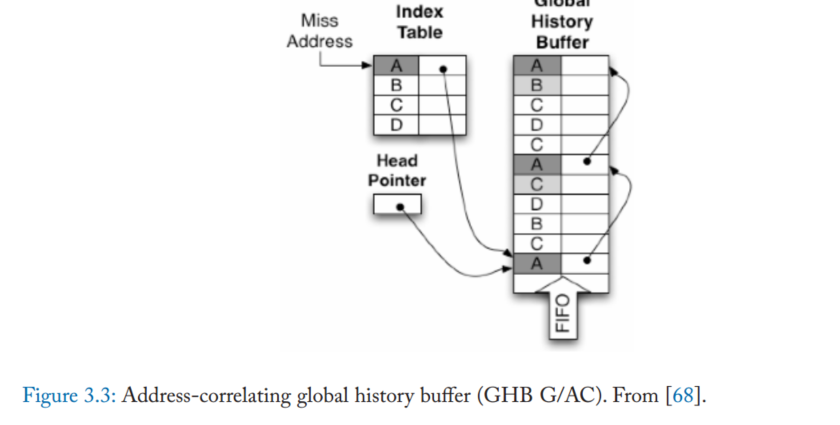
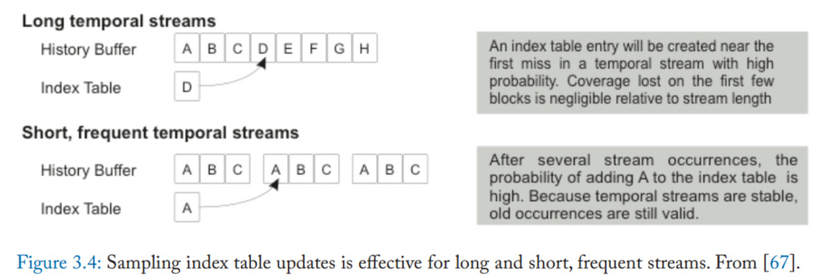

# 介绍

预取要干的事情：

1. 预测地址
2. 预测何时预取
3. 选择数据放在何处

覆盖率衡量预取成功的显式处理器请求的比例（即，预取消除的需求缺失的比例）。准确性衡量的是预取器发出的访问中有用的部分（即，正确预取占所有预取的比例）

目前大部分处理器将预取数据放入缓存或者额外的缓冲区，这种策略称为非绑定策略

# **指令预取**

## NEXT-LINE PREFETCHING

利用了空间局部性，每次处理器请求预取，他就从下级存储的数据转到缓存，然后预取下一个块

## FETCH-DIRECTED PREFETCHING

分支预测定向与曲奇重用分支预测器探索未来控制流，这些技术使用分支预测器进行递归预测，找到地址

**Fetch-directed instruction prefetching (FDIP)**：这个技术是最好的一批，FDIP将BP和IF解耦，通过fetch target queue (FTQ)，预取器使用FTQ从L2获取指令块，将他们放在全相连的缓存区，该缓冲区由指令获取单元与L1	缓存并行访问，为了避免其与L1重复，可以使用空闲的L1端口探测FTQ地址，看看是否存在，如果存在，就不进行预取，

## DISCONTINUITY PREFETCHING

主要针对函数调用，获取分支和陷阱中断等进行预取

观察到服务器程序具有重复函数的深度调用堆栈后，图预取预测即将到来的函数堆栈，而不仅仅只是下一个不连续行为

而上图这个就是相当于只预测下一个不连续

## PRESCIENT FETCH

## TEMPORAL INSTRUCTION FETCH STREAMING

Temporal instruction fetch streaming (TIFS)：记录Cache缺失顺序，然后进行预取

只是适用于单个控制流

## RETURN-ADDRESS STACK-DIRECTED INSTRUCTION PREFETCHING

返回地址堆栈定向指令预取（RDIP）[26]使用额外的程序上下文信息来提高预测准确性和前瞻性。RDIP基于两个观察：(1)在调用堆栈中捕获的程序上下文与L1指令缺失密切相关；(2)返回地址堆栈（RAS）已经存在于所有高性能处理器中，它简洁地总结了程序上下文。RDIP将预取操作与由RAS内容形成的签名相关联。它将签名和相关的预取地址存储在约64kb的签名表中，在每次调用和返回操作时都要查看签名表以触发预取。RDIP实现了理想L1缓存70%的潜在加速，在一组服务器工作负载上比无预取器基准高出11.5%。

## PROACTIVE INSTRUCTION FETCH

主动指令获取[27]将TIFS设计修改为(1)记录提交指令序列访问的缓存块序列（而不是缓存中丢失的指令获取）和(2)分别记录在中断/trap处理程序上下文中执行的流。该设计的一个关键创新是指令序列的压缩表示，它使用位向量来有效地编码预取地址之间的空间局域性。后续工作[28]将预取元数据集中在跨核共享的结构中，这大大降低了在多核共享元数据的同构设计中的存储成本。集中化将每核元数据减少到最小容量，使预取器甚至适用于具有小核的多核设计（例如，在移动/嵌入式平台中使用的核）。

# 数据预取

数据访问模式多样，访问模式复杂，

分为四类

## STRIDE AND STREAM PREFETCHERS FOR DATA

这种预取器主要针对连续布局的数据，如数组和矩阵，但对于基于指针的数据结构不太行

stride 预取器关键的挑战就是区分多个交错的跨行序列，比如矩阵向量积，下图是每次load跟踪步幅，每个表保存load的最后一个地址，其实就是最新的addr，然后stride就是和之前的相减，每当连续两次观察到相同的stride，使用最一次的地址和stride计算预取地址

然后第二个问题就是检查到strided stream要预取多少块，这个参数被称为预取深度

## ADDRESS-CORRELATING PREFETCHERS

上一种遇到链表类似的结构就寄了，这类是针对这种情况的，基于算法倾向于以相同的方式重复遍历数据结构，从而导致反复出现的缓存缺失序列，这个利用了temporal correlation.：即最近访问的地址很可能在不久的将来再次被访问

### JUMP POINTERS

关联预取器是专门针对指针跟踪访问模式的硬件和软件机制的泛化。这些早期的机制依赖于跳转指针的概念，该指针在数据结构遍历中允许大的前向跳转。例如，链表中的一个节点可以用在链表中向前10个节点的指针进行扩充；预取器可以跟随跳转指针以获得对正在执行的主遍历的前瞻性。

依赖于跳转指针的预取器通常需要软件或编译器支持来注释指针。，内容导向预取器[47,48]避免注释，而是尝试解引用和预取任何看起来形成有效虚拟地址的负载值。虽然跳转指针机制对于特定的数据结构遍历（例如，链表遍历）非常有效，但它们的主要缺点是必须仔细平衡跳转指针推进遍历的距离，以便在不跳过太多元素的情况下提供足够的前瞻性。跳转指针的距离很难调优，而且指针本身的存储成本也很高

### PAIR-WISE CORRELATION

本质上，基于关联的硬件预取器是一个查找表，它将一个地址映射到另一个可能在访问序列中紧随其后的地址。虽然这种关联可以捕获顺序关系和跨步关系，但它更通用，例如，捕获指针的地址和它所指向的地址之间的关系。

然而，地址相关的预取器依赖于重复；它们无法预取以前从未引用过的地址（与跨步预取器相反）。此外，地址相关预取器需要巨大的状态，因为它们需要存储每个地址的后继地址。

### MARKOV PREFETCHER

马尔可夫预取器存储了几个先前观察到的后继者，当观察到触发器地址丢失时，所有这些后继者都被预取。通过预取几个可能的后继地址，马尔可夫预取器牺牲精度（正确预取占所有预取的比例）来提高覆盖范围

表中的条目包含要预取的后继地址集和可选的置信度或替换策略信息

马尔可夫预取器的设计灵感来自于对片外访问序列的马尔可夫模型的概念化。模型中的每个状态对应于一个触发地址，可能的后继状态对应于随后的错过地址。一阶马尔可夫模型中的转移概率对应于每个后继者失败的可能性。查找表的目标是存储最常遇到的触发器具有最高转移概率的后继者。然而，现有的硬件建议没有明确计算触发或转移概率；每个触发地址和后继地址都使用最近最少使用（LRU）替换启发式地进行管理。

有两个因素限制了马尔可夫预取器的有效性：(1)预读和内存级并行性是有限的，因为预取器只尝试预测下一次错过；(2)覆盖范围受到片上相关表容量的限制。

### IMPROVING LOOKAHEAD VIA PREFETCH DEPTH

一种直接的方法就是获取更多地址，还有就是使用预测地址递归执行表查找来发出更深的预取，

与其连续找不如折叠预取表，每个预取触发器旁边存短序列的后续程序，然而，更深层次的问题是，这样的表组织必须为每个表项中提供的存储固定最大预取深度。

Chou和合著者观察到，在乱序核中，指令窗口经常导致几个片外失误并发[56]。当这组miss被处理时，执行会停止。一旦这些错误返回，指令窗口就可以前进，并且可以计算相关的地址，从而允许并行地发出下一组错误。它们将这些组中发出的失败次数的平均值称为应用程序的内存级并行性。

## IMPROVING LOOKAHEAD VIA DEAD BLOCK PREDICTION

第二个方法就是为每个预取操作选较早的触发时间，

死块预测[51,54,60,61,62]是基于一个关键的观察，即缓存块大部分时间都在缓存死区中[63,64,65]，也就是说，它们仍然处于缓存中，但在失效或移除之前不会被再次访问。

死缓存块占用存储空间，但不会提供进一步的缓存命中。DBCP试图预测对缓存块最后一次访问，也就是检测死块，

他依赖两个预测，首先就是必须预测缓存块何时失效，这个事件可以通过code correlation [51, 54, 62], or time keeping发现，代码相关预测就是识别缓存快被移除之前访问缓存的最后一条指令，也就是，在该快变为死块之前访问，代码相关性依赖于每次缓存快进入缓存，他们往往会被相同的load和store序列访问，从分配块的初始丢失，到访问序列，最后到块失效时的最后一次访问。

其优点就是可以从缓存块学习到的访存序列可以应用于预测其他地址的死亡事件

另外，计时机制试图预测缓存块死亡的时间，而不是指示其死亡的特定访问[61]。这种方法的观察结果是，块的生命周期（以时钟周期衡量）在每次进入缓存时趋于相似。在这样的设计中，马尔可夫预取表增加了一个额外的字段，表明块最后一次进入缓存时的生存期。然后，在某个合适的安全范围（例如，比先前的寿命长一倍）之后，该块被预测为死块。

一旦预测到死亡事件，就必须预测一个合适的预取候选项来代替它。早期的死块预取器使用类似马尔可夫的预测表来达到这个目的[51,61]。后来的提案[54]依赖于更复杂的时间流预测器

## ADDRESSING ON-CHIP STORAGE LIMITATIONS

马尔可夫预取器限制其有效性的第二个关键方面是相关表的有限片上存储容量

提高马尔可夫预取器有效性的一种方法是提高片上相关表的存储效率，标签相关预取器[66]在相关表项中只存储标签而不是完整的缓存块地址。大型程序不太行

第二种方法是将相关表重新定位到主存，消除片上相关表的容量限制，然而，将相关表移出芯片会增加预取元数据的访问延迟，从几个时钟周期增加到芯片外内存引用的延迟

为了提高效率，片外关联表必须提供足够的前瞻性，以隐藏较长的元数据访问延迟一种方法是设计预取器来记录将来并行组（epoch）中内存引用的地址，如EBCP[57]。第二种方法是增加预取深度[52]；即使第一个要预取的地址块不及时，后面的地址也会预取成功。增加预取深度的一种概括是时间流[42]，它通过针对任意长度的流（即实际上无限的预取深度）来分摊片外元数据引用[67]。

## GLOBAL HISTORY BUFFER

Nesbit和Smith在他们的全局历史缓冲区[68]中引入了一个关键的进步，就是将关联表分成两个结构：一个历史缓冲区，它按照发生的顺序在循环缓冲区中记录缺失的序列，一个索引表，它提供从地址（或其他预取触发器）到历史缓冲区中的位置的映射。历史缓冲区允许单个预取触发器指向任意长度的流。图3.3（来自[68]）说明了全局历史缓冲区的组织。

当miss发生时，GHB引用索引表，查看是否有任何信息与miss地址相关联。如果找到一个条目，检查历史缓冲区条目，看它是否仍然包含丢失的地址（条目可能已经被覆盖）。如果是，历史缓冲区中的下几个条目包含预测的流（也就是A,C,B,D,C）。历史缓冲区条目也可以用指向其他历史缓冲区位置的链接指针来增强，以使历史遍历能够根据多个顺序进行（例如，每个链接指针可以指示先前发生的相同的丢失地址，从而增加预取宽度和深度）。

通过改变存储在索引表中的键和历史缓冲区条目之间的链接指针，GHB设计可以利用将触发事件与预测的预取流关联起来的各种属性。Nesbit和Smith引入了GHB X/Y形式的GHB变体分类法，其中X表示流如何本地化（即链接指针如何连接应该连续预取的历史缓冲区条目），Y表示相关方法（即查找过程如何定位候选流）[68,69]。本地化可以是全局(G)或单个PC （PC）

在全局本地化下，连续记录的历史缓冲区条目形成一个流。与每个历史表项相关联的指针要么指向先前出现的相同的miss地址（如上面讨论的那样，方便更高的预取宽度），要么是未使用的。在每台PC本地化下，索引表和链接指针都基于触发访问的PC连接历史缓冲区条目；一个流是通过遵循连接由同一触发PC发出的连续未命中的链接指针形成的。相关方法可以是地址相关（AC）或增量相关（DC）

GHB组织下的一个挑战是确定流何时结束，也就是说，预取器何时不应再获取历史缓冲区中指示的额外地址。

## STREAM CHAINING

流可以通过辅助查找机制将单独存储的流链接在一起来扩展，该机制可以预测从一个流到下一个流的关系[58,59]。流链接将不同pc形成的流链接在一起，以创建更长的预取序列[59]。流链依赖于连续pc本地化流之间存在时间相关性的洞察力；也就是说，相同的两个流倾向于连续地重复出现。更一般地说，可以想象流之间的有向图，指示哪个后续流最有可能跟随每个前一个流。流链使用下一个流指针扩展每个索引表项，该指针指示在此流之后使用的索引表项，以及一个置信度计数器。通过将单个pc本地化的流链接在一起，流链可以从单个触发器访问中获得更正确的预取。

## TEMPORAL MEMORY STREAMING

临时内存流[42]采用GHB存储组织，但将索引表和历史缓冲区都放在芯片外的主存中，允许它记录和重播任意长度的流，即使对于大型工作集的工作负载也是如此。

然而，Wenisch和合著者表明，索引表更新带宽可以通过采样索引表更新来管理，只执行历史表写入的随机子集[67,70]。他们的研究表明，占覆盖范围大部分的流要么很长，要么频繁重复。对于长数据流，索引表项很有可能在数据流开始的几次访问中被记录下来，相对于数据流的长数据流主体，牺牲了可以忽略不计的覆盖范围。对于频繁的流，即使在第一次遍历流时可能没有记录索引表项，但随着流的重复出现，记录所需项的概率迅速接近1。图3.4（来自[67]）说明了为什么抽样是有效的。

## IRREGULAR STREAM BUFFER

虽然采样可以减少维护片外流元数据的开销，但查找延迟仍然很高，限制了短流的预取前瞻性。此外，片外存储排除了类似ghb的地址相关流的pc定位；在片外历史缓冲区中跟踪条目之间的链接指针太慢了

ISB引入了一个新的地址空间概念，即结构地址空间，它只对预取器可见。

两个片上表维护物理地址和结构地址之间的双向映射。

这些映射与TLB中的填充和替换一起从片上表转移到片外备份存储，确保片上结构包含处理器当前可以访问的地址集的元数据。

# SPATIALLY CORRELATED PREFETCHING

利用了数据布局的规律性和重复性，虽然时间相关性依赖于重复出现的缺失序列，而不考虑特定的缺失地址，但空间相关性依赖于在时间上彼此相邻的内存访问的相对偏移量的模式。

空间相关性是由于数据结构布局的规律性而产生的，因为程序经常在内存中使用具有固定布局的数据结构（例如，面向对象编程语言中的对象，具有固定大小字段的数据库记录，堆栈帧）。许多高级编程语言将数据结构与缓存行和页面边界对齐，进一步提高了布局的规律性。

空间相关性的优势之一是相同的布局模式经常在内存中的许多对象中重复出现。因此，一旦学习了空间相关模式，就可以用来预取许多对象，从而使利用空间相关的预取器具有很高的存储效率（即，可以经常重用紧凑的模式来预取许多地址）。此外，与地址相关性（依赖于对特定地址的重复丢失）相反，空间模式可以应用于以前从未被引用过的地址，因此可以消除冷缓存丢失。

触发事件必须(1)提供一个键来查找描述要预取的相对位置的相关布局模式，(2)提供计算这些相对地址的基础地址。

直接读SMS那篇文章

# EXECUTION-BASED PREFETCHING

我们简要介绍的最后一类数据预取器既不依赖于缺失序列中的重复，也不依赖于数据布局；相反，基于执行的预取器寻求在指令执行和退出之前探索程序的指令序列，以发现地址计算和解引用指针。这种预取器的主要目标是比指令执行本身运行得更快，在处理器内核之前运行，同时仍然使用实际的地址计算算法来识别预取候选者。因此，这些机制根本不依赖于重复。相反，它们依赖的机制要么是总结地址计算而忽略计算的其他方面，要么是直接猜测值，要么是利用暂停周期和空闲处理器资源在指令退役之前进行探索。

主要就是提前执行然后猜

建议看runahead
