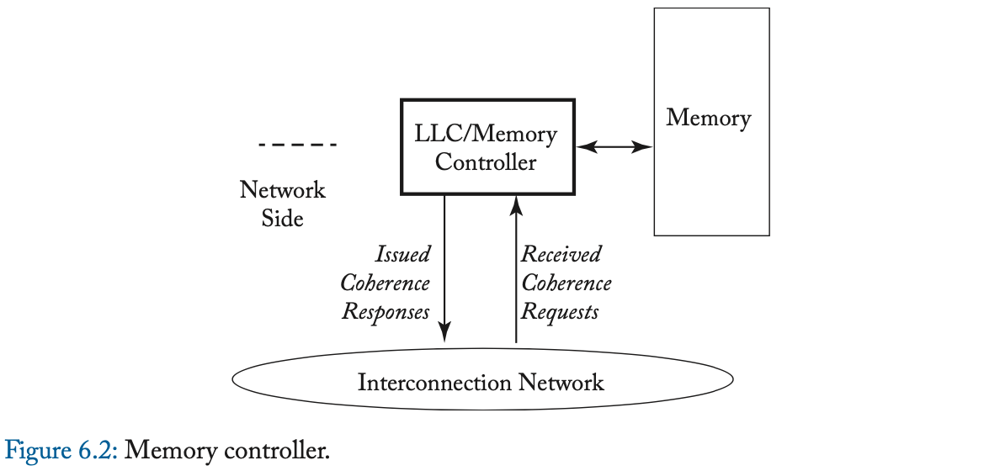
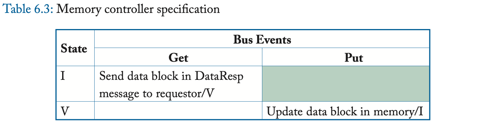
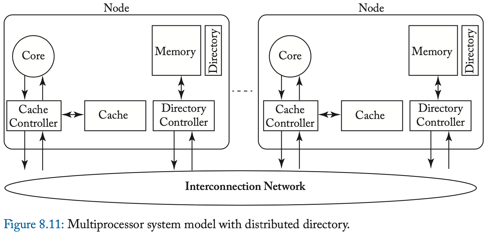

# 1.介绍

> The goal of this chapter is to explain enough about coherence to understand how consistency models interact with coherent caches, but not to explore specific coherence protocols or implementations, which are topics we defer until the second portion of this primer in Chapters 6–9.

## MEMORY CONSISTENCY

内存一致性根据load和sw定义了正确的共享内存行为,并不涉及缓存一致性

假设一门课最初在152教室,开学前一天,教务处把他变为252,干这个事情的人收到消息,准备向学生发布信息,检查更新的时间表,比如网站管理员太忙了,没立即发布新教室，一个同学收到短信立即去检查教师，这时候仍然是152，尽管网上的时间表最终被更新到252号房间，注册员也按照正确的顺序写了“写”，但这位勤奋的学生却按照不同的顺序观察，因此走错了房间。内存一致性模型就是定义这种行为是否正确

> we need to define shared memory correctness—that is, which shared memory behaviors are allowed—so that programmers know what to expect and implementors know the limits to
> what they can provide

共享内存正确性由内存一致性模型指定，或者更简单地说，由内存模型指定。内存模型指定使用共享内存执行的多线程程序所允许的行为。对于使用特定输入数据执行的多线程程序，内存模型指定动态加载可能返回的值以及内存可能的最终状态。与单线程执行不同，通常允许多个正确的行为，这使得理解内存一致性模型变得微妙。

第3章介绍了内存一致性模型的概念，并介绍了最强大、最直观的一致性模型——顺序一致性（SC）。本章首先阐述了指定共享内存行为的必要性，并精确定义了什么是内存一致性模型。接下来将深入研究直观的SC模型，该模型指出，多线程执行应该看起来像每个组成线程的顺序执行的交错，就好像线程在单核处理器上进行时间复用一样。除了这种直觉之外，本章还将SC形式化，并以简单而积极的方式探索实现SC的一致性，最后以MIPS R10000案例研究告终

在第4章中，专注于x86和SPARC系统实现的内存一致性模型。这种一致性模型称为总存储顺序（TSO），其动机是希望在将结果写入缓存之前，使用先入先出的写缓冲区来保存已提交存储的结果。这种优化违反了SC，但保证了足够的性能优势，从而激发了架构来定义TSO，从而允许这种优化。在本章中，我们将展示如何从我们的SC形式化中形式化TSO， TSO如何影响实现，以及SC和TSO如何比较

最后，第5章介绍了“宽松”或“弱”内存一致性模型。如果一个线程更新10个数据项，然后更新一个同步标志，程序员通常不关心数据项是否按顺序更新，而只关心在更新标志之前更新所有数据项。宽松模型试图捕捉这种增加的排序灵活性，以获得更高的性能或更简单的实现。

## CACHE COHERENCE

如果多个参与者（例如，多个核心）访问数据的多个副本（例如，在多个缓存中），并且至少有一次访问是写操作，则可能出现一致性问题。考虑一个类似于内存一致性示例的示例。学生查看在线课程表，发现计算机体系结构课程在152教室（读取数据），并将此信息复制到她的笔记本（缓存数据）。随后，大学注册官决定将班级移至252室，并更新在线时间表（写入数据）。学生的数据副本现在已经过期了。

如果她去152号房，她会找不到她的班级。不连贯的例子来自计算世界，但不包括计算机体系结构，包括陈旧的web缓存和程序员使用未更新的代码库。

使用一致性协议可以防止对陈旧数据（不一致性）的访问，一致性协议是由系统内的分布式参与者集实现的一组规则。相干协议有许多变体，但遵循几个主题

第6章介绍了缓存一致性协议的总体情况，并为后续章节的具体一致性协议奠定了基础。本章涵盖了大多数相干协议共享的问题，包括缓存控制器和内存控制器的分布式操作以及常见的MOESI相干状态：修改(M)、拥有(O)、独占(E)、共享(S)和无效(I)。重要的是，本章还介绍了我们的表驱动方法，用于呈现具有稳定（例如MOESI）和瞬态相干状态的协议

> Transient states are required in real implementations because modern systems rarely permit atomic transitions from one stable state to another (e.g., a read miss in state Invalid will spend some time waiting for a data response before it can enter state Shared).

第7章涵盖snoop缓存一致性协议，直到最近才主导商业市场。在手波级别，窥探协议很简单。当缓存丢失发生时，内核的缓存控制器将为共享总线进行仲裁并广播其请求。共享总线确保所有控制器以相同的顺序观察所有请求，因此所有控制器可以协调它们各自的分布式操作，以确保它们保持全局一致的状态。

然而，窥探变得复杂，因为系统可能使用多个总线，而现代总线不能自动处理请求。现代总线具有仲裁队列，并且可以发送单播、管道延迟或乱序的响应。所有这些特征导致了更多的瞬态一致态。第七章总结了Sun UltraEnterprise E10000和IBM Power5的案例研究

第8章深入研究了目录缓存一致性协议，缓存丢失请求来自下一级缓存（或内存）控制器的内存位置，下一级缓存（或内存）控制器维护一个目录，该目录跟踪哪些缓存保存哪些位置。根据所请求内存位置的目录条目，控制器向请求者发送响应消息，或将请求消息转发给当前缓存内存位置的一个或多个参与者。每个消息通常有一个目的地（即，没有广播或多播），但是瞬态相干状态大量存在，因为从一个稳定相干状态转换到另一个稳定相干状态可以生成许多与系统中参与者数量成比例的消息。

第9章深入研究更复杂的系统模型和优化，重点关注窥探和目录协议中常见的问题。最初的主题包括处理指令缓存、多级缓存、透写缓存、（tlb）、（DMA）、虚拟缓存

# Coherence Basics

本书用的模型

不一致什么时候发生

一致性协议做的就是在Time3让core2观察到的数据是core1的数据，而不是来自内存的老数据

## DEFINING COHERENCE

我们首选的相干定义的基础是单写入多读取（SWMR）不变量。对于任何给定的内存位置，在任何给定的时刻，要么有一个核心可以写它（也可以读它），要么有一些核心可以读它。因此，永远不会有这样的情况：一个内核可以写入给定的内存位置，而其他内核可以同时读取或写入该位置。查看此定义的另一种方式是考虑，对于每个内存位置，内存位置的生命周期被划分为多个epoch。在每个epoch中，要么单个内核具有读写访问权限，要么若干内核（可能为零）具有只读访问权限。图2.3展示了一个示例内存位置的生命周期，它分为四个epoch，以保持SWMR不变性。

除了SWMR不变量外，一致性还要求给定内存位置的值被正确传播。为了解释为什么值很重要，让我们重新考虑图2.3中的例子。即使SWMR不变式成立，如果在第一个只读epoch， core 2和core 5可以读取不同的值，那么系统是不一致的。同样，core1没有读到core3写入的最新数据，这种情况也是不一致

> Coherence invariants
>
> 1. Single-Writer, Multiple-Read (SWMR) Invariant. For any memory location A, at any
>    given (logical) time, there exists only a single core that may write to A (and can also read it)
>    or some number of cores that may only read A.
> 2. Data-Value Invariant. The value of the memory location at the start of an epoch is the same
>    as the value of the memory location at the end of its last read–write epoch.

第二句话的意思就是core1读的数据应该来自core3写的数据的位置

缓存一致性是架构不可见的

# Memory Consistency Motivation and Sequential Consistency

## PROBLEMS WITH SHARED MEMORY BEHAVIOR

首先从一个例子开始：大多数程序员会期望内核C2的寄存器r2应该得到值NEW。然而，在今天的一些计算机系统中，r2可以是0。硬件可以通过对核心C1的存储S1和S2重新排序，使r2的值为0。在本地（即，如果我们只看C1的执行而不考虑与其他线程的交互），这种重新排序似乎是正确的，因为S1和S2访问不同的地址。

还有一个例子

大家期待的结果：

实际两者都可以为0

内存一致性模型，或者更简单地说，内存模型，是对使用共享内存执行的多线程程序所允许的行为的规范。对于使用特定输入数据执行的多线程程序，它指定了动态加载可能返回的值以及内存的最终状态。与单线程执行不同，通常允许多个正确的行为，正如我们将看到的顺序一致性

## CONSISTENCY VS. COHERENCE

缓存一致性不等于内存一致性。

内存一致性实现可以使用缓存一致性作为有用的“黑盒”。

## BASIC IDEA OF SEQUENTIAL CONSISTENCY (SC)

Lamport首先将单处理器（核心）称为顺序处理器，如果“执行的结果与按照程序指定的顺序执行的操作相同”。然后，如果“任何执行的结果都与所有处理器（核心）的操作以某种顺序执行的结果相同，并且每个处理器（核心）的操作按照其程序指定的顺序出现在该顺序中”，他称之为多处理器顺序一致性。这种操作的总顺序称为内存顺序。在SC中，内存顺序尊重每个核心的程序顺序，但其他一致性模型可能允许内存顺序并不总是尊重程序顺序。

上图p表示程序顺序,m表示内存顺序,op1 <m op2表示内存顺序中OP1先于OP2,op1
 An SC execution requires:All cores insert their loads and stores into the order <m respecting their program order,
> regardless of whether they are to the same or different addresses (i.e., a=b or a≠b). There are four
> cases:
>
> 
>
> Every load gets its value from the last store before it (in global memory order) to the same
> address:
> Value of L(a) = Value of MAX <m {S(a) | S(a) <m L(a)}, where MAX <m denotes “latest in
> memory order.”

也即是每个load的值来自全局顺序最近相同地址的数据

“X”表示这些操作必须按程序顺序执行。

## NAIVE SC IMPLEMENTATIONS

两种方法

**The Multitasking Uniprocessor**

首先，可以通过在单个顺序核心（单处理器）上执行所有线程来实现多线程用户级软件的SC。线程T1的指令在核心C1上执行，直到上下文切换到线程T2，等等。在上下文切换时，任何挂起的内存操作必须在切换到新线程之前完成。检查显示所有SC规则都得到遵守。

**The Switch**

其次，可以使用一组核心Ci、单个开关和内存来实现SC，如图3.3所示。假设每个核心按其程序顺序一次向交换机提供一个内存操作。每个核心可以使用任何不影响其向交换机呈现内存操作的顺序的优化。

这些实现性能随着核心增加不一定会增加

## A BASIC SC IMPLEMENTATION WITH CACHE COHERENCE

缓存一致性使SC实现可以完全并行地执行无冲突的加载和存储（如果两个操作位于相同的地址，并且至少其中一个是存储，则两个操作会发生冲突）。此外，创建这样一个系统在概念上很简单。

在这里，我们将相干性主要视为实现第2章的单写多读（SWMR）不变量的黑盒。我们通过稍微打开相干块框来展示简单的一级（L1）缓存来提供一些实现直觉：

使用状态修改(M)来表示一个内核可以写入和读取的L1块，使用状态共享(S)来表示一个或多个内核只能读取的L1块，并使用GetM和GetS分别表示在M和S中获取块的一致性请求。

图3.4(b)稍微“打开”内存系统黑盒子，显示每个核心连接到自己的L1缓存（我们将在后面讨论多线程）。如果B具有适当的一致性权限（状态M for store或S for load），则存储系统可以响应加载或存储到块B

此外，如果相应的L1缓存具有适当的权限，则内存系统可以并行响应来自不同内核的请求。

例如，图3.5(a)描述了四个内核各自寻求执行内存操作之前的缓存状态。这四个操作不冲突，可以由它们各自的L1缓存来满足，因此可以并发执行。如图3.5(b)所示，我们可以任意排序这些操作以获得合法的SC执行模型。更一般地说，可以由L1缓存满足的操作总是可以并发地完成，因为coherence的单写多读不变性确保了它们不冲突。

## OPTIMIZED SC IMPLEMENTATIONS WITH CACHE COHERENCE

大多数真正的核心实现都比我们的基本SC实现要复杂得多。内核采用预取、推测执行和多线程等特性来提高性能和容忍内存访问延迟。这些特性与内存接口交互，现在我们讨论这些特性如何影响SC的实现

**Non-Binding Prefetching**

块B的非绑定预取是向一致性内存系统请求更改块B在一个或多个缓存中的一致性状态，最常见的是，预取是由软件、核心硬件或缓存硬件请求的，以改变一级缓存中B的状态，以允许load（例如，B的状态是M或S）或通过发出一致性请求（例如GetS和GetM）来load和store（B的状态是M）

> Importantly, in no case does a non-binding prefetch change the state of a register or data in block B.

非绑定预取的效果仅限于图3.4中的“cache-coherent memory system”块内，使得非绑定预取对内存产生影响等同于无操作，**只要加载和存储是按程序顺序执行的，以什么顺序获得一致性权限并不重要**

可以在不影响内存一致性模型的情况下进行非绑定预取。这对于内部缓存预取（例如，流缓冲区）和更激进的内核都很有用。

Non-Binding Prefetching：预取来的数据单独放一个空间，

**Speculative Cores**

考虑一个按程序顺序执行指令的核心，但也执行分支预测，其中后续指令（包括加载和存储）开始执行，但可能会因分支错误预测而被丢弃（即，使其效果无效）。这些丢弃的加载和存储可以看起来像非绑定预取，使这种推测是正确的，因为它对 SC 没有影响。分支预测之后的加载可以呈现给 L1 缓存，其中它要么未命中（导致非绑定 GetS 预取）要么命中，然后将值返回到寄存器。如果加载被丢弃，核心会丢弃寄存器更新，从而消除加载的任何功能影响——就好像它从未发生过一样。缓存不会撤消非绑定预取，因为这样做不是必需的，并且如果重新执行加载，预取块可以提高性能。对于store，核心可能会提前发出非绑定 GetM 预取，但它不会将store呈现给缓存，直到store被保证提交。（store buffer）

感觉说的意思就是分支预测错误路径的load发出请求，可以类似于预取

**Dynamically Scheduled Cores**

也就是乱序执行的CPU核，

然而，在多核处理器的上下文中，动态调度引入了一个新的问题：内存 consistency 的推测。考虑一个希望动态重新排序两个加载指令 L1 和 L2 的核心（例如，因为在计算 L1 地址之前计算 L2 地址）。许多核心将会在 L1 之前推测性地执行 L2 ，它们预测这种重新排序对其他核心不可见，这将违反 SC。

对 SC 的推测需要核心验证预测是否正确。 Gharachorloo 等人 [8] 提出了两种执行此检查的技术。首先，在核心推测性地执行 L2 之后，但在它提交 L2 之前，核心可以检查推测性访问的块是否没有离开缓存。只要块保留在缓存中，它的值就不会在加载执行和提交之间发生变化。为了执行此检查，核心跟踪 L2 加载的地址，并将其与被驱逐的块和传入的 coherence 请求进行比较。传入的 GetM 表明另一个核心可以观察 L2 乱序，并且此 GetM 将暗示错误推测并丢弃推测执行。

第二种检查技术是在核心准备好提交加载时重放每个推测性加载（注2）[2, 17]。如果提交时加载的值不等于先前推测加载的值，则预测不正确。在示例中，如果重放的 L2 加载值与 L2 的原始加载值不同，则加载-加载重新排序导致执行明显不同，推测执行必须被丢弃。

**Non-Binding Prefetching in Dynamically Scheduled Cores**

动态调度的核心可能会遇到程序顺序不正确的加载和存储缺失。例如，假设程序顺序是加载 A，存储 B，然后存储 C。核心可能会“乱序”启动非绑定预取，例如，首先是 GetM C，然后是并行的 GetS A 和 GetM B。 SC 不受非绑定预取顺序的影响。 SC 只要求核心的加载和存储（看起来）按程序顺序访问其一级缓存。Coherence 要求一级缓存块处于适当的状态以接收加载和存储。

重要的是，SC（或任何其他内存 consistency 模型）：

* 规定加载和存储（出现）应用于 coherent 内存的顺序，但不规定 coherence 活动的顺序。

**Multithreading**

SC 实现可以容纳多线程——粗粒度、细粒度或同时的。 每个多线程核心应该在逻辑上等同于多个（虚拟）核心，它们通过一个交换机共享每个一级缓存，其中缓存选择接下来要服务的虚拟核心。 此外，每个缓存实际上可以同时服务多个非冲突请求，因为它可以假装它们是按某种顺序服务的。 一个挑战是确保线程 T1 在存储对其他核心上的线程“可见”之前无法读取同一核心上另一个线程 T2 写入的值。 因此，虽然线程 T1 可以在线程 T2 以内存顺序插入存储后立即读取该值（例如，通过将其写入状态 M 的缓存块），但它无法从处理器核心中的共享加载存储队列中读取该值。

# TSO

继续考虑这个例子，

假设多核处理器具有顺序核心，其中每个核心都有一个单入口写入缓冲区并按以下顺序执行代码。

1. 核心 C1 执行存储 S1，但在其写缓冲区中缓冲新存储的 NEW 值。
2. 同样，核心 C2 执行存储 S2 并将新存储的 NEW 值保存在其写缓冲区中。
3. 接下来，两个核心执行各自的加载 L1 和 L2，并获得旧值 0。
4. 最后，两个核心的写缓冲区使用新存储的值 NEW 更新内存。

最后的结果就是（0，0）正如我们在上一章中看到的，这是 SC 禁止的执行结果。没有写缓冲区，硬件就是 SC，但有了写缓冲区，它就不是了，这使得写缓冲区在多核处理器中在架构上是可见的。

## 4.2 TSO/X86 的基本思想

本地的store和load需要按照顺序，但全局不需要按照顺序

程序员（或编译器）可以通过在核心 C1 上的 S1 和 L1 之间以及核心 C2 上的 S2 和 L2 之间插入 FENCE 指令来阻止图 4.2d 中的执行。在核心 Ci 上执行 FENCE 可确保 Ci 上 FENCE 之前的内存操作（按程序顺序）按照内存顺序放置在 Ci 上 FENCE 之后的内存操作之前。使用 TSO 的程序员很少使用 FENCE（又名内存屏障），因为 TSO 对大多数程序“做正确的事”。尽管如此，FENCE 在下一章讨论的宽松模型中发挥着重要作用。

TSO 确实允许一些非直观的执行结果。表 4.3 说明了表 4.1 中程序的修改版本，其中核心 C1 和 C2 分别制作 x 和 y 的本地副本。许多程序员可能假设如果 r2 和 r4 都等于 0，那么 r1 和 r3 也应该为 0，因为存储 S1 和 S2 必须在加载 L2 和 L4 之后插入到内存顺序中。然而，图 4.3 展示了一个执行，显示 r1 和 r3 绕过每个核心写入缓冲区中的值 NEW。事实上，为了保持单线程顺序语义

，每个核心都必须按照程序顺序看到自己存储的效果，即使存储还没有被其他核心观察到。因此，在所有 TSO 执行下，本地副本 r1 和 r3 将始终设置为 NEW 值。

# Relaxed Memory Consistency

本文介绍RVWMO模型

在RVWMO下，从同一hart中的其他内存指令的角度来看，在单个hart上运行的代码似乎是按顺序执行的，但是来自另一个hart的内存指令可能会观察到来自第一个hart的内存指令以不同的顺序执行。因此，多线程代码可能需要显式的同步，以保证不同内存指令之间的顺序。基本的RISC-V ISA为这个目的提供了一个FENCE指令，在2.7节中描述，而原子扩展“a”额外定义了load-reserved/storeconditional和原子读-修改-写指令。

## 17.1. Definition of the RVWMO Memory Model

### 17.1.1. Memory Model Primitives

注：ac表示指令顺序后的指令不能先于这条指令执行，rl表示指令顺序前的指令不能后于这条指令

如下图，注：LDAR代表load具有acquire语义，STLR代表store具有release语义。

内存操作的程序顺序反映了生成每次加载和存储的指令在该处理器的动态指令流中逻辑布局的顺序；即，一个简单的有序处理器执行该处理器指令的顺序。

不对齐的加载或存储指令可以分解为一组任意粒度的组件内存操作。XLEN<64的FLD或FSD指令也可以分解为一组任意粒度的组件内存操作。由这些指令产生的存储器操作并不按照程序顺序彼此排序，但是它们通常按照程序顺序按照前面和后面的指令产生的存储器操作进行排序。原子扩展“A”根本不需要执行环境来支持不对齐的原子指令。但是，如果通过不对齐的原子性颗粒PMA支持不对齐的原子，则原子性颗粒中的AMOs不会被分解，基本isa中也不会定义负载和存储，也不会在F、D和Q扩展中定义不超过XLEN位的负载和存储。

> The decomposition of misaligned memory operations down to byte granularity facilitates emulation on implementations that do not natively support misaligned accesses. Such implementations might, for example, simply iterate over the bytes of a misaligned access one by one.

如果LR指令在程序顺序上先于SC指令，并且中间没有其他LR或SC指令，则称LR指令和SC指令成对；相应的内存操作也被称为成对的（除了SC失败的情况，没有生成存储操作）。第14.2节定义了决定SC是否必须成功、可能成功或必须失败的完整条件列表。

Load和store操作也可以携带一个或多个顺序注释，这些注释来自以下集合：“acquire-RCpc”、“acquire-RCsc”、“release-RCpc”和“release-RCsc”。带有aq集的AMO或LR指令具有“acquire-RCsc”注释。带有rl集的AMO或SC指令有一个“release-RCsc”注释。具有aq和rl集的AMO、LR或SC指令同时具有“acquire-RCsc”和“release-RCsc”注释。

> For convenience, we use the term "acquire annotation" to refer to an acquire-RCpc annotation or an acquire-RCsc annotation. Likewise, a "release annotation" refers to a release-RCpc annotation or a release-RCsc annotation. An "RCpc annotation" refers to an acquire-RCpc annotation or a releaseRCpc annotation. An RCsc annotation refers to an acquire-RCsc annotation or a release-RCsc annotation.

在内存模型文献中，术语“RCpc”表示与处理器一致的同步操作的释放一致性，术语“RCsc”表示与顺序一致的同步操作的释放一致性。

尽管有许多不同的获取和发布注释的定义，RCpc注释目前只在隐式分配给每个标准扩展“Ztso”的内存访问时使用（第18章）。此外，尽管ISA目前不包含本机加载获取或存储释放指令，也不包含其RCpc变体，但RVWMO模型本身被设计为向前兼容，以便在将来的扩展中将上述任何或全部添加到ISA中。

RCpc语义”代表“Acquire-RCpc”或“Release-RCpc”。“RCsc语义”代表“Acquire-RCsc”或“Release-RCsc”。Load(store)可以携带任何一种ACQUIRE(RELEASE)语义，而RMW只能携带RCsc语义。这些语义有如下保序：

ACQUIRE -> Load,Store   (ACQUIRE代表ACQUIRE-RCsc和ACQUIRE-RCpc)

Load,Store -> RELEASE (RELEASE 代表RELEASE-RCsc和RELEASE-RCpc)

RELEASE-RCsc -> ACQUIRE-RCsc  (注意RELEASE-RCpc -> ACQUIRE-RCpc不成立)

从上述保序公式可以看出：

带有RELEASE-RCpc的older store指令的写数据可以直接被forward给带有ACQUIRE-RCpc的同地址younger load指令。

如果它们两个是不同地址，那么在younger load指令会先于older store指令出现在global memory order上。

上述这两点是RCsc不允许的，RCsc具有更强的保序行为。 **为什么RCsc和RCpc有这两点区别** ，看它们的全称就知道了。

“RCpc”代表release consistency with processor-consistent synchronization operations。

“RCsc”代表release consistency with sequentially consistent synchronization operations。

 **RCpc语义有processor-consistent特性** 。Processor consistency(PC)表示一个Core的store操作按顺序达到其它Core，但不一定同时达到其它Core。TSO模型是PC的特殊情况，其中每个Core都可以立即看到自己的Store操作，但是当任何其它Core看到Store操作时，所有其它Core都可以看到它，这个属性称为write atomicity。

 **RCsc语义有sequentially consistent特性** 。Sequential consistency (SC)模型中，memory order保留了每个core的program order。也就是SC模型为同一个线程的两个指令间的所有四种load和store组合(Load -> Load, Load -> Store, Store -> Store, and Store -> Load)保留了顺序。

因此RCpc和RCsc在行为上还是有些区别，RCsc语义可以让RVWMO模型像SC(Sequential Consistency)模型行为一样，RCpc语义可以让RVWMO像TSO(Total Store Order)内存模型行为一样， **这极大方便了其它[CPU](https://www.eefocus.com/baike/1552575.html)内存模型的代码移植到RISC-V CPU上运行** 。比如要迁移MIPS R10000的代码到RISC-V CPU上，可以使用RCsc的load和store指令。要迁移Intel/[AMD](https://www.eefocus.com/manufacturer/1000225/)的代码到RSIC-V CPU上，可以使用RCpc的load和store指令。

如下图，注：LDAR代表load具有acquire-RCsc语义，STLR代表store具有release-RCsc语义。LDAPA代表load具有acquire-RCpc语义。

### 17.1.2. Syntactic Dependencies

语法依赖关系是根据指令的源寄存器、指令的目标寄存器以及指令从源寄存器到目标寄存器携带依赖关系的方式来定义的。

**源寄存器定**义：一般来说，如果满足下列任何条件之一，寄存器R(除X0)就是指令A的源寄存器：

* 在指令A的操作码中，rs1、rs2或rs3被设置为R；
* A是CSR指令，在A的操作码中，csr被设置为R。如果A是CSRRW或CSRRWI，需要rd不是x0；
* R是CSR，且是指令A的隐式源寄存器；
* R是CSR，它是A的另一个源寄存器别名；

**目的寄存器定义**：一般来说，如果满足下列任何条件之一，寄存器R(除x0)就是指令A的目的寄存器：

* 在指令A的操作码中，rd被设置为R；
* A是CSR指令，在A的操作码中，CSR被设置为R。如果A为CSRRS或CSRRC，需要rs1不是x0.如果A为CSRRSI或CSRRCI，需要umm[4:0]不是0；
* R是CSR，且是指令A的隐式目的寄存器；
* R是CSR，它是A的另一个目的寄存器别名；

**语法依赖定义**：如果以下任何一个条件成立，那么指令j通过i的目的寄存器s和指令j的源寄存器r在语法上依赖于指令i。

* s和r是同一个，且在i和j之间排序的程序指令没有r作为目的寄存器；
* 在指令i和指令j之间有指令m，使得以下所有条件都成立：
  * 指令m的目的寄存器q和指令j的源寄存器r在语法上存在依赖；
  * 指令m的源寄存器p和指令i的目的寄存器s在语法上存在依赖；
  * 指令m的p和q存在依赖；

对于内存访问操作中， **Syntactic Dependencies(语法依赖)可以分为syntactic address dependency(地址依赖)，syntactic data dependency(数据依赖)和syntactic control dependency(控制依赖)** 。

为了说明这个三个依赖的不同之处，假设有a和b两个内存操作，i和j分别是生成a和b的指令。

**地址依赖**：如果r是j的地址源操作数，并且j通过源寄存器r对i有语法依赖，则b有语法地址依赖于a。

指令i (操作a)：lw **r**,0(r1)

指令j (操作b)：sw  r2,0( **r** )

**数据依赖**：如果b是一个store操作，r是j的数据源寄存器，j通过源寄存器r对i有语法依赖，那么b对a有语法数据依赖。

指令i (操作a)：lw **r**,0(r1)

指令j (操作b)：sw  **r**,0(r0)

**控制依赖**：如果在i和j之间有一条指令m，m是一条分支或间接跳转指令，并且m在语法上依赖于i，则b在语法控制上依赖于a。

指令i (操作a)：lw **r**,0(r0)

指令m：bne **r**,r1,next

指令j (操作b)：sw  r3,0(r4)

### 17.1.3. Preserved Program Order

任何给定的程序执行的全局内存顺序都尊重每个hart的部分（但不是全部）程序顺序。全局内存顺序必须遵守的程序顺序的子集称为保留程序顺序，全局必须尊重本地

保留程序顺序的完整定义如下（请注意，AMOs同时是加载和存储）：内存操作a在保留程序顺序中先于内存操作b（因此也在全局内存顺序中），如果a在程序顺序中先于b，则a和b都访问常规主存（而不是I/O区域），并且以下任何一种情况都有效：

Overlapping-Address Orderings：（其实不太理解这个名词？）

a操作在程序顺序中先于b操作，a和b都访问常规主存，不包含I/O区域， **如果存在以下任何一个条件** ，那么a操作和b操作在全局内存顺序中的顺序也不会变。

1. b是store，且a和b访问重叠的内存地址。
2. a和b是load，x是a和b同时读取的字节，且在a和b程序顺序之间没有store操作访问x，a和b返回x的值由不同的内存操作写入。
3. a是由AMO或SC指令生成的，b是一个load，b返回由a写入的值。

**关于第一点** ，load或store操作永远不能与后面访问重叠内存位置的store操作进行重排序。从微体系架构的角度来看，一般来说，如果投机是无效的，则很难或不可能撤回投机重排序的store操作，因此模型直接不允许这种行为。不过另一方面，store可以forward数据给后面的load操作，这种情况通常发生在store的数据暂时存放在store buffer里，之后load命中store buffer，就直接load数据走了。

**关于第二点** ，其实就是要求同一个hart中，younger的load返回的值不能比同地址older load返回的值更老。这通常被称为“CoRR”(Coherence for Read-Read pairs)，或者SC模型(sequential consistency)的要求一部分， **RVWMO需要强制执行CoRR排序**。如下代码所示，不管程序如何执行，(f)返回的值肯定比(d)的新。

其实就是AMO或成功的SC必须要全局可见后，才能将值返回给后续的load操作。

这三个原则也适用于内存访问之间只有部分重叠的情况，而且基地址也不一定相同的。例如，当使用不同大小的操作访问同一个地址区间时，就可以发生这种情况。当使用非对齐的内存访问时，重叠地址的规则可以独立地应用于每个地址的内存访问。

**Explicit Synchronization**

 **显示同步指的是** ：a操作在程序顺序中先于b操作，a和b都访问常规主存，不是I/O区域，如果存在以下任何一个条件，那么a操作和b操作在全局内存顺序中的顺序也不会变。

1. **a和b之间有FENCE指令。**
2. **a拥有acquire语义。**
3. **b拥有release语义。**
4. **a和b都有RCsc语义。**
5. **a和b是配对的。**

**关于第四点**：如果单独使用RCpc语义，就不会强制store release到load acquire的顺序，这有助于移植在TSO或RCpc内存模型下编写的代码。为了确保store release到load acquire的顺序，代码必须使用RCsc的语义。

在全局内存顺序中，SC必须出现在与其配对的LR之后。由于固有的语法数据依赖，通常使用LR/SC来执行原子读-修改-写操作。但其实即使store的值在语法上不依赖于成对LR返回的值，这一点也适用。

**Syntactic Dependencies**

9. b has a syntactic address dependency on a
10. b has a syntactic data dependency on a
11. b is a store, and b has a syntactic control dependency on a

**Pipeline Dependencies**

a操作在程序顺序中先于b操作，a和b都访问常规主存，不是I/O区域，如果存在以下任何一个条件，那么a操作和b操作在全局内存顺序中的顺序也不会变。

1. b是load，在a和b程序顺序之间存在一个store m，m的地址或数据依赖于a，b返回的值是m写的值。
2. b是store，在a和b程序顺序之间存在一些指令m，m的地址依赖于a。

这两点几乎在所有真实处理器pipeline上都存在的

**关于第一点**：是想表明如果old的store的地址或数据还未知的话，load是不能从store转发数据的。也就是必须等a确定执行完之后，得到了m的地址或数据了，才会执行b，所以a和b的全局顺序肯定是保证的。如下图所示。

(f)在(e)的数据确定之前是不能被执行的，因为(f)必须返回(e)写的值，并且在(d)有机会执行之前，旧的值不能被(e)的回写所破坏，因此，(f)将不会在(d)之前执行，也就是它们俩的顺序是固定的。

**关于第二点**：它与第一点规则有着类似的观察：在可能访问同一地址的所有older load被执行之前，store不能在memory中确定执行。因为store如果提前执行的话，那么旧的值被覆盖了，那么older的load就无法读取到了。同样的，除非知道前面的指令不会由于地址解析失败而导致异常，都则通常不能执行store操作，从这个意义上说，这个一点是之前语法依赖里的控制依赖的某种特殊情况。如下图所示。

在(e)的地址被解析完之前，(f)不能执行，因为结果可能是地址匹配，也就是a1等于0。因此，在(d)被执行并确认(e)地址是否确实重叠之前，(f)不能被发到内存去执行的，也就是(d)和(f)的顺序是固定的。

### **17.1.4. Memory Model Axioms**

> An execution of a RISC-V program obeys the RVWMO memory consistency model only if there exists a global memory order conforming to preserved program order and satisfying the load value axiom, the atomicity axiom, and the progress axiom.

**load value公理**

loadA读到的每个字节来自于store写入该字节的值，loadA可以读到store的值来自于以下两种场景：

* **在全局内存顺序中，在loadA之前的store写该字节**
* **在program order中，在loadA之前的store写该字节 (可以forward)**

全局内存顺序排在loadA之前的store，loadA肯定可以观察到。另外第二点意思是现在几乎所有的CPU实现中都存在store buffer，store操作的数据可能会暂时存放在这里面，而且还没有全局可见，后续younger的load其实就可以提前forward里面的写数据来执行。因此，对于其它hart来说，在全局内存顺序上将观察到load在store之前执行。

我们可以看下面经典的一个例子，假如这段程序是在具有store buffer的hart上运行的，那么最终结果可能是：a0=1，a1=0，a2=1，a3=0。

程序一种执行顺序如下：

* 执行并进入第一个hart的store buffer；
* 执行并转发store buffer中(a)的返回值1；
* 执行，因为所有先前的load（即(b)）已完成；
* 执行并从内存中读取值0；
* 执行并进入第二个hart的store buffer；
* 执行并转发store buffer中(e)的返回值1；
* 执行，因为所有先前的load（即(f)）已经完成；
* 执行并从内存中读取值0；
* 从第一个hart的store buffer中写到内存；
* (e)从第二个hart的store buffer中写到内存；

然而，即使(b)在全局内存顺序上先于(a)和，(f)先于(e)，在本例中唯一合理的可能性是(b)返回由(a)写入的值，(f)和(e)也是如此，这种情况的结合促使了load value公理定义中的第二种选择。即使(b)在全局内存顺序上在(a)之前，(a)仍然对(b)可见，因为(b)执行时(a)位于store buffer中。因此，即使(b)在全局内存顺序上先于(a), (b)也应该返回由(a)写的值，因为(a)在程序顺序上先于(b)。(e)和(f)也是如此。

**atomicity公理**

如果r和w是分别由hart h中对齐的LR和SC指令生成的成对load和store操作，s是对字节x的store，r返回由s写的值，那么在全局内存顺序中，s必须位于w之前，并且在全局内存顺序中，除了h之外不能有其它hart的同地址store出现在s之后和w之前。

**简单说，就是如果r从s读到数据了，那么s和w之间不可能穿插其它hart的store数据了，但允许本hart穿插其它同地址store数据，由此来确保一个hart使用LR和SC的原子性** 。

RISC-V包含两种类型的原子操作：AMO和LR/SC对，它们的行为有所不同。LR/SC的行为就好像旧的值返回给hart，hart对它进行修改，并写回主存，这中间不被其它hart的store打断，否则就是失败的。AMO的行为就好像是在内存中直接进行的，因此AMO本质上就是原子性的。

**progress公理**

**在全局内存顺序中，任何内存操作都不能在其他内存操作的无限序列之前进行** 。

这个公理保证程序终究可以往前执行，确保来自一个hart的store最终在有限的时间内对系统中的其它hart可见，并且来自其它hart的load最终能够读取这些值。如果没有这个规则，例如spinlock在一个值上无限自旋是合法的，即使有来自其它一个hart的store等到解锁该自旋锁。

# Coherence Protocols

# 第六章：Coherence 协议

在本章中，我们回到了我们在第 2 章中介绍的 cache coherence 主题。我们在第 2 章中定义了 coherence，以便理解 coherence 在支持 consistency 方面的作用，但我们没有深入研究特定的 coherence 协议是如何工作的，或者它们是如何实现的。本章先一般性地讨论了 coherence 协议，然后我们将在接下来的两章中讨论特定的协议分类。我们从 6.1 节开始介绍 coherence 协议如何工作的整体情况，然后在 6.2 节展示如何指定 (specify) 协议。我们在第 6.3 节中介绍了一个简单而具体的 coherence 协议示例，并在第 6.4 节中探讨了协议设计空间。

## 6.1 整体情况

Coherence 协议的目标是通过强制执行 (enforce) 第 2.3 节中介绍、并在此重申的不变量来保持 coherence。

1. **单写多读 (Single-Writer, Multiple-Reader (SWMR)) 不变量。** 对于任何内存位置 A，在任何给定的（逻辑）时间，仅存在一个核心可以读写 A、或一些核心可以只读 A。
2. **数据值 (Data-Value) 不变量。** 一个时间段 (epoch) 开始时的内存位置的值，与其最后一个读写时间段 (epoch) 结束时的内存位置的值相同。(这句话的意思就是读到的数据必须是最新写入的数据的位置,比如B核写入位置0,但还内写入内存,然后A核读位置0,必须要求读的是B核的数据)

为了实现这些不变量，我们将每个存储结构（即，每个 cache 和 LLC/memory）关联到一个称为 **coherence 控制器 (coherence controller)** 的有限状态机。这些 coherence controllers 的集合 (collection) 构成了一个分布式系统。其中，控制器相互交换消息，以确保对于每个块，SWMR 和 Data-Value 不变量始终保持不变。这些有限状态机之间的交互由 coherence protocol 指定。

Coherence controllers 有几个职责。Cache 中的 coherence controller，我们称之为  **缓存控制器 (cache controller)** ，如图 6.1 所示。Cache controller 必须为来自两个来源的请求提供服务。在 “ **核心侧 (core side)** ”，cache controller 与处理器核心连接。控制器接受来自核心的 loads 和 stores，并将 load values 返回给核心。一次 cache miss、会导致控制器发出一个 coherence  **请求 (request)** （例如，请求只读权限）、来启动一个 coherence  **事务 (transaction)** ，其中，这个请求包含了核心所访问位置的块。这个 coherence 请求通过互连网络发送到一个或多个 coherence controllers。一个事务由一个请求和为满足请求而交换的其他消息（例如，从另一个 coherence controller 发送到请求者的数据响应消息）组成。作为每个事务的一部分，发送的事务和消息的类型、取决于特定的 coherence 协议。

在 cache controller 的 “ **网络侧 (network side)** ”，cache controller 通过互连网络与系统的其余部分连接。控制器接收它必须处理的 coherence 请求和 coherence 响应。与核心侧一样，如何处理传入的 coherence 消息、取决于特定的 coherence 协议。

LLC/memory 处的 coherence 控制器，我们称之为  **内存控制器 (memory controller)** ，如图 6.2 所示。内存控制器类似于缓存控制器，只是它通常只有一个网络侧。因此，它不会发出 coherence 请求（为了 loads 或 stores）、或接收 coherence 响应。其他代理（例如 I/O 设备）的行为，可能类似于缓存控制器、内存控制器、或两者都是，取决于它们的特定要求。

每个 coherence 控制器都会实现一组 有限状态机（逻辑上，每个块都有一个独立但相同的有限状态机），并根据块的状态接收和处理 **事件 (events)** （例如，传入的 coherence 消息）。

## 6.2 指定 Coherence 协议

> 如果想读懂之后内容,这部分必须会

我们通过指定 (specify) coherence 控制器来指定 coherence 协议。我们可以通过多种方式指定 coherence 控制器，但是 coherence 控制器的特定行为适合用表格规范来表示 [9]。如表 6.1 所示，我们可以将一个控制器指定为一张表，其中行对应于块状态 (states)，列对应于事件 (events)。我们将表中的一个 state/event 条目称为一次 **转换 (transition)** ，与块 B 相关的事件 E 的转换包括

* (a) E 发生时采取的动作 (actions)，和
* (b) 块 B 的下一个状态。

**也就是 这种格式:做的事情/下一个状态**

我们将转换格式表示为 “action/next state”，如果下一个状态是当前状态，我们可以省略 “next state” 部分。作为表 6.1 中的转换示例，如果从核心接收到块 B 的 store 请求、并且块 B 处于只读状态 (RO)，则该表显示控制器的转换将是执行动作 “issue coherence request for read-write permission (to block B)”，并将块 B 的状态更改为 RW。

为简单起见，表 6.1 中的示例故意做得不完整，但它说明了表格规范方法捕获 coherence 控制器行为的能力。要指定 coherence 协议，我们只需要完全指定缓存控制器和内存控制器的表即可。

Coherence 协议之间的差异在于控制器规范之间的差异。这些差异包括不同的块状态 (block states)、事务 (transactions)、事件 (events) 和转换 (transitions)。在 6.4 节中，我们通过探索每个方面的选项、来描述 coherence 协议的设计空间，但我们首先来指定一个简单、具体的协议。

## 6.3 一个简单的 Coherence 协议示例

为了帮助理解 coherence 协议，我们现在提出一个简单的协议。我们的系统模型是第 2.1 节中的基线系统模型，但互连网络仅限于共享总线：一组共享的连线 (wires)，核心可以在这些连线上发出消息并让所有核心和 LLC/memory 观察到它。

每个缓存块可以处于两种**稳定 (stable)** 的 coherence 状态之一：**I(nvalid)** 和  **V(alid)** 。LLC/memory 中的每个块也可以处于两种 coherence 状态之一：I 和 V。在 LLC/memory 中，

* 状态 I 表示所有缓存都将该 block 保持在状态 I，
* 状态 V 表示有一个缓存将 block 保持在状态 V。

缓存块也有一个单一的**瞬间 (transient)** 状态，即  **IV^D** ，将在下面讨论。在系统启动时，所有的缓存块和 LLC/memory 块都处于状态 I。每个核都可以向其缓存控制器发出 load 和 store 请求；当缓存控制器需要为另一个块腾出空间时，它会隐式生成一个 **Evict Block** 事件。缓存中未命中的 loads 和 stores 会启动 coherence 事务，如下所述，以获得缓存块的 valid 拷贝。像本入门书中的所有协议一样，我们假设了一个 **写回缓存 (writeback cache)** ；也就是说，当 store 命中时，它将 store 值仅写入（局部）缓存、并等待将整个块写回 LLC/memory、以响应 Evict Block 事件。

我们使用三种类型的**总线消息 (bus messages)** 实现了两种类型的  **coherence 事务 (coherence transactions)** ：

* **Get 消息** 用于请求一个 block，
* **DataResp 消息** 用于传输一个 block 的数据，
* **Put 消息** 用于将 block 写回内存控制器。

> 译者注：两种事务是指  **Get 事务** 、 **Put 事务** 。

在一次 load 或 store miss 时，缓存控制器通过发送 Get 消息、并等待相应的 DataResp 消息、来启动 Get 事务。Get 事务是原子的，因为在缓存发送 Get 和该 Get 的 DataResp 出现在总线上之间，没有其他事务（Get 或 Put）可以使用总线。在 Evict Block 事件中，缓存控制器将带有整个缓存块的 Put 消息发送到内存控制器。

我们在图 6.3 中说明了稳定 coherence 状态之间的转换。我们使用前缀 “ **Own** ” 和 “ **Other** ” 来区分由给定缓存控制器发起的事务的消息、以及由其他缓存控制器发起的事务的消息。请注意，如果给定的缓存控制器具有处于状态 V 的块，并且另一个缓存使用 Get 消息（表示为  **Other-Get** ）请求它，则 owning cache 必须用一个块去响应（使用 DataResp 消息，图中未显示）、并转换到状态 I。

表 6.2 和 6.3 更详细地指定了协议。表中的阴影条目表示不可能的转换。例如，缓存控制器不应该在总线上看到它自己对于一个块的 Put 请求，其中，该请求在其缓存中处于状态 V（因为它应该已经转换到了状态 I）。

瞬间状态 IV^D 对应于状态 I 中的块，该块在转换到状态 V 之前正在等待数据（通过 DataResp 消息,也就是等待数据阶段）。当稳定状态之间的转换不是原子的之时，会出现瞬间状态。在这个简单的协议中，单个消息的发送和接收是原子的，但是从内存控制器获取一个块需要发送一个 Get 消息、并接收一个 DataResp 消息，两者之间有一个中间的间隙 (gap)。IV^D 状态指示协议正在等待 DataResp。我们将在 6.4.1 节更深入地讨论瞬间状态。

这种 coherence 协议在许多方面都过于简单且效率低下，但介绍该协议的目的是了解如何指定协议。在介绍不同类型的 coherence 协议时，我们在整本书中都使用了这种规范方法。

## 6.4 Coherence 协议设计空间概述

如第 6.1 节所述，coherence 协议的设计者必须为系统中每种类型的 coherence 控制器选择状态 (states)、事务 (transactions)、事件 (events) 和转换 (transitions)。**稳定状态**的选择在很大程度上独立于 coherence 协议的其余部分。例如，有两类不同的 coherence 协议，称为 **监听 (snooping)** 、和 **目录 (directory)** ，架构师可以根据相同的稳定状态集、设计不同的监听协议或目录协议。我们将在 6.4.1 节中讨论独立于协议的稳定状态。同样，**事务的选择**也很大程度上独立于具体的协议，我们将在 6.4.2 节讨论事务。然而，与稳定状态和事务的选择不同，**事件、转换和特定的瞬间状态，高度依赖于 coherence 协议**，不能孤立地讨论。因此，在第 6.4.3 节中，我们讨论了 coherence 协议中的一些主要的设计决策。

### 6.4.1 状态

在只有一个参与者 (actor) 的系统中（例如，没有 coherent DMA 的单核处理器），缓存块的状态是 valid 或 invalid。如果需要区分块是 **脏的 (dirty)** ，则缓存块可能有两种可能的 valid 状态。脏块具有比该块的其他拷贝更近期的写入值。例如，在具有写回式 L1 缓存的两级缓存层次结构中，L1 中的块相对于 L2 缓存中的陈旧拷贝可能是脏的。

具有多个参与者的系统也可以只使用这两个或三个状态，如第 6.3 节所述，但我们经常想要区分不同类型的 valid 状态。我们希望在其状态中编码缓存块的四个特征： **有效性 (validity)** 、 **脏性 (dirtiness)** 、 **独占性 (exclusivity)** 、和**所有权 (ownership)** [10]。后两个特征是具有多个参与者的系统所独有的。

* **Validity** ：一个**有效 (valid)** 的块具有该块的最新值。该块可以被读取，但只有在它同时是独占的情况下才能被写入。
* **Dirtiness** ：就像在单核处理器中一样，如果一个缓存块的值是最新的值、且这个值与 LLC/memory 中的值不同，那么这个缓存块就是**脏 (dirty)** 的，且缓存控制器负责最终使用这个新值去更新 LLC/memory。**干净 (clean)** 一词通常用作脏的反义词。
* **Exclusivity** ：如果一个缓存块是系统中该块的唯一私有缓存拷贝，则该缓存块是独占的（注1）（即，除了可能在共享 LLC 中之外，该块不缓存在其他任何地方）。
* **Ownership** ：如果缓存控制器（或内存控制器）负责响应对该块的 coherence 请求，那么它就是该块的 **所有者 (owner)** 。在大多数协议中，始终只有一个给定块的所有者。在不将块的所有权交给另一个 coherence 控制器的情况下，已拥有的块可能不会被从缓存中逐出（由于容量或冲突 miss）、以腾出空间给另一个块。在某些协议中，非拥有的块可能会被静默地驱逐（即，不发送任何消息）。

在本节中，我们首先讨论一些常用的稳定状态（当前未处于一致性事务中的块的状态），然后讨论使用瞬间状态来描述当前处于事务中的块。

> 原书作者注1：这里的术语可能会令人困惑，因为已经有一个称为 “Exclusive” 的缓存 coherence 状态，但还有其他缓存 coherence 状态在此处定义的意义上是 exclusive 的。

> 译者注：这边作者是想说，一个是协议里 “Exclusive” 状态的定义，另一个是缓存块 “exclusive” 性质的定义。

#### 稳定状态 (Stable States)

许多 coherence 协议使用 Sweazey 和 Smith [10] 首次引入的经典五态 MOESI 模型的一个子集。这些 MOESI（通常发音为 “MO-sey” 或 “mo-EE-see”）状态指的是缓存中块的状态，最基本的三个状态是 MSI；可以使用 O 和 E 状态，但它们不是基本的。这些状态中的每一个都具有前面描述的特征的不同组合。

* **M(odified)** ：该块是有效的、独占的、拥有的，并且可能是脏的。该块可以被读取或写入。该缓存具有块的唯一有效拷贝，且该缓存必须响应对块的请求，并且 LLC/memory 中的该块的拷贝可能是陈旧的。
* **S(hared)** ：该块有效，但不独占、不脏、不拥有。该缓存具有块的只读拷贝。其他缓存可能具有该块的有效只读拷贝。
* **I(nvalid)** ：该块无效。该缓存要么不包含该块，要么包含可能无法读取或写入的陈旧拷贝。在本入门书中，我们不区分这两种情况，尽管有时前一种情况可以表示为 “不存在 (Not Present)” 状态。

最基本的协议仅使用 MSI 状态，但有理由添加 O 和 E 状态以优化某些情况。当我们想要讨论带有和不带有这些状态的监听和目录协议时，我们将在后面的章节中讨论这些优化。现在，这里是 MOESI 状态的完整列表：

* **M(odified)**
* **O(wned)** ：该块是有效的、拥有的、并且可能是**脏**的，但不是独占的。该缓存具有该块的**只读**拷贝，并且必须响应对该块的请求。其他缓存可能具有该块的只读副本，但它们不是所有者。LLC/memory 中的该块的拷贝可能是陈旧的。
* **E(xclusive)** ：该块是有效的、独占的、且干净的。该缓存具有该块的**只读**拷贝。没有其他缓存拥有该块的有效拷贝，并且 LLC/memory 中的该块的拷贝是最新的。在本入门书中，我们认为当该块处于独占状态时，它是拥有 (owned) 的，尽管在某些协议中独占状态不被视为所有权 (ownership) 状态。当我们在后面的章节中介绍 MESI 监听和目录协议时，我们将讨论是否把独占的块视为所有者的问题。
* **S(hared)**
* **I(nvalid)**

我们在图 6.4 中展示了 MOESI 状态的维恩图。维恩图显示了哪些状态共享哪些特征。

* 除了 I 之外的所有状态都是有效的。
* M、O 和 E 是所有权 (ownership) 状态。
* M 和 E 都表示独占性，因为没有其他缓存具有该块的有效拷贝。
* M 和 O 都表示该块可能是脏的。

回到第 6.3 节中的简单示例，我们观察到协议有效地将 MOES 状态压缩为 V 状态。

MOESI 状态虽然很常见，但并不是一套详尽的稳定状态。例如，F (Forward) 状态类似于 O 状态，只是它是**干净**的（即 LLC/memory 中的拷贝是最新的）。有许多其他可能的 coherence 状态，但我们在本入门书中，会将注意力集中在著名的 MOESI 状态上。

#### 瞬间状态 (Transient States)

到目前为止，我们只讨论了当块没有当前 coherence 活动时出现的稳定状态，并且在提到协议（例如，“具有 MESI 协议的系统”）时，仅使用这些稳定状态。然而，正如我们在 6.3 节的例子中看到的那样，在从一种稳定状态到另一种稳定状态的转换过程中，可能存在瞬间状态。在 6.3 节中，我们有瞬间状态 IV^D（在 I 中，正在进入 V，等待 DataResp）。在更复杂的协议中，我们可能会遇到几十种瞬间状态。我们使用符号 XY^Z 对这些状态进行编码，这表示该块正在从稳定状态 X 转换到稳定状态 Y，并且在发生 Z 类型的事件之前不会完成转换。**例如，在后面章节的一个协议中，我们使用 IM^D 来表示一个块先前在 I 中，一旦 D (Data) 消息到达该块，它将变为 M。**

#### LLC/Memory 中的块状态

到目前为止，我们讨论的状态（稳定的和瞬间的）都与缓存中的块有关。LLC 和内存中的块也有与之相关的状态，有两种通用的方法来命名 LLC 和内存中的块的状态。命名约定的选择不会影响功能或性能；这只是一个规范问题，可能会使不熟悉该约定的架构师感到困惑。

* **以缓存为中心 (Cache-centric)** ：在我们认为最常见的这种方法中，LLC 和内存中的块状态是缓存中该块状态的聚合 (aggregation)。例如，如果一个块在所有缓存中都处于 I 状态，则该块的 LLC/memory 状态为 I。如果一个块在一个或多个缓存中处于 S 状态，则 LLC/memory 状态为 S。如果一个块在单个缓存中处于 M 状态，则 LLC/memory 状态为 M。
* **以内存为中心 (Memory-centric)** ：在这种方法中，LLC/memory 中块的状态对应于内存控制器对该块的权限（而不是缓存的权限）。例如，如果一个块在所有缓存中都处于 I 状态，则该块的 LLC/memory 状态为 O（不是 I，如在以缓存为中心的方法中那样），因为 LLC/memory 的行为类似于该块的所有者。如果一个块在一个或多个缓存中处于 S 状态，则 LLC/memory 状态也是 O，出于同样的原因。但是，如果一个块在单个缓存中处于 M 或 O 状态，则 LLC/memory 状态为 I，因为 LLC/memory 有该块的无效拷贝。

本入门书中的所有协议都使用**以缓存为中心的名**称来表示 LLC 和内存中的块状态。

#### 维护块状态

系统实现必须维护与缓存、LLC 和内存中的块相关联的状态。对于缓存和 LLC，这通常仅需要将 per-block 的缓存状态进行扩展、至多几位，因为稳定状态的数量通常很少（例如，MOESI 协议的 5 个状态需要每个块 3 位）。Coherence 协议可能有更多的瞬间状态，但只需要为那些有未决 (pending) coherence 事务的块维护这些状态。实现通常通过向未命中状态处理寄存器 (miss status handling registers, MSHR) 添加额外的位，或添加用于跟踪这些未决事务 [4] 的类似结构、来维护这些瞬间状态。

对于内存而言，更大的总容量似乎会带来重大挑战。然而，许多当前的多核系统会维护一个 inclusive LLC，这意味着 LLC 会维护缓存在系统中任何位置的每个块的拷贝（甚至是 “独占” 的块）。使用 inclusive LLC，则内存不需要 **explicitly** 表示 coherence 状态。如果一个块驻留在 LLC 中，则它在内存中的状态与它在 LLC 中的状态相同。如果块不在 LLC 中，则其在内存中的状态为  **implicitly Invalid** ，因为 inclusive LLC 的缺失意味着该块不在任何缓存中。侧边栏讨论了在具有 inclusive LLC 的多核出现之前，内存状态是如何保持的。上面对内存的讨论假设了系统具有单个多核芯片，本入门书的大部分内容也是如此。具有多个多核芯片的系统可能会受益于内存逻辑上的显式 coherence 状态。

#### 原书侧边栏：在多核之前：在内存中保持一致性状态

传统地，pre-multicore 协议需要维护每个内存块的 coherence 状态，并且它们不能使用第 6.4.1 节中解释的 LLC。我们简要讨论了几种维持这种状态的方法以及相关的工程权衡。

**用状态位扩充每个内存块。** 最通用的实现是向每个内存块添加额外的位、以保持 coherence 状态。如果内存中有 N 个可能的状态，那么每个块需要 log_2(N) 个额外的位。尽管这种设计是完全通用的并且在概念上很简单，但它有几个缺点。首先，额外的位可能会以两种方式增加成本。使用现代的面向块的 DRAM 芯片很难添加两个或三个额外位，这些芯片通常至少需要 4 位宽，而且通常更宽。此外，内存中的任何变化都会妨碍使用商用 DRAM 模块（例如 DIMM），这会显著增加成本。幸运的是，对于每个块只需要几位状态的协议，可以使用修改后的 ECC 代码来存储这些状态。通过在更大的粒度上维护 ECC（例如，512 位、而不是 64 位），可以释放足够的代码空间来 “隐藏” 少量额外的位，同时，还能使用商用 DRAM 模块 [1, 5, 7]。第二个缺点是，将状态位存储在 DRAM 中、意味着获取状态会导致完整的 DRAM 延迟，即使在最新版本的、块存储在其他缓存中的情况下、也是如此。在某些情况下，这可能会增加缓存到缓存 coherence 传输的延迟。最后，将状态存储在 DRAM 中意味着所有状态更改都需要一个 DRAM read-modify-write 周期，这可能会影响功率和 DRAM 带宽。

**在内存中为每个块添加单个状态位。** Synapse [3] 使用的一个设计选项是，使用与每个内存块相关联的单个位来区分两个稳定状态（I 和 V）。很少有块处于瞬间状态，并且可以通过小型专用结构来维持这些状态。该设计是更完整的第一个设计的子集，存储成本最低。

**Zero-bit logical OR。** 为了避免修改内存，我们可以让缓存按需重建 (reconstruct) 内存状态。一个块的内存状态、是关于每个缓存中块状态的函数，因此，如果所有缓存聚合它们的状态，它们就可以确定内存状态。系统可以通过让所有核心发送 “IsOwned?”（注a）来推断内存是否是块的所有者。信号发送到逻辑或门（或门树），其输入数量等于缓存的数量。如果此 OR 的输出为高，则表示缓存是所有者；如果输出低，那么内存就是所有者。该解决方案避免了在内存中维护任何状态的需要。然而，使用逻辑门、或 wired-OR 来实现一个快速 OR、可能很困难。

> 原书作者注a：不要将此 IsOwned 信号与 Owned 缓存状态相混淆。IsOwned 信号由处于所有权状态的缓存置位 (asserted)，该状态包括 Owned、Modified 和 Exclusive 缓存状态。

### 6.4.2 TRANSACTIONS

大多数协议都有一组相似的事务，因为 coherence 控制器的基本目标是相似的。例如，几乎所有协议都有一个事务来获得对块的共享（只读）访问。在表 6.4 中，我们列出了一组常见事务，并且对于每个事务，我们描述了发起事务的请求者的目标。这些事务都是由缓存控制器发起的、以响应来自其相关核心的请求。在表 6.5 中，我们列出了核心可以向其缓存控制器发出的请求，以及这些核心请求如何引导缓存控制器启动 coherence 事务。

尽管大多数协议使用一组类似的事务，但它们在 coherence 控制器如何交互、以执行事务、这一方面存在很大差异。正如我们将在下一节中看到的，在某些协议（例如，监听协议）中，缓存控制器通过向系统中的所有 coherence 控制器广播 GetS 请求来启动 GetS 事务，并且当前该块的所有者的控制器、会用包含所需数据的消息、来响应请求者。相反，在其他协议（例如，目录协议）中，缓存控制器通过向特定的预定义 coherence 控制器发送单播 GetS 消息来发起 GetS 事务，该 coherence 控制器可以直接响应、或者可以将请求转发到将响应请求者的另一个 coherence 控制器。

### 6.4.3 主要协议设计选项

设计 coherence 协议有许多不同的方法。即使对于同一组状态和事务，也有许多不同的可能协议。协议的设计决定了每个 coherence 控制器上可能发生的事件和转换；与状态和事务不同，没有办法提供独立于协议的可能事件或转换的列表。

尽管 coherence 协议有巨大的设计空间，但有两个主要的设计决策会对协议的其余部分产生重大影响，我们接下来将讨论它们。

#### Snooping vs. Directory

Coherence 协议主要有两类：监听和目录。我们现在对这些协议进行简要概述，并将它们的深入介绍分别推迟到第 7 章和第 8 章。

* **监听协议** ：缓存控制器通过向所有其他 coherence 控制器广播请求消息来发起对块的请求。Coherence 控制器集体 “做正确的事”，例如，如果他们是所有者，则发送数据以响应另一个核心的请求。监听协议依靠互连网络以 consistent 的顺序将广播消息传递到所有核心。大多数监听协议假定请求按 total order 到达，例如，通过 shared-wire 总线。但更高级的互连网络和更宽松的顺序也是可能的。
* **目录协议** ：缓存控制器通过将块单播到作为该块所在的内存控制器来发起对块的请求。内存控制器维护一个目录，该目录保存有关 LLC/memory 中每个块的状态，例如当前所有者的身份或当前共享者的身份。当对块的请求到达主目录时，内存控制器会查找该块的目录状态。例如，如果请求是 GetS，则内存控制器查找目录状态以确定所有者。如果 LLC/memory 是所有者，则内存控制器通过向请求者发送数据响应来完成事务。如果缓存控制器是所有者，则内存控制器将请求转发给所有者缓存；当所有者缓存接收到转发的请求时，它通过向请求者发送数据响应来完成事务。

监听与目录的选择涉及权衡取舍。监听协议在逻辑上很简单，但它们无法扩展到大量核心，因为广播无法扩展。目录协议是可扩展的，因为它们是单播的，但许多事务需要更多时间，因为当 home 不是所有者时，它们需要发送额外的消息。此外，协议的选择会影响互连网络（例如，经典的监听协议需要请求消息的 total order）。

#### Invalidate vs. Update

Coherence 协议中的另一个主要设计决策是决定核心写入块时要做什么。这个决定与协议是监听还是目录无关。有两种选择。

* **Invalidate protocol** ：当一个核心希望写入一个块时，它会启动一个 coherence 事务以使所有其他缓存中的拷贝无效。一旦拷贝失效，请求者就可以写入块，而另一个核心不可能读取块的旧值。如果另一个核心希望在其副本失效后读取该块，它必须启动一个新的 coherence 事务来获取该块，并且它将从写入它的核获得一个副本，从而保持 coherence。
* **Update protocol** ：当一个核心希望写入一个块时，它会启动一个 coherence 事务来更新所有其他缓存中的副本，以反映它写入块的新值。

再一次，在做出这个决定时需要权衡取舍。更新协议减少了核心读取新写入块的延迟，因为核心不需要启动并等待 GetS 事务完成。但是，更新协议通常比无效协议消耗更多的带宽，因为更新消息大于无效消息（地址和新值，而不仅仅是地址）。此外，更新协议使许多 memory consistency models 的实现变得非常复杂。例如，当多个缓存必须对一个块的多个拷贝、应用多个更新时，保持写原子性（第 5.5 节）变得更加困难。由于更新协议的复杂性，它们很少被实现；**在本入门书中，我们将重点介绍更为常见的无效协议。**

#### 混合设计

对于这两个主要的设计决策，一种选择是开发一种混合设计。有些协议结合了监听和目录协议 [2, 6] 的各个方面，还有一些协议结合了无效和更新协议 [8] 的各个方面。设计空间丰富，架构师不受限于遵循任何特定的设计风格。

# 监听一致性协议

## 7.1 监听简介

监听协议基于一个想法：所有一致性控制器以相同的顺序观察（监听）一致性请求，并集体“做正确的事”以保持一致性。 通过要求对给定块的所有请求按顺序到达，监听系统使分布式一致性控制器能够正确更新共同表示缓存块状态的有限状态机。

传统的监听协议将请求广播到所有一致性控制器，包括发起请求的控制器。 一致性请求通常在有序的广播网络上传播，例如总线。 有序广播确保每个一致性控制器以相同顺序观察相同系列的一致性请求，即存在一致性请求的总顺序 (total order)。 由于总顺序包含所有每个块的顺序，因此该总顺序保证所有一致性控制器都可以正确更新缓存块的状态。

为了说明以相同的每个块顺序 (per-block order) 处理一致性请求的重要性，请考虑表 7.1 和 7.2 中的示例，其中核心 C1 和核心 C2 都希望在状态 M 中获得相同的块 A。在表 7.1 中，所有三个一致性控制器观察一致性请求的相同的每个块顺序，并共同维护单写多读（SWMR）不变量。块的所有权从 LLC/内存到核心 C1 再到核心 C2。作为每个观察到的请求的结果，每个一致性控制器独立地得出关于块状态的正确结论。相反，表 7.2 说明了如果核心 C2 观察到与核心 C1 和 LLC/内存不同的每个块的请求顺序，可能会出现不一致性。首先，我们遇到核心 C1 和核心 C2 同时处于状态 M 的情况，这违反了 SWMR 不变量。接下来，我们有一种情况，没有一致性控制器认为它是所有者，因此此时的一致性请求不会收到响应（可能导致死锁）。

传统的监听协议在所有块中创建了一个总的一致性请求顺序，即使一致性只需要每个块的请求顺序。 具有总顺序可以更容易地实现需要内存引用的总顺序的内存连贯性模型 (memory consistency model)，例如 SC 和 TSO。 考虑表 7.3 中涉及两个块 A 和 B 的示例； 每个块只被请求一次，因此系统很容易观察每个块的请求顺序。 然而，由于核心 C1 和 C2 观察到 GetM 和 GetS 请求乱序，因此该执行违反了 SC 和 TSO 内存连贯性模型。

原书侧边栏：监听如何依赖于一致性请求的总顺序 乍一看，读者可能会认为表 7.3 中的问题的出现是因为在周期 1 中块 A 的 SWMR 不变量被违反，因为 C1 有一个 M 副本，而 C2 仍然有一个 S 副本。 但是，表 7.4 说明了相同的示例，但强制执行一致性请求的总顺序。 此示例在第 4 周期之前是相同的，因此具有相同的明显 SWMR 违规。 然而，就像众所周知的“森林中的树”一样，这种违规行为不会引起问题，因为它没有被观察到（即“没有人听到它”）。 具体来说，因为核心以相同的顺序看到两个请求，所以 C2 在看到块 B 的新值之前使块 A 无效。因此，当 C2 读取块 A 时，它必须获取新值，因此产生正确的 SC 和 TSO 执行。 传统的监听协议使用一致性请求的总顺序来确定何时在基于监听顺序的逻辑时间内观察到特定请求。 在表 7.4 的例子中，由于总顺序，核心 C1 可以推断 C2 将在 B 的 GetS 之前看到 A 的 GetM，因此 C2 在收到一致性消息时不需要发送特定的确认消息。 这种对请求接收的隐式确认 (implicit acknowledgment) 将监听协议与我们在下一章研究的目录协议区分开来。

要求以**总顺序**观察广播一致性请求对于用于实现传统监听协议的互连网络具有重要意义。**由于许多一致性控制器可能同时尝试发出一致性请求，互连网络必须将这些请求序列化为某种总顺序**。然而，网络决定了这个顺序，这个机制被称为协议的序列化顺序点 (**serialization ordering poin**t)。在一般情况下，一致性控制器发出一致性请求，网络在序列化点对该请求进行排序并将其广播给所有控制器，发射控制器 (issuing controller) 通过监听从控制器接收到的请求流来了解其请求的排序位置。作为一个具体而简单的例子，考虑一个使用总线来广播一致性请求的系统。一致性控制器必须使用仲裁逻辑来确保一次在总线上只发出一个请求。该仲裁逻辑充当序列化点，因为它有效地确定了请求在总线上出现的顺序。一个微妙但重要的一点是，一致性请求在仲裁逻辑序列化它的瞬间就被排序，但控制器可能只能通过监听总线以观察在它自己的请求之前和之后出现哪些其他请求来确定这个顺序。因此，一致性控制器可以在序列化点确定之后的几个周期内观察总请求顺序。

到目前为止，我们只讨论了一致性请求，而不是对这些请求的响应。这种看似疏忽的原因是监听协议的关键方面围绕着请求。响应消息几乎没有限制。他们可以在不需要支持广播也不需要任何顺序要求的单独互连网络上 travel。由于响应消息携带数据，因此比请求长得多，因此能够在更简单、成本更低的网络上发送它们有很大的好处。值得注意的是，响应消息不会影响一致性事务的序列化。从逻辑上讲，无论响应何时到达请求者，当请求被排序时，都会发生一个由广播请求和单播响应组成的一致性事务。请求出现在总线上和响应到达请求者之间的时间间隔确实会影响协议的实现（例如，在这个间隙期间，是否允许其他控制器请求此块？如果是，请求者如何响应?)，但不影响事务的序列化。（注1）

原书作者注1：这种一致性事务的逻辑序列化类似于处理器核心中指令执行的逻辑序列化。 即使核心执行乱序执行，它仍然按程序顺序提交（序列化）指令。

## 7.2 基准监听协议

### 7.2.1 高层次协议规范

基准协议只有三个稳定状态：M、S 和 I。这样的协议通常称为 MSI 协议。 与第 6.3 节中的协议一样，该协议假定一个回写缓存。 一个块由 LLC/内存拥有，除非该块在状态 M 的缓存中。在介绍详细规范之前，我们首先说明协议的更高层次的抽象，以了解其基本行为。 在图 7.1 和 7.2 中，我们分别展示了缓存和内存控制器的稳定状态之间的转换。

需要注意三个符号问题。 首先，在图 7.1 中，弧被标记为在总线上观察到的一致性请求。 我们有意省略了其他事件，包括加载、存储和一致性响应。 其次，缓存控制器上的一致性事件被标记为“Own”或“Other”，以表示观察请求的缓存控制器是否是请求者。 第三，在图 7.2 中，我们使用以**缓存为中心**的符号来指定内存中的块的状态（例如，内存状态 M 表示存在状态为 M 的块的缓存）。

> 可以看之前的LLC块状态节来了解cache-centric

### 7.2.2 简单的监听系统模型：原子请求，原子事务

图 7.3 说明了简单的系统模型，它几乎与图 2.1 中介绍的基准系统模型相同。唯一的区别是图 2.1 中的通用互连网络被指定为总线。每个核心都可以向其缓存控制器发出加载和存储请求；当缓存控制器需要为另一个块腾出空间时，它会选择一个块来驱逐。总线促进了被所有一致性控制器监听的一致性请求的总顺序。与前一章中的示例一样，该系统模型具有简化一致性协议的原子性属性。具体来说，该系统实现了两个原子性属性，我们将其定义为原子请求 (Atomic Request) 和原子事务 (Atomic Transaction)。 Atomic Request 属性声明一致性请求在其发出的当个周期中排序。此属性消除了在发射请求 (issue request) 和排序请求 (order request) 之间（由于另一个核心的一致性请求）而导致块状态发生变化的可能性。 Atomic Transaction 属性指出一致性事务是原子的，因为对同一块的后续请求可能不会出现在总线上，直到第一个事务完成之后（即，直到响应出现在总线上之后）。由于一致性涉及对单个块的操作，因此系统是否允许对不同块的后续请求不会影响协议。尽管比大多数当前系统更简单，但该系统模型类似于 1980 年代成功的机器 SGI Challenge [5]。

表 7.5 和 7.6 给出了简单系统模型的详细一致性协议。 与第 7.2.1 节中的高层次描述相比，最显着的区别是在缓存控制器中添加了两个瞬间状态 (transient state)，在内存控制器中添加了一个瞬间状态。 该协议的瞬间状态很少，因为简单系统模型的原子性约束极大地限制了可能的消息交织的数量。

表中的阴影条目表示不可能的（或至少是错误的）转换。 例如，缓存控制器永远不应该收到它没有请求的块（即，在其缓存中处于状态 I 的块）的 Data 消息。 类似地，Atomic Transaction 约束阻止另一个核心在当前事务完成之前发出后续请求； 由于此约束，无法出现标记为“(A)”的表条目。 空白条目表示不需要任何操作的合法转换。 这些表省略了许多理解协议所不需要的实现细节。 此外，在本协议和本章的其余协议中，我们省略了另一个核心事务的 Data 对应的事件； 一个核心从不采取任何行动来响应在总线上观察另一个核心事务的 Data。

与所有 MSI 协议一样，可以在状态 S 和 M 中执行加载（即命中），而存储仅在状态 M 中命中。在加载和存储未命中时，缓存控制器分别通过发送 GetS 和 GetM 请求来启动一致性事务。 瞬间状态 IS^D、IM^D 和 SM^D 表示请求消息已发送，但尚未收到数据响应（Data）。 在这些瞬间状态下，因为请求已经被排序，所以事务已经被排序并且块在逻辑上分别处于状态 S、M 或 M。（注2） 但是，加载或存储必须等待数据到达。（注3） 一旦数据响应出现在总线上，缓存控制器就可以将数据块复制到缓存中，根据需要转换到稳定状态 S 或 M，并执行挂起的加载或存储。

数据响应可能来自内存控制器或具有处于状态 M 的块的另一个缓存。具有处于状态 S 的块的缓存可以忽略 GetS 请求，因为需要内存控制器响应，但必须使 GetM 请求上的块无效，以强制执行一致性不变量。 具有处于状态 M 的块的缓存必须响应 GetS 和 GetM 请求，发送数据响应并分别转换到状态 S 或状态 I。

LLC/内存有两种稳定状态，M 和 IorS，以及一种瞬间状态 IorS^D。 在状态 IorS 中，内存控制器是所有者并响应 GetS 和 GetM 请求，因为此状态表明没有缓存具有状态 M 的块。在状态 M 中，内存控制器不响应数据，因为缓存处于状态 M 是所有者并且拥有数据的最新副本。 但是，状态 M 中的 GetS 意味着缓存控制器将转换到状态 S，因此内存控制器还必须获取数据、更新内存并开始响应所有未来的请求。 它通过立即转换到瞬间状态 IorS^D 并等待直到它从拥有它的缓存中接收到数据来做到这一点。

当缓存控制器由于替换决定而驱逐一个块时，这会导致协议的两种可能的一致性降级：从 S 到 I 和从 M 到 I。在这个协议中，S-to-I 降级在该块被从缓存中逐出，而不与其他一致性控制器进行任何通信。通常，只有在所有其他一致性控制器的行为保持不变时，才有可能进行静默状态转换；例如，不允许无声地驱逐拥有的区块。 M-to-I 降级需要通信，因为块的 M 副本是系统中唯一有效的副本，不能简单地丢弃。因此，另一个一致性控制器（即内存控制器）必须改变其状态。为了替换处于状态 M 的块，缓存控制器在总线上发出 PutM 请求，然后将数据发送回内存控制器。在 LLC，当 PutM 请求到达时，块进入状态 IorS^D，然后在 Data 消息到达时转换到状态 IorS。（注4） Atomic Request 属性简化了缓存控制器，通过在 PutM 在总线上排序之前阻止可能降级状态的干预请求（例如，另一个核心的 GetM 请求）。类似地，Atomic Transaction 属性通过阻止对块的其他请求，直到 PutM 事务完成并且内存控制器准备好响应它们来简化内存控制器。

在本节中，我们将展示一个系统执行示例，以展示一致性协议在常见场景中的行为方式。 我们将在后续部分中使用此示例来理解协议并突出它们之间的差异。 该示例仅包括一个块的活动，并且最初，该块在所有缓存中处于状态 I，在 LLC/内存处处于状态 IorS。

在此示例中，如表 7.7 所示，核心 C1 和 C2 分别发出load和store指令，这些指令在**同一块**上未命中。 核心 C1 尝试发出 GetS，核心 C2 尝试发出 GetM。 我们假设核心 C1 的请求恰好首先被序列化，并且 Atomic Transaction 属性阻止核心 C2 的请求到达总线，直到 C1 的请求完成。 内存控制器在周期 3 响应 C1 完成事务。然后，核心 C2 的 GetM 在总线上被序列化； C1 使其副本无效，并且内存控制器响应 C2 以完成该事务。 最后，C1 发出另一个 GetS。 所有者 C2 以数据响应并将其状态更改为 S。C2 还将数据的副本发送到内存控制器，因为 LLC/内存现在是所有者并且需要块的最新副本。 在此执行结束时，C1 和 C2 处于状态 S，LLC/内存处于状态 IorS。

### 7.2.3 基准监听系统模型：非原子请求、原子事务

我们在本章其余部分中使用的基准监听系统模型与简单的监听系统模型不同，它允许非原子请求。 非原子请求来自许多实现优化，但最常见的原因是在缓存控制器和总线之间插入消息队列（甚至单个缓冲区）。 通过将发出请求的时间与发出请求的时间分开，协议必须解决简单监听系统中不存在的漏洞窗口 (window of vulnerability)。 基准监听系统模型保留了原子事务属性，直到第 7.5 节我们才放松。

我们在表 7.8 和 7.9 中介绍了详细的协议规范，包括所有瞬间状态。 与第 7.2.2 节中的简单监听系统协议相比，最显着的区别是瞬间状态的数量要多得多。 放宽 Atomic Request 属性引入了许多情况，其中缓存控制器在发射其一致性请求和在总线上观察其自己的一致性请求之间观察来自总线上另一个控制器的请求。

以 I-to-S 转换为例，缓存控制器发出 GetS 请求并将块的状态从 I 更改为 IS^AD。**直到在总线上观察到请求缓存控制器自己的 GetS (Own-GetS) 并序列化**，块的状态实际上是 I。也就是说，请求者的块被视为在 I 中；无法执行加载和存储，并且必须忽略来自其他节点的一致性请求。一旦请求者观察到自己的 GetS，请求是有序的，块在逻辑上是 S，但是由于数据还没有到达，所以无法进行加载。缓存控制器将块的状态更改为 IS^D 并等待前一个所有者的数据响应。由于 Atomic Transaction 属性，数据消息是下一个一致性消息（到同一个块）。一旦数据响应到达，事务就完成了，请求者将块的状态更改为稳定的 S 状态并执行加载。 I-to-M 转换与 I-to-S 转换类似。

从 S 到 M 的转变说明了在漏洞窗口期间发生状态变化的可能性。 如果一个核心试图在状态 S 中存储到一个块，缓存控制器发出一个 GetM 请求并转换到状态 SM^AD。 **该块有效地保持在状态 S，因此加载可能会继续命中，**并且控制器会忽略来自其他核心的 GetS 请求。 但是，如果另一个核心的 GetM 请求首先被排序，则缓存控制器必须将状态转换为 IM^AD 以防止进一步的加载命中。 正如我们在侧边栏中所讨论的，S 到 M 转换期间的漏洞窗口使添加升级事务变得复杂。

原书侧边栏：没有**原子请求**的系统中的升级事务 对于具有原子请求 (Atomic Request) 的协议，升级事务 (Upgrade transaction) 是缓存从 Shared 转换为 Modified 的有效方式。 升级请求使所有共享副本失效，并且比发出 GetM 快得多，因为请求者只需要等待升级被序列化（即总线仲裁延迟），而不是等待来自 LLC/内存的数据到达。 但是，如果没有原子请求，添加升级事务变得更加困难，因为在发出请求和请求被序列化之间存在漏洞窗口。 由于在此漏洞窗口期间序列化的 Other-GetM 或 Other-Upgrade，请求者可能会丢失其共享副本。 **解决这个问题的最简单的方法是将块的状态更改为一个新状态**，在该状态下它等待自己的升级被序列化。 当其 Upgrade 被序列化时，这将使其他 S 副本（如果有）无效但不会返回数据，然后核心必须发出后续 GetM 请求以转换到 M。 更有效地处理升级是困难的，因为 LLC/内存需要知道何时发送数据。 考虑核心 C0 和 C2 共享一个块 A 并寻求升级它，同时核心 C1 寻求读取它的情况。 C0 和 C2 发出升级请求，C1 发出 GetS 请求。 假设它们在总线上序列化为 C0、C1 和 C2。 C0 的升级成功，因此 LLC/内存（处于 IorS 状态）应将其状态更改为 M 但不发送任何数据，C2 应使其 S 副本无效。 C1 的 GetS 在 C0 处找到处于状态 M 的块，它以新的数据值响应并将 LLC/内存更新回状态 IorS。 C2 的 Upgrade 终于出现了，但是因为它丢失了共享副本，需要LLC/内存来响应。 不幸的是，LLC/内存处于 IorS 状态，无法判断此升级需要数据。 存在解决此问题的替代方案，但不在本入门的范围内。 漏洞窗口也以更显着的方式影响 M-to-I 一致性降级。为替换状态为 M 的块，缓存控制器发出 PutM 请求并将块状态更改为 MI^A；与第 7.2.2 节中的协议不同，它不会立即将数据发送到内存控制器。在总线上观察到 PutM 之前，块的状态实际上是 M 并且缓存控制器必须响应其他核心对该块的一致性请求。在没有干预一致性请求到达的情况下，缓存控制器通过将数据发送到内存控制器并将块状态更改为状态 I 来响应观察自己的 PutM。如果干预的 GetS 或 GetM 请求在 PutM 排序之前到达，缓存控制器必须像处于状态 M 一样做出响应，然后转换到状态 II^A 以等待其 PutM 出现在总线上。一旦它看到它的 PutM，直观地，缓存控制器应该简单地转换到状态 I，因为它已经放弃了块的所有权。不幸的是，这样做会使内存控制器卡在瞬间状态，因为它也接收到 PutM 请求。缓存控制器也不能简单地发送数据，因为这样做可能会覆盖有效数据。（注5）解决方案是，当缓存控制器在状态 II^A 中看到其 PutM 时，它会向内存控制器发送一条特殊的 NoData 消息。 NoData 消息向内存控制器表明它来自非所有者并让内存控制器退出其瞬间状态。内存控制器变得更加复杂，因为它需要知道如果它收到 NoData 消息应该返回到哪个稳定状态。我们通过添加第二个瞬态内存状态 M^D 来解决这个问题。请注意，这些瞬间状态代表了我们通常的瞬间状态命名约定的一个例外。在这种情况下，状态 X^D 表示内存控制器在收到 NoData 消息时应恢复到状态 X（如果收到数据消息则移动到状态 IorS）。

原书作者注5：考虑这样一种情况，核心 C1 在 M 中有一个块并发出一个 PutM，但核心 C2 执行 GetM，核心 C3 执行 GetS，两者都在 C1 的 PutM 之前排序。 C2 获取 M 中的块，修改块，然后响应 C3 的 GetS，用更新的块更新 LLC/内存。 当 C1 的 PutM 最终被排序时，写回数据会覆盖 C2 的更新。

### 7.2.4 运行示例

回到表 7.10 所示的运行示例，核心 C1 发出 GetS，核心 C2 发出 GetM。与前面的示例（在表 7.7 中）不同，消除 Atomic Request 属性意味着两个核心都会发出它们的请求并更改它们的状态。**我们假设核心 C1 的请求恰好首先被序列化**，并且 Atomic Transaction 属性确保 C2 的请求在 C1 的事务完成之前不会出现在总线上。在 LLC/内存响应完成 C1 的事务后，核心 C2 的 GetM 在总线上被序列化。 C1 使其副本无效，LLC/内存响应 C2 以完成该事务。最后，C1 发出另一个 GetS。当这个 GetS 到达总线时，所有者 C2 以数据响应并将其状态更改为 S。C2 还将数据的副本发送到内存控制器，因为 LLC/内存现在是所有者并且需要一个 up-to-date 的块的副本。在此执行结束时，C1 和 C2 处于状态 S，LLC/内存处于状态 IorS。

7.2.5 协议简化 该协议相对简单，并牺牲了性能来实现这种简单性。 最重要的简化是在总线上使用原子事务。 拥有原子事务消除了许多可能的转换，在表中用“(A)”表示。 例如，当一个核心有一个处于 IM^D 状态的缓存块时，该核心不可能观察到另一个核心对该块的一致性请求。 如果事务不是原子的，则可能会发生此类事件，并会迫使我们重新设计协议来处理它们，如第 7.5 节所示。

另一个牺牲性能的显着简化涉及对状态 S 的缓存块的存储请求事件。在此协议中，缓存控制器发出 GetM 并将块状态更改为 SM^AD。 如前面的侧边栏所述，更高性能但更复杂的解决方案将使用升级事务。

**7.3 ADDING THE EXCLUSIVE STATE**

TODO

# 第八章：目录一致性协议

在本章中，我们介绍目录一致性协议 (directory coherence protocol)。 最初开发目录协议是为了解决监听协议缺乏可扩展性的问题。 传统的监听系统在一个完全有序的互连网络上广播所有请求，并且所有请求都被所有一致性控制器监听。 相比之下，目录协议使用一定程度的间接性来避免有序广播网络和让每个缓存控制器处理每个请求。

我们首先在高层次介绍目录协议（第 8.1 节）。 然后，我们展示了一个具有完整但简单的三态 (MSI) 目录协议的系统（第 8.2 节）。 该系统和协议作为我们稍后添加系统功能和协议优化的基准。 然后我们解释如何将独占状态（第 8.3 节）和拥有状态（第 8.4 节）添加到基准 MSI 协议。 接下来我们讨论如何表示目录状态（第 8.5 节）以及如何设计和实现目录本身（第 8.6 节）。 然后，我们描述了提高性能和降低实现成本的技术（第 8.7 节）。 然后，在讨论目录协议及其未来（第 8.9 节）结束本章之前，我们将讨论具有目录协议的商用系统（第 8.8 节）。

## 8.1 目录协议简介

目录协议的关键创新是建立一个目录，维护每个块的一致性状态的全局视图。 目录跟踪哪些缓存保存每个块以及处于什么状态。 想要发出一致性请求（例如，GetS）的缓存控制器将其直接发送到目录（即，**单播消息**），并且目录查找块的状态以确定接下来要采取的操作。 例如，目录状态可能表明请求的块由核心 C2 的缓存拥有，因此应将请求转发 (forward) 到 C2（例如，**使用新的 Fwd-GetS 请求**）以获取块的副本。 当 C2 的缓存控制器接收到这个转发的请求时，它会向请求的缓存控制器**单播响应**。

比较目录协议和监听协议的基本操作是有启发性的。在目录协议中，目录维护每个块的状态，缓存控制器将所有请求发送到目录。目录要么响应请求，要么将请求转发给一个或多个其他一致性控制器然后响应。一致性事务通常涉及两个步骤（单播请求，随后是单播响应）或三个步骤（单播请求，K >= 1 个转发请求和 K 个响应，其中 K 是共享者的数量）。一些协议甚至还有第四步，因为响应是通过目录间接进行的，或者因为请求者在事务完成时通知目录。相比之下，监听协议将块的状态分布在可能的所有一致性控制器上。因为没有对这种分布式状态的中央总结，所以必须将一致性请求广播到所有一致性控制器。因此，监听一致性事务总是涉及两个步骤（**广播请求，随后是单播响应**）。

与监听协议一样，目录协议需要定义一致性事务何时以及如何相对于其他事务进行排序。在大多数目录协议中，一致性事务是在目录中排序的。多个一致性控制器可以同时向目录发送一致性请求，事务顺序由请求在目录中的序列化顺序决定。如果两个请求竞争 (race) 到目录，互连网络有效地选择目录将首先处理哪个请求。第二个到达的请求的命运取决于目录协议和竞争的请求类型。第二个请求可能会（a）在第一个请求之后立即处理，（b）在等待第一个请求完成时保留在目录中，或者（c）否定确认 (negatively acknowledged, NACKed)。在后一种情况下，目录向请求者发送否定确认消息 (NACK)，请求者必须重新发出其请求。在本章中，我们不考虑使用 NACK 的协议，但我们会在第 9.3.2 节讨论 NACK 的可能使用以及它们如何导致活锁 (livelock) 问题。

使用目录作为排序点代表了目录协议和监听协议之间的另一个关键区别。 传统的监听协议通过序列化有序广播网络上的所有事物来创建总顺序。 监听的总顺序不仅可以确保每个块的请求按块顺序处理，而且还有助于实现内存连贯性模型 (memory consistency model)。 回想一下，传统的监听协议使用完全有序的广播来序列化所有请求； 因此，当请求者观察到其自己的一致性请求时，这将作为其一致性时期可能开始的通知。 特别是，当一个监听控制器看到自己的 GetM 请求时，它可以推断出其他缓存将使其 S 块无效。 我们在表 7.4 中证明了这个序列化通知足以支持强 SC 和 TSO 内存连贯性模型。

相反，目录协议对目录中的事务进行排序，以确保所有节点按块顺序处理冲突请求。 然而，缺少总顺序意味着目录协议中的请求者需要另一种策略来确定其请求何时被序列化，从而确定其一致性时期何时可以安全开始。 因为（大多数）目录协议不使用完全有序的广播，所以没有序列化的全局概念。 相反，必须针对（可能）具有块副本的所有缓存单独序列化请求。 需要显式消息来通知请求者其请求已被每个相关缓存序列化。 特别是，在 GetM 请求中，每个具有共享 (S) 副本的缓存控制器必须在序列化失效消息后发送显式确认 (Ack) 消息。

目录和监听协议之间的这种比较突出了它们之间的基本权衡。 目录协议以间接级别（即，对于某些事务具有三个步骤，而不是两个步骤）为代价实现了更大的可扩展性（即，因为它需要更少的带宽）。 这种额外的间接级别增加了一些一致性事务的延迟。

## 8.2 基准目录系统

### 8.2.1 目录系统模型

我们在图 8.1 中说明了我们的目录系统模型。 与监听协议不同的是，互连网络的拓扑是有意模糊的。 它可以是 mesh、torus 或架构师希望使用的任何其他拓扑。 我们在本章中假设的互连网络的一个限制是它强制执行点对点排序。 也就是说，如果控制器 A 向控制器 B 发送两条消息，则这些消息以与发送它们相同的顺序到达控制器 B。（注1） 点对点排序降低了协议的复杂性，我们将没有排序的网络讨论推迟到第 8.7.3 节。

原书作者注1：严格来说，我们只需要某些类型的消息的点对点顺序，但这是我们推迟到第 8.7.3 节的细节。

此目录系统模型与图 2.1 中的基准系统模型之间的唯一区别是我们添加了一个目录并将内存控制器重命名为目录控制器 (directory controller)。 有很多方法来调整和组织目录的大小，现在我们假设最简单的模型：对于内存中的每个块，都有一个对应的目录条目。 在 8.6 节中，我们检查和比较了更实用的目录组织选项。 我们还假设一个具有单个目录控制器的单片 LLC； 在第 8.7.1 节中，我们解释了如何在 LLC 的多个 bank 和多个目录控制器之间分配此功能。

### 8.2.2 高层次协议规范

基准目录协议只有三个稳定状态：MSI。 除非块处于状态 M 的缓存中，否则块由目录控制器拥有。每个块的目录状态包括稳定的一致性状态、所有者的身份（如果块处于状态 M）和 共享者编码为 one-hot 位向量（如果块处于状态 S）。 我们在图 8.2 中说明了一个目录条目。 在 8.5 节中，我们将讨论目录条目的其他编码。

在介绍详细规范之前，我们首先说明协议的更高层次的抽象，以了解其基本行为。 在图 8.3 中，我们展示了缓存控制器发出一致性请求以将权限从 I 更改为 S、I 或 S 更改为 M、M 更改为 I 以及 S 更改为 I 的事务。与上一章中的监听协议一样，我们使用以缓存为中心的符号指定块的目录状态（例如，目录状态 M 表示存在一个缓存，该块处于状态 M）。 请注意，缓存控制器可能不会静默地驱逐共享块； 也就是说，有一个明确的 PutS 请求。 我们将讨论具有静默驱逐共享块的协议，以及静默与显式 PutS 请求的比较，直到第 8.7.4 节。

大多数事务都相当简单，但有两个事务值得在这里进一步讨论。第一个是当缓存试图将权限从 I 或 S 升级到 M 并且目录状态为 S 时发生的事务。缓存控制器向目录发送 GetM，目录执行两个操作。**首先，它用包含数据和“AckCount”的消息响应请求者； AckCount 是块当前共享者的数量**。目录将 AckCount 发送给请求者，以通知请求者有多少共享者必须确认已使他们的块无效以响应 GetM。其次，目录向所有当前共享者发送无效 (Inv) 消息。每个共享者在收到 Invalidation 后，会向请求者发送 Invalidation-Ack (Inv-Ack)。一旦请求者收到来自目录的消息和所有 Inv-Ack 消息，它就完成了事务。收到所有 Inv-Ack 消息的请求者知道该块不再有任何读者，因此它可以在不违反一致性的情况下写入该块。

值得进一步讨论的第二个事务发生在缓存试图驱逐处于状态 M 的块时。在此协议中，我们让缓存控制器向目录发送包含数据的 PutM 消息。 该目录以 Put-Ack 响应。 如果 PutM 没有携带数据，那么协议将需要在 PutM 事务中发送第三条消息——从缓存控制器到目录的数据消息，被逐出的块已处于状态 M。 此目录协议中的 PutM 事务与监听协议中发生的不同，其中 PutM 不携带数据。

### 8.2.3 避免死锁

在这个协议中，消息的接收会导致一致性控制器发送另一个消息。一般来说，如果事件 A（例如，消息接收）可以导致事件 B（例如，消息发送）并且这两个事件都需要资源分配（例如，网络链接和缓冲区），那么我们必须小心避免可能发生的死锁，如果出现循环资源依赖。例如，GetS 请求会导致目录控制器发出 Fwd-GetS 消息；如果这些消息使用相同的资源（例如，网络链接和缓冲区），那么系统可能会死锁。在图 8.4 中，我们说明了一个死锁，其中两个一致性控制器 C1 和 C2 正在响应彼此的请求，但传入队列已经充满了其他一致性请求。如果队列是 FIFO，则响应无法通过请求。由于队列已满，每个控制器都会停止尝试发送响应。因为队列是先进先出的，控制器无法切换到处理后续请求（或获取响应）。因此，系统死锁。

避免一致性协议中的死锁的一个众所周知的解决方案是为每类消息使用单独的网络。 网络可以在物理上分离或在逻辑上分离（称为虚拟网络），但关键是避免消息类别之间的依赖关系。 图 8.5 说明了一个系统，其中请求和响应消息在不同的物理网络上传播。 因为一个响应不能被另一个请求阻塞，它最终会被它的目的节点消费，打破了循环依赖。

本节中的目录协议使用三个网络来避免死锁。 因为请求可以导致转发 (forward) 请求，而转发请求可以导致响应，所以存在三个消息类别，每个类别都需要自己的网络。 请求消息是 GetS、GetM 和 PutM。 转发的请求消息是 Fwd-GetS、Fwd-GetM、Inv (Invalidation) 和 Put-Ack。 响应消息是 Data 和 Inv-Ack。 本章中的协议要求**转发请求网络提供点对点排序**； 其他网络没有排序约束，在不同网络上传输的消息之间也没有任何排序约束。

我们推迟到第 9.3 节对避免死锁进行更彻底的讨论，包括对虚拟网络的更多解释和避免死锁的确切要求。

### 8.2.4 详细的协议规范

我们在表 8.1 和 8.2 中提供了详细的协议规范，包括所有瞬间状态。与第 8.2.2 节中的高层次描述相比，最显着的区别是瞬间状态。一致性控制器必须管理处于一致性事务中的块的状态，包括缓存控制器在将其一致性请求发送到目录和接收其所有必要的响应消息之间接收来自另一个控制器的转发请求的情况，包括数据和可能的 Inv-Ack。缓存控制器可以在未命中状态处理寄存器 (miss status handling register, MSHR) 中维护此状态，核心使用该寄存器跟踪未完成的一致性请求。在符号上，我们以 XY^AD 的形式表示这些瞬间状态，其中上标 A 表示等待确认，上标 D 表示等待数据。 （这种表示法不同于监听协议，其中上标 A 表示等待请求出现在总线上。）

### 8.2.5 协议操作

该协议使缓存能够获取处于状态 S 和 M 的块，并将块替换到处于这两种状态中的目录中。

I to S (common case #1)

缓存控制器向目录发送 GetS 请求并将块状态从 I 更改为 IS^D。 目录接收到这个请求，如果该目录是所有者（即当前没有缓存在 M 中拥有该块），则该目录以 Data 消息响应，将块的状态更改为 S（如果它已经不是 S），并且 将请求者添加到共享者列表 (sharer list)。 当数据到达请求者时，缓存控制器将块的状态更改为 S，完成事务。

I to S (common case #2)

缓存控制器向目录发送 GetS 请求并将块状态从 I 更改为 IS^D。 如果目录不是所有者（即存在当前在 M 中具有块的缓存），则目录将请求转发给所有者并将块的状态更改为瞬态 S^D。 所有者通过向请求者发送 Data 并将块的状态更改为 S 来响应此 Fwd-GetS 消息。现在的先前所有者还必须将 Data 发送到目录，因为它正在放弃对目录的所有权，该目录必须具有块的最新副本。 当数据到达请求者时，缓存控制器将块状态更改为 S 并认为事务完成。 当 Data 到达目录时，目录将其复制到内存中，将块状态更改为 S，并认为事务完成。

I to S (race cases)

上述两种 I-to-S 场景代表了常见的情况，其中正在进行的块只有一个事务。 该协议的大部分复杂性源于必须处理一个块的多个正在进行的事务的不太常见的情况。 例如，读者可能会惊讶于缓存控制器可以接收到状态 IS^D 的块的无效 (Invalidation)。 考虑发出 GetS 并转到 IS^D 的核心 C1 和另一个核心 C2，它为在 C1 的 GetS 之后到达目录的同一块发出 GetM。 该目录首先发送 C1 Data 以响应其 GetS，然后发送 Invalidation 以响应 C2 的 GetM。 由于 Data 和 Invalidation 在不同的网络上传输，它们可能会**乱序到达**，因此 C1 可以在数据之前接收失效。

I or S to M

缓存控制器向目录发送 GetM 请求并将块的状态从 I 更改为 IM^AD。在这种状态下，缓存等待 Data 和（可能的）Inv-Ack，表明其他缓存已经使它们在状态 S 中的块副本无效。**缓存控制器知道需要多少 Inv-Ack，因为 Data 消息包含 AckCount，可能为零**。图 8.3 说明了目录响应 GetM 请求的三种常见情况。如果目录处于状态 I，它只需发送 AckCount 为零的数据并进入状态 M。如果处于状态 M，目录控制器将请求转发给所有者并更新块的所有者；现在以前的所有者通过发送 AckCount 为零的 Data 来响应 Fwd-GetM 请求。最后一种常见情况发生在目录处于状态 S 时。目录以 Data 和等于共享者数量的 AckCount 进行响应，另外它向共享者列表中的每个核心发送 Invalidation。接收 Invalidation 消息的缓存控制器使其共享副本无效并将 Inv-Ack 发送给请求者。当请求者收到最后一个 Inv-Ack 时，它转换到状态 M。注意表 8.1 中的特殊 Last-Inv-Ack 事件，它简化了协议规范。

这些常见情况忽略了一些突出目录协议并发性的可能竞争。 例如，核心 C1 的缓存块处于 IM^A 状态，并从 C2 的缓存控制器接收 Fwd-GetS。 这种情况是可能的，因为目录已经向 C1 发送了 Data，向共享者发送了 Invalidation 消息，并将其状态更改为 M。当 C2 的 GetS 到达目录时，目录将其简单地转发给所有者 C1。 这个 Fwd-GetS 可能在所有 Inv-Ack 到达 C1 之前到达 C1。 在这种情况下，我们的协议只是停止并且缓存控制器等待 Inv-Ack。 因为 Inv-Ack 在单独的网络上传输，所以保证它们不会阻塞在未处理的 Fwd-GetS 后面。

M to I

为了驱逐处于状态 M 的块，缓存控制器发送一个包含数据的 PutM 请求并将块状态更改为 MI^A。 当目录接收到这个 PutM 时，它会更新 LLC/内存，以 Put-Ack 响应，并转换到状态 I。在请求者收到 Put-Ack 之前，块的状态保持有效 M 并且缓存控制器必须响应转发块的一致性请求。 如果缓存控制器在发送 PutM 和接收 Put-Ack 之间收到转发的一致性请求（Fwd-GetS 或 Fwd-GetM），缓存控制器响应 Fwd-GetS 或 Fwd-GetM 并更改其块状态分别到 SI^A 或 II^A。 这些瞬间状态实际上分别是 S 和 I，但表示缓存控制器必须等待 Put-Ack 完成到 I 的转换。

S to I

与前一章中的监听协议不同，我们的目录协议不会静默地驱逐状态 S 中的块。相反，为了替换状态 S 中的块，缓存控制器发送 PutS 请求并将块状态更改为 SI^A。 目录接收此 PutS 并以 Put-Ack 响应。 在请求者收到 Put-Ack 之前，block 的状态实际上是 S。如果缓存控制器在发送 PutS 之后并且在收到 Put-Ack 之前收到 Invalidation 请求，它会将 block 的状态更改为 II^A。 这种瞬间状态实际上是 I，但它表示缓存控制器必须等待 Put-Ack 完成从 S 到 I 的事务。

### 8.2.6 协议简化

该协议相对简单，并牺牲了一些性能来实现这种简单性。 我们现在讨论两个简化：

除了只有三个稳定状态之外，最重要的简化是协议在某些情况下停止。 例如，缓存控制器在处于瞬间状态时收到转发的请求时会停止。 在第 8.7.2 节中讨论的更高性能选项是处理消息并添加更多瞬间状态。 第二个简化是目录发送 Data（和 AckCount）以响应将块状态从 S 更改为 M 的缓存。缓存已经有有效数据，因此目录只需发送 data-less AckCount 就足够了。 我们推迟添加这种新类型的消息，直到我们在第 8.4 节中介绍 MOSI 协议。

## **8.3 ADDING THE EXCLUSIVE STATE**

正如我们之前在snoop协议的上下文中所讨论的那样，添加Exclusive (E)状态是一个重要的优化，因为它使核心能够仅通过一个coherence事务读取和写入块，而不是MSI协议所要求的两个coherence事务。在最高级别上，这种优化与缓存一致性是使用snoop还是使用目录无关。如果一个内核发出了get请求，并且该块当前没有被其他内核共享，那么请求者可以获得状态为E的块，然后内核可以静默地将块的状态从E升级到M，而无需发出另一个一致性请求

在本节中，我们将E状态添加到基线MSI目录协议中。与前一章的MESI窥探协议一样，协议的操作取决于E状态是否被视为所有权状态。而且，与MESI窥探协议一样，主要的操作差异涉及确定哪个一致性控制器应该响应对目录提供给状态E的缓存的块的请求。自从目录将块提供给状态E的缓存以来，块可能已经从E默默地升级到M。

在拥有E块的协议中，解决方案很简单。在E（或M）中包含块的缓存是所有者，因此必须响应请求。发送到目录的一致性请求将被转发到状态为E的块的缓存中，因为E状态是所有权状态，所以E块的删除不能静默执行；缓存必须向目录发出PutE请求。如果没有显式的PutE，目录将不知道该目录现在是所有者，并且应该响应传入的一致性请求。因为我们在本入门中假设E中的块是拥有的，所以这个简单的解决方案就是我们在本节的MESI协议中实现的。

在不拥有E块的协议中，E块可以被静默地驱逐，但这会增加协议的复杂性。考虑这样一种情况：核心C1获得状态E的块，然后目录从核心C2接收GetS或GetM。目录知道C1要么  i)仍然处于状态E， ii)处于状态M（如果C1执行了从E到M的静默升级），要么 iii)处于状态I（如果协议允许C1执行静默PutE）。如果C1在M中，则目录必须将请求转发给C1，以便C1可以提供最新版本的数据。如果C1在E中，则C1或目录可能会响应，因为它们都具有相同的数据。如果C1在I中，则目录必须响应。一个解决方案是让C1和目录都响应，我们将在第8.8.1节中对SGI Origin[10]的案例研究中详细描述。另一种解决方案是让目录将请求转发给C1。如果C1在I中，C1通知目录响应C2；否则，C1响应C2并通知目录它不需要响应C2。

### 8.3.1 High-Level Protocol Specification

我们在图8.6中指定了事务的高级视图，突出显示了与MSI协议的不同之处。只有两个显著的区别

首先，从I到E有一个过渡 如果目录接收到状态I的块的get，则会发生这种情况。其次，存在一个用于驱逐状态E的块的PutE事务。因为E是所有权状态，所以E块不能被静默地驱逐。与处于M状态的块不同，E块是干净的，因此PutE不需要携带数据；该目录已经拥有该块的最新副本

### 8.3.2 Detailed Protocol Specification

在表8.3和8.4中，我们给出了MESI协议的详细规范，包括瞬态状态。关于MSI协议的差异用黑体字突出显示。该协议向缓存状态集添加稳定E状态和瞬态状态，以处理最初处于状态E的块的事务。

这个协议比MSI协议稍微复杂一些，在目录控制器上增加了很多复杂性。除了具有更多状态之外，目录控制器还必须区分更多可能的事件。例如，当一个PutS到达时，目录必须区分这是否是“最后一次”PutS；也就是说，这个put是否来自唯一的当前共享者？如果这个PutS是最后一个PutS，那么目录的状态变为I。

## 8.4 ADDING THE OWNED STATE

出于同样的原因，我们在第7章中将Owned状态添加到基线MSI窥探协议中，架构师可能希望将Owned状态添加到第8.2节中介绍的基线MSI目录协议中。回顾第二章，如果一个缓存中有一个块处于Owned状态，那么这个块是有效的，只读的，脏的（也就是说，它最终必须更新内存），并且是拥有的（也就是说，缓存必须响应块的一致性请求）。与MSI相比，添加Owned状态在三个重要方面改变了协议：(1)在M中观察Fwd-GetS的块的缓存将其状态更改为O，并且不需要（立即）将数据复制回LLC/内存，(2)缓存（在O状态下）比LLC/内存满足更多的一致性请求，(3)有更多的3-hop 事务（这将由MSI协议中的LLC/内存满足）

### 8.4.1 High-Level Protocol Specification

我们在图8.7中指定了事务的高级视图，突出显示了与MSI协议的不同之处。最有趣的区别是，当处于状态I或S的块在所有者缓存中处于O状态，而在一个或多个共享器缓存中处于S状态时，请求者向目录发送GetM的事务。在这种情况下，目录将GetM转发给所有者，并追加AckCount。该目录还将Invalidations发送给每个共享器。所有者接收Fwd-GetM并使用Data和AckCount响应请求者。请求者使用这个接收到的AckCount来确定它何时收到了最后一个Inv-Ack。如果GetM的请求者是所有者（处于状态O），则会有类似的事务。这里的不同之处在于，目录将AckCount直接发送给请求者，因为请求者是所有者。

该协议有一个与PutM事务几乎相同的PutO事务。它包含数据的原因与PutM事务包含数据的原因相同，即，因为M和O都是脏状态

### 8.4.2 Detailed Protocol Specification

表8.5和8.6给出了MOSI协议的详细规范，包括瞬态状态。关于MSI协议的差异用黑体字突出显示。该协议向缓存状态集中添加了稳定的O状态以及瞬态OM^AC、OM^A和OI^A状态来处理最初处于状态o的块的事务。状态OM^AC表明缓存正在等待来自缓存的inv - ack (A)和来自目录的AckCount (C)，但不是数据。因为这个块是从状态O开始的，所以它已经有了有效的数据。

当核心C1的缓存控制器在OM^AC或SM^AD中有一个块并从核心C2接收该块的Fwd-GetM或Invalidation时，会出现一种有趣的情况。要出现这种情况，必须在C1的GetM之前在目录中对C2的GetM进行排序。因此，在观察C1的GetM之前，目录状态更改为M（由C2拥有）。当C2的Fwd-GetM或Invalidation到达C1时，C1必须知道C2的GetM是先订购的。因此，C1的缓存状态从OM^AC或SM^AD变为IM^AD。从C2转发的GetM或Invalidation使C1的缓存块无效，现在C1必须等待Data和inv - ack。

## 8.5表示目录状态

在前面的小节中，我们假设了一个完整的目录；也就是说，目录维护每个块的完整状态，包括（可能）具有共享副本的完整缓存集。然而，这个假设与目录协议的主要动机相矛盾：可扩展性(scalability)。在具有大量缓存的系统中（即，一个块的大量潜在共享者），维护每个块的完整共享者集需要大量的存储空间，即使使用紧凑的位向量表示也是如此。对于具有适度数量的缓存的系统,能够维护这个完整的集合可能是有原因的，但是大型系统的架构师可能希望有更可扩展的解决方案来维护目录状态。有许多方法可以减少目录为每个块维护的状态量。这里我们讨论两种重要的技术：粗目录和有限指针(coarse directories and limited pointers.)。我们单独讨论这些技术，但注意到它们可以结合使用。我们将每个解决方案与基线设计进行对比，如图8.8顶部条目所示。

### 8.5.1 Coarse Directory

拥有完整的共享器集使目录能够将Invalidation消息准确地发送到那些处于状态S的块的缓存控制器。减少目录状态的一种方法是保守地维护一个粗略的共享器列表，该列表是实际共享器集的超集。也就是说，共享器列表中的一个**给定条目对应于一组K个缓存**，如图8.8中间的条目所示。如果该集合中的一个或多个缓存（可能）的块处于状态S，则设置共享器列表中的该位。GetM将导致目录控制器向该集合中的所有K个缓存发送Invalidation。因此，粗目录减少了目录状态，代价是不必要的Invalidation消息带来额外的互连网络带宽，以及处理这些额外的Invalidation消息所需的缓存控制器带宽。

### 8.5.2 Limited Pointer Directory

在带有C缓存的芯片中，一个完整的共享列表需要C个条目，每个条目一个位，总共C位。

然而，研究表明，许多区块没有共享者或只有一个共享者。有限指针目录通过拥有i （i< C）个条目来利用这一观察结果，其中每个条目需要log2C位，总共i * log2C位，如图8.8底部条目所示。

需要一些额外的机制来处理（希望不常见）系统试图添加第i+1个共享者的情况。有三个经过充分研究的选项可以处理这些情况，使用符号DiriX[2,8]表示，其中i指的是指向共享器的指针数量，X指的是处理系统试图添加第i+1个共享器的情况的机制。

广播（DiriB）：如果已经有i个共享器，并且另一个getS到达，目录控制器将设置块的状态，以指示后续的GetM要求目录将Invalidation广播到所有缓存（即新的“太多共享器”状态）。DiriB的一个缺点是，即使只有K个共享器（i<K<C），目录也必须广播到所有C缓存，这要求目录控制器发送（以及缓存控制器处理）C-K个不必要的Invalidation消息。极限情况Dir0B将这种方法发挥到了极致，它消除了所有指针，并要求对所有一致性操作进行广播。最初的Dir0B提议在每个区块中保持两个状态位，编码三个MSI状态加上一个特殊的“Single Sharer”状态[3]。当缓存试图将其S副本升级到M副本时，这种新状态有助于消除广播（类似于Exclusive状态优化）。类似地，当内存拥有该块时，目录的I状态消除广播。AMD的Coherent HyperTransport[6]实现了一个不使用目录状态的Dir0B版本，放弃了这些优化，但消除了存储任何目录状态的需要。然后，发送到该目录的所有请求被广播到所有缓存。

无广播（DiriNB）：如果已经有i个共享器，并且另一个getS到达，则目录要求当前共享器中的一个使自身无效，以便在共享器列表中为新的请求者腾出空间。对于广泛共享的块（即由超过i个节点共享的块），由于使共享器失效所花费的时间，此解决方案可能会导致显著的性能损失。

对于具有一致指令缓存的系统来说，DiriNB尤其成问题，因为代码经常被广泛共享。

软件（DiriSW）：如果已经有i个共享器，并且另一个get到达，系统将trap到一个软件处理程序。trap到软件提供了极大的灵活性，例如在软件管理的数据结构中维护完整的共享者列表。然而，由于对软件的捕获会导致显著的性能成本和实现复杂性，因此这种方法在商业上的接受程度有限。

## 8.6目录组织

逻辑上，该目录包含每个内存块的单个条目。许多传统的基于目录的系统（其中目录控制器与内存控制器集成）通过增加内存来保存目录，直接实现了这种逻辑抽象。例如，SGI Origin在每个内存块中添加了额外的DRAM芯片来存储完整的目录状态[10]。

然而，对于今天的多核处理器和大型有限责任公司，传统的目录设计已经没有什么意义了。首先，架构师不希望目录访问片外内存的延迟和功率开销，特别是缓存在芯片上的数据。其次，当几乎所有的内存块在任何给定的时间都没有缓存时，系统设计者对大的片外目录状态犹豫不决。这些缺点促使架构师通过在芯片上仅缓存目录条目的子集来优化常见情况。在本节的其余部分，我们将讨论**目录缓存设计**，其中有几种是Marty和Hill先前分类的[13]。

与传统的指令和数据缓存一样，目录缓存[7]提供了对完整目录状态子集的更快访问。由于目录总结了一致性缓存的状态，因此它们表现出与指令和数据访问相似的局部性，但只需要存储每个块的一致性状态，而不需要存储其数据。因此，相对较小的目录缓存实现了高命中率。

目录缓存对一致性协议的功能没有影响；它只是减少了平均目录访问延迟。目录缓存在多核处理器时代变得更加重要。在内核位于单独的芯片和/或电路板上的旧系统中，消息延迟足够长，以至于它们倾向于摊销目录访问延迟。

在多核处理器中，消息可以在几个周期内从一个核心传递到另一个核心，而片外目录访问的延迟往往会使通信延迟相形见绌，并成为瓶颈。因此，对于多核处理器来说，实现片内目录缓存以避免代价高昂的片外访问是一种强烈的动机。

片上目录缓存包含目录条目的完整集合的子集。因此，关键的设计问题是处理**目录缓存缺失**，即，当一个一致性请求到达一个目录条目不在目录缓存中的块时。

我们总结表8.7中的设计选项，并在下面进行描述。

### 8.6.1 Directory Cache Backed by DRAM

最直接的设计是将完整的目录保存在DRAM中，就像传统的多芯片多处理器一样，并使用单独的目录缓存结构来减少平均访问延迟。一致性请求在这个目录缓存中丢失导致访问这个DRAM目录。这种设计虽然简单，但有几个重要的缺点。首先，它需要大量的DRAM来保存目录，包括当前不在芯片上缓存的绝大多数块的状态。其次，由于目录缓存与LLC解耦，因此有可能在LLC中命中，但在目录缓存中未命中，从而导致DRAM访问，即使数据在本地可用。最后，目录缓存替换必须将目录条目写回DRAM，这会导致高延迟和功耗开销。

### 8.6.2 Inclusive Directory Caches

我们可以设计更经济有效的目录缓存，因为我们只需要缓存正在芯片上缓存的块的目录状态。如果目录缓存保存了芯片上缓存的所有块的超集的目录条目，我们将目录缓存称为inclusive目录缓存。一个inclusive目录缓存作为一个“完美的”目录缓存，永远不会错过访问缓存在芯片上的块。不需要在DRAM中存储完整的目录。包含目录缓存中的缺失表明该块处于状态I；miss并不是访问某个后备目录存储的前兆。

我们现在讨论两种包含目录缓存设计，以及适用于这两种设计的优化

#### 8.6.2.1 Inclusive directory cache embedded in inclusive LLC

最简单的目录缓存设计依赖于与上层缓存保持inclusive的LLC。缓存包含意味着如果一个块在一个高级缓存中，那么它也必须出现在一个低级缓存中。对于图8.1的系统模型，LLC包含意味着如果一个块在一个核心的L1缓存中，那么它也必须在LLC中。

inclusiveLLC的结果是，如果一个块不在LLC中，它也不在L1缓存中，因此对于芯片上的所有缓存必须处于状态I ,inclusive目录缓存通过在LLC中嵌入每个块的一致性状态来利用此属性。如果将一致性请求发送到LLC/目录控制器，并且请求的地址不存在于LLC中，则目录控制器知道所请求的块未缓存在芯片上，因此在所有l1中处于状态I。

因为目录镜像了LLC的内容，所以整个目录缓存可以简单地通过在LLC中的每个块中添加额外的位而嵌入到LLC中。这些添加的位可能导致严重的开销，这取决于内核的数量和表示目录状态的格式。我们在图8.9中说明了将这种目录状态添加到LLC缓存块中，并将其与没有嵌入LLC目录缓存的系统中的LLC块进行比较。

不幸的是，LLC inclusion 有几个重要的缺点。首先，对于私有缓存层次结构（如果底层缓存具有足够的关联性[4]），可以自动维护LLC包含，对于我们系统模型中的共享缓存，在替换LLC中的块时，通常需要发送特殊的“召回”请求来使L1缓存中的块失效（在8.6.2.3节中进一步讨论）。更重要的是，LLC包含需要维护位于上层缓存中的缓存块的冗余副本。在多核处理器中，上层缓存的总容量可能是LLC容量的很大一部分（有时甚至大于）

#### 8.6.2.2 Standalone Inclusive Directory Cache

我们现在提出了一个不依赖于LLC包含的包含目录缓存设计。在这种设计中，目录缓存是一个独立的结构，它在逻辑上与目录控制器相关联，而不是嵌入在LLC本身中。为了使目录缓存具有inclusive，它必须包含所有L1缓存中块的联合目录条目，因为LLC中的块（但不包含任何L1缓存中的块）必须处于状态I。因此，在这种设计中，目录缓存由所有L1缓存中标记的重复副本组成。与之前的设计（第8.6.2.1节）相比，这种设计更灵活，因为不需要LLC包含，但它增加了重复标签的存储成本。

这个inclusive目录缓存的实现成本很高。最值得注意的是，它需要一个高度关联的目录缓存。（如果我们在包含LLC中嵌入目录缓存（章节8.6.2.1），那么LLC也必须是高度关联的。）考虑具有C个内核的芯片的情况，每个内核都有一个k路集关联L1缓存。目录缓存必须是C*K-way关联的，以保存所有L1缓存标记，不幸的是，这种关联性随着核心数线性增长。我们在图8.10中说明了K=2时的这个问题。

为了使目录缓存保持最新，包容性目录缓存设计也引入了一些复杂性。当一个块从L1缓存中被驱逐时，缓存控制器必须通过发出显式的PutS请求来通知目录缓存哪个块被替换了（例如，我们不能使用带有静默驱逐的协议，如第8.7.4节所讨论的）。一种常见的优化是在get或GetX请求上附带显式put。由于索引位必须相同，因此可以通过指定替换的方式对PutS进行编码。这有时被称为“替换提示”，尽管通常它是必需的（而不是真正的“提示”）。

#### 8.6.2.3 Limiting the Associativity of Inclusive Directory Caches

为了克服先前实现中高关联目录缓存的成本，我们提出了一种限制其关联性的技术。我们不是为最坏情况（C*K结合性）设计目录缓存，而是通过不允许最坏情况发生来限制结合性。也就是说，我们将目录缓存设计为A路集关联的，其中A<C*K，并且我们不允许在芯片上缓存映射到给定目录缓存集的条目超过A个。当缓存控制器发出一个corherence请求，将一个块添加到它的缓存中，而目录缓存中相应的集合已经充满了有效条目时，目录控制器首先从所有缓存中取出该集合中的一个块,目录控制器执行此退出操作通过向持有该块的所有缓存发送“召回”请求，缓存将响应确认。一旦目录缓存中的条目通过此回调被释放，那么目录控制器就可以处理触发回调的原始一致性请求。

使用recall克服了在目录缓存中对高关联性的需求，但是如果不仔细设计，它可能会导致较差的性能。如果目录缓存太小，则会频繁发生召回，性能将受到影响。Conway等人[6]提出了一个经验法则，即目录缓存应该至少覆盖它所包含的聚合缓存的大小，但它也可以更大，以减少召回率。此外，为了避免不必要的回收，此方案最适合于状态s中的块的非静默回收。使用静默回收，不必要的回收将被发送到不再保存被回收块的缓存中。

### 8.6.3 Null Directory Cache (with no backing store)

成本最低的目录缓存是根本没有目录缓存。回想一下，目录状态有助于修剪要转发一致性请求的一致性控制器集。但是，与粗目录（第8.5.1节）一样，如果这种修剪不完全完成，协议仍然可以正常工作，但是会发送不必要的消息，并且协议的效率比它可能的要低。在极端情况下，Dir0B协议（第8.5.2节）不进行任何修剪，在这种情况下，它实际上根本不需要目录（或目录缓存）。每当一致性请求到达目录控制器时，目录控制器简单地将其转发到所有缓存（即广播转发的请求）。这种目录缓存设计（我们称之为空目录缓存）可能看起来很简单，但它在中小型系统中很流行，因为它不需要存储成本。

如果没有目录状态，可能会有人质疑目录控制器的目的，但是它有两个重要的作用。首先，与本章中的所有其他系统一样，目录控制器负责LLC；更准确地说，它是一个LLC/目录控制器。第二，目录控制器作为协议中的排序点；如果多个内核并发地请求同一个块，则在目录控制器上对请求进行排序。目录控制器解析哪个请求首先发生。

## 8.7 PERFORMANCE AND SCALABILITY OPTIMIZATIONS

### 8.7.1 Distributed Directories

到目前为止，我们假设有一个目录附加到单个整体 LLC。 这种设计显然有可能在这个共享的中央资源上造成性能瓶颈。 集中式瓶颈问题的典型、通用解决方案是分配资源。 给定块的目录仍然固定在一处，但不同的块可以有不同的目录。

在较旧的具有 N 个节点的多芯片多处理器中（每个节点由多个芯片组成，包括处理器核心和内存），每个节点通常具有与其关联的内存的 1/N 以及相应的目录状态的 1/N 。

我们在图 8.11 中说明了这样一个系统模型。 节点的内存地址分配通常是静态的，并且通常可以使用简单的算术轻松计算。 例如，在具有 N 个目录的系统中，块 B 的目录项可能位于目录 B 模 N 处。每个块都有一个主目录，即保存其内存和目录状态的目录。 因此，我们最终得到一个系统，其中有多个独立的目录管理不同块集的一致性。 与要求所有一致性流量通过单个中央资源相比，拥有多个目录可以提供更大的一致性事务带宽。 重要的是，分发目录对一致性协议没有影响。

在当今具有大型 LLC 和目录缓存的多核处理器世界中，分发目录的方法在逻辑上与传统多芯片多处理器中的方法相同。 我们可以分发（存储）LLC 和目录缓存。 每个块都有一个 LLC 主库及其关联的目录缓存库。

## 8.7.2 Non-Stalling Directory Protocols
