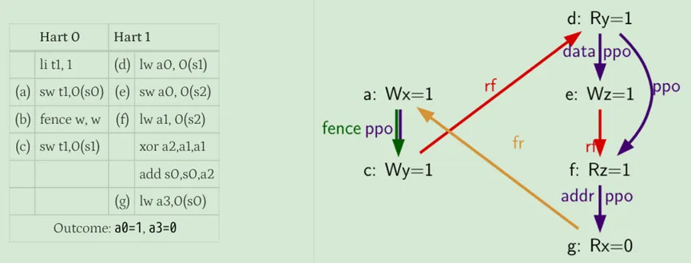

# 1.介绍

> The goal of this chapter is to explain enough about coherence to understand how consistency models interact with coherent caches, but not to explore specific coherence protocols or implementations, which are topics we defer until the second portion of this primer in Chapters 6–9.

## MEMORY CONSISTENCY

内存一致性根据load和sw定义了正确的共享内存行为,并不涉及缓存一致性

假设一门课最初在152教室,开学前一天,教务处把他变为252,干这个事情的人收到消息,准备向学生发布信息,检查更新的时间表,比如网站管理员太忙了,没立即发布新教室，一个同学收到短信立即去检查教师，这时候仍然是152，尽管网上的时间表最终被更新到252号房间，注册员也按照正确的顺序写了“写”，但这位勤奋的学生却按照不同的顺序观察，因此走错了房间。内存一致性模型就是定义这种行为是否正确

> we need to define shared memory correctness—that is, which shared memory behaviors are allowed—so that programmers know what to expect and implementors know the limits to
> what they can provide

共享内存正确性由内存一致性模型指定，或者更简单地说，由内存模型指定。内存模型指定使用共享内存执行的多线程程序所允许的行为。对于使用特定输入数据执行的多线程程序，内存模型指定动态加载可能返回的值以及内存可能的最终状态。与单线程执行不同，通常允许多个正确的行为，这使得理解内存一致性模型变得微妙。

第3章介绍了内存一致性模型的概念，并介绍了最强大、最直观的一致性模型——顺序一致性（SC）。本章首先阐述了指定共享内存行为的必要性，并精确定义了什么是内存一致性模型。接下来将深入研究直观的SC模型，该模型指出，多线程执行应该看起来像每个组成线程的顺序执行的交错，就好像线程在单核处理器上进行时间复用一样。除了这种直觉之外，本章还将SC形式化，并以简单而积极的方式探索实现SC的一致性，最后以MIPS R10000案例研究告终

在第4章中，专注于x86和SPARC系统实现的内存一致性模型。这种一致性模型称为总存储顺序（TSO），其动机是希望在将结果写入缓存之前，使用先入先出的写缓冲区来保存已提交存储的结果。这种优化违反了SC，但保证了足够的性能优势，从而激发了架构来定义TSO，从而允许这种优化。在本章中，我们将展示如何从我们的SC形式化中形式化TSO， TSO如何影响实现，以及SC和TSO如何比较

最后，第5章介绍了“宽松”或“弱”内存一致性模型。如果一个线程更新10个数据项，然后更新一个同步标志，程序员通常不关心数据项是否按顺序更新，而只关心在更新标志之前更新所有数据项。宽松模型试图捕捉这种增加的排序灵活性，以获得更高的性能或更简单的实现。

## CACHE COHERENCE

如果多个参与者（例如，多个核心）访问数据的多个副本（例如，在多个缓存中），并且至少有一次访问是写操作，则可能出现一致性问题。考虑一个类似于内存一致性示例的示例。学生查看在线课程表，发现计算机体系结构课程在152教室（读取数据），并将此信息复制到她的笔记本（缓存数据）。随后，大学注册官决定将班级移至252室，并更新在线时间表（写入数据）。学生的数据副本现在已经过期了。

如果她去152号房，她会找不到她的班级。不连贯的例子来自计算世界，但不包括计算机体系结构，包括陈旧的web缓存和程序员使用未更新的代码库。

使用一致性协议可以防止对陈旧数据（不一致性）的访问，一致性协议是由系统内的分布式参与者集实现的一组规则。相干协议有许多变体，但遵循几个主题

第6章介绍了缓存一致性协议的总体情况，并为后续章节的具体一致性协议奠定了基础。本章涵盖了大多数相干协议共享的问题，包括缓存控制器和内存控制器的分布式操作以及常见的MOESI相干状态：修改(M)、拥有(O)、独占(E)、共享(S)和无效(I)。重要的是，本章还介绍了我们的表驱动方法，用于呈现具有稳定（例如MOESI）和瞬态相干状态的协议

> Transient states are required in real implementations because modern systems rarely permit atomic transitions from one stable state to another (e.g., a read miss in state Invalid will spend some time waiting for a data response before it can enter state Shared).

第7章涵盖snoop缓存一致性协议，直到最近才主导商业市场。在手波级别，窥探协议很简单。当缓存丢失发生时，内核的缓存控制器将为共享总线进行仲裁并广播其请求。共享总线确保所有控制器以相同的顺序观察所有请求，因此所有控制器可以协调它们各自的分布式操作，以确保它们保持全局一致的状态。

然而，窥探变得复杂，因为系统可能使用多个总线，而现代总线不能自动处理请求。现代总线具有仲裁队列，并且可以发送单播、管道延迟或乱序的响应。所有这些特征导致了更多的瞬态一致态。第七章总结了Sun UltraEnterprise E10000和IBM Power5的案例研究

第8章深入研究了目录缓存一致性协议，缓存丢失请求来自下一级缓存（或内存）控制器的内存位置，下一级缓存（或内存）控制器维护一个目录，该目录跟踪哪些缓存保存哪些位置。根据所请求内存位置的目录条目，控制器向请求者发送响应消息，或将请求消息转发给当前缓存内存位置的一个或多个参与者。每个消息通常有一个目的地（即，没有广播或多播），但是瞬态相干状态大量存在，因为从一个稳定相干状态转换到另一个稳定相干状态可以生成许多与系统中参与者数量成比例的消息。

第9章深入研究更复杂的系统模型和优化，重点关注窥探和目录协议中常见的问题。最初的主题包括处理指令缓存、多级缓存、透写缓存、（tlb）、（DMA）、虚拟缓存

# Coherence Basics

本书用的模型

不一致什么时候发生

一致性协议做的就是在Time3让core2观察到的数据是core1的数据，而不是来自内存的老数据

## DEFINING COHERENCE

我们首选的相干定义的基础是单写入多读取（SWMR）不变量。对于任何给定的内存位置，在任何给定的时刻，要么有一个核心可以写它（也可以读它），要么有一些核心可以读它。因此，永远不会有这样的情况：一个内核可以写入给定的内存位置，而其他内核可以同时读取或写入该位置。查看此定义的另一种方式是考虑，对于每个内存位置，内存位置的生命周期被划分为多个epoch。在每个epoch中，要么单个内核具有读写访问权限，要么若干内核（可能为零）具有只读访问权限。图2.3展示了一个示例内存位置的生命周期，它分为四个epoch，以保持SWMR不变性。

除了SWMR不变量外，一致性还要求给定内存位置的值被正确传播。为了解释为什么值很重要，让我们重新考虑图2.3中的例子。即使SWMR不变式成立，如果在第一个只读epoch， core 2和core 5可以读取不同的值，那么系统是不一致的。同样，core1没有读到core3写入的最新数据，这种情况也是不一致

> Coherence invariants
>
> 1. Single-Writer, Multiple-Read (SWMR) Invariant. For any memory location A, at any
>    given (logical) time, there exists only a single core that may write to A (and can also read it)
>    or some number of cores that may only read A.
> 2. Data-Value Invariant. The value of the memory location at the start of an epoch is the same
>    as the value of the memory location at the end of its last read–write epoch.

第二句话的意思就是core1读的数据应该来自core3写的数据的位置

缓存一致性是架构不可见的

# Memory Consistency Motivation and Sequential Consistency

## PROBLEMS WITH SHARED MEMORY BEHAVIOR

首先从一个例子开始：大多数程序员会期望内核C2的寄存器r2应该得到值NEW。然而，在今天的一些计算机系统中，r2可以是0。硬件可以通过对核心C1的存储S1和S2重新排序，使r2的值为0。在本地（即，如果我们只看C1的执行而不考虑与其他线程的交互），这种重新排序似乎是正确的，因为S1和S2访问不同的地址。

还有一个例子

大家期待的结果：

实际两者都可以为0

内存一致性模型，或者更简单地说，内存模型，是对使用共享内存执行的多线程程序所允许的行为的规范。对于使用特定输入数据执行的多线程程序，它指定了动态加载可能返回的值以及内存的最终状态。与单线程执行不同，通常允许多个正确的行为，正如我们将看到的顺序一致性

## CONSISTENCY VS. COHERENCE

缓存一致性不等于内存一致性。

内存一致性实现可以使用缓存一致性作为有用的“黑盒”。

## BASIC IDEA OF SEQUENTIAL CONSISTENCY (SC)

Lamport首先将单处理器（核心）称为顺序处理器，如果“执行的结果与按照程序指定的顺序执行的操作相同”。然后，如果“任何执行的结果都与所有处理器（核心）的操作以某种顺序执行的结果相同，并且每个处理器（核心）的操作按照其程序指定的顺序出现在该顺序中”，他称之为多处理器顺序一致性。这种操作的总顺序称为内存顺序。在SC中，内存顺序尊重每个核心的程序顺序，但其他一致性模型可能允许内存顺序并不总是尊重程序顺序。

上图p表示程序顺序,m表示内存顺序,op1 <m op2表示内存顺序中OP1先于OP2,op1
 An SC execution requires:All cores insert their loads and stores into the order <m respecting their program order,
> regardless of whether they are to the same or different addresses (i.e., a=b or a≠b). There are four
> cases:
>
> 
>
> Every load gets its value from the last store before it (in global memory order) to the same
> address:
> Value of L(a) = Value of MAX <m {S(a) | S(a) <m L(a)}, where MAX <m denotes “latest in
> memory order.”

也即是每个load的值来自全局顺序最近相同地址的数据

“X”表示这些操作必须按程序顺序执行。

## NAIVE SC IMPLEMENTATIONS

两种方法

**The Multitasking Uniprocessor**

首先，可以通过在单个顺序核心（单处理器）上执行所有线程来实现多线程用户级软件的SC。线程T1的指令在核心C1上执行，直到上下文切换到线程T2，等等。在上下文切换时，任何挂起的内存操作必须在切换到新线程之前完成。检查显示所有SC规则都得到遵守。

**The Switch**

其次，可以使用一组核心Ci、单个开关和内存来实现SC，如图3.3所示。假设每个核心按其程序顺序一次向交换机提供一个内存操作。每个核心可以使用任何不影响其向交换机呈现内存操作的顺序的优化。

这些实现性能随着核心增加不一定会增加

## A BASIC SC IMPLEMENTATION WITH CACHE COHERENCE

缓存一致性使SC实现可以完全并行地执行无冲突的加载和存储（如果两个操作位于相同的地址，并且至少其中一个是存储，则两个操作会发生冲突）。此外，创建这样一个系统在概念上很简单。

在这里，我们将相干性主要视为实现第2章的单写多读（SWMR）不变量的黑盒。我们通过稍微打开相干块框来展示简单的一级（L1）缓存来提供一些实现直觉：

使用状态修改(M)来表示一个内核可以写入和读取的L1块，使用状态共享(S)来表示一个或多个内核只能读取的L1块，并使用GetM和GetS分别表示在M和S中获取块的一致性请求。

图3.4(b)稍微“打开”内存系统黑盒子，显示每个核心连接到自己的L1缓存（我们将在后面讨论多线程）。如果B具有适当的一致性权限（状态M for store或S for load），则存储系统可以响应加载或存储到块B

此外，如果相应的L1缓存具有适当的权限，则内存系统可以并行响应来自不同内核的请求。

例如，图3.5(a)描述了四个内核各自寻求执行内存操作之前的缓存状态。这四个操作不冲突，可以由它们各自的L1缓存来满足，因此可以并发执行。如图3.5(b)所示，我们可以任意排序这些操作以获得合法的SC执行模型。更一般地说，可以由L1缓存满足的操作总是可以并发地完成，因为coherence的单写多读不变性确保了它们不冲突。

## OPTIMIZED SC IMPLEMENTATIONS WITH CACHE COHERENCE

大多数真正的核心实现都比我们的基本SC实现要复杂得多。内核采用预取、推测执行和多线程等特性来提高性能和容忍内存访问延迟。这些特性与内存接口交互，现在我们讨论这些特性如何影响SC的实现

**Non-Binding Prefetching**

块B的非绑定预取是向一致性内存系统请求更改块B在一个或多个缓存中的一致性状态，最常见的是，预取是由软件、核心硬件或缓存硬件请求的，以改变一级缓存中B的状态，以允许load（例如，B的状态是M或S）或通过发出一致性请求（例如GetS和GetM）来load和store（B的状态是M）

> Importantly, in no case does a non-binding prefetch change the state of a register or data in block B.

非绑定预取的效果仅限于图3.4中的“cache-coherent memory system”块内，使得非绑定预取对内存产生影响等同于无操作，**只要加载和存储是按程序顺序执行的，以什么顺序获得一致性权限并不重要**

可以在不影响内存一致性模型的情况下进行非绑定预取。这对于内部缓存预取（例如，流缓冲区）和更激进的内核都很有用。

Non-Binding Prefetching：预取来的数据单独放一个空间，

**Speculative Cores**

考虑一个按程序顺序执行指令的核心，但也执行分支预测，其中后续指令（包括加载和存储）开始执行，但可能会因分支错误预测而被丢弃（即，使其效果无效）。这些丢弃的加载和存储可以看起来像非绑定预取，使这种推测是正确的，因为它对 SC 没有影响。分支预测之后的加载可以呈现给 L1 缓存，其中它要么未命中（导致非绑定 GetS 预取）要么命中，然后将值返回到寄存器。如果加载被丢弃，核心会丢弃寄存器更新，从而消除加载的任何功能影响——就好像它从未发生过一样。缓存不会撤消非绑定预取，因为这样做不是必需的，并且如果重新执行加载，预取块可以提高性能。对于store，核心可能会提前发出非绑定 GetM 预取，但它不会将store呈现给缓存，直到store被保证提交。（store buffer）

感觉说的意思就是分支预测错误路径的load发出请求，可以类似于预取

**Dynamically Scheduled Cores**

也就是乱序执行的CPU核，

然而，在多核处理器的上下文中，动态调度引入了一个新的问题：内存 consistency 的推测。考虑一个希望动态重新排序两个加载指令 L1 和 L2 的核心（例如，因为在计算 L1 地址之前计算 L2 地址）。许多核心将会在 L1 之前推测性地执行 L2 ，它们预测这种重新排序对其他核心不可见，这将违反 SC。

对 SC 的推测需要核心验证预测是否正确。 Gharachorloo 等人 [8] 提出了两种执行此检查的技术。首先，在核心推测性地执行 L2 之后，但在它提交 L2 之前，核心可以检查推测性访问的块是否没有离开缓存。只要块保留在缓存中，它的值就不会在加载执行和提交之间发生变化。为了执行此检查，核心跟踪 L2 加载的地址，并将其与被驱逐的块和传入的 coherence 请求进行比较。传入的 GetM 表明另一个核心可以观察 L2 乱序，并且此 GetM 将暗示错误推测并丢弃推测执行。

第二种检查技术是在核心准备好提交加载时重放每个推测性加载（注2）[2, 17]。如果提交时加载的值不等于先前推测加载的值，则预测不正确。在示例中，如果重放的 L2 加载值与 L2 的原始加载值不同，则加载-加载重新排序导致执行明显不同，推测执行必须被丢弃。

**Non-Binding Prefetching in Dynamically Scheduled Cores**

动态调度的核心可能会遇到程序顺序不正确的加载和存储缺失。例如，假设程序顺序是加载 A，存储 B，然后存储 C。核心可能会“乱序”启动非绑定预取，例如，首先是 GetM C，然后是并行的 GetS A 和 GetM B。 SC 不受非绑定预取顺序的影响。 SC 只要求核心的加载和存储（看起来）按程序顺序访问其一级缓存。Coherence 要求一级缓存块处于适当的状态以接收加载和存储。

重要的是，SC（或任何其他内存 consistency 模型）：

* 规定加载和存储（出现）应用于 coherent 内存的顺序，但不规定 coherence 活动的顺序。

**Multithreading**

SC 实现可以容纳多线程——粗粒度、细粒度或同时的。 每个多线程核心应该在逻辑上等同于多个（虚拟）核心，它们通过一个交换机共享每个一级缓存，其中缓存选择接下来要服务的虚拟核心。 此外，每个缓存实际上可以同时服务多个非冲突请求，因为它可以假装它们是按某种顺序服务的。 一个挑战是确保线程 T1 在存储对其他核心上的线程“可见”之前无法读取同一核心上另一个线程 T2 写入的值。 因此，虽然线程 T1 可以在线程 T2 以内存顺序插入存储后立即读取该值（例如，通过将其写入状态 M 的缓存块），但它无法从处理器核心中的共享加载存储队列中读取该值。

# TSO

继续考虑这个例子，

假设多核处理器具有顺序核心，其中每个核心都有一个单入口写入缓冲区并按以下顺序执行代码。

1. 核心 C1 执行存储 S1，但在其写缓冲区中缓冲新存储的 NEW 值。
2. 同样，核心 C2 执行存储 S2 并将新存储的 NEW 值保存在其写缓冲区中。
3. 接下来，两个核心执行各自的加载 L1 和 L2，并获得旧值 0。
4. 最后，两个核心的写缓冲区使用新存储的值 NEW 更新内存。

最后的结果就是（0，0）正如我们在上一章中看到的，这是 SC 禁止的执行结果。没有写缓冲区，硬件就是 SC，但有了写缓冲区，它就不是了，这使得写缓冲区在多核处理器中在架构上是可见的。

## 4.2 TSO/X86 的基本思想

本地的store和load需要按照顺序，但全局不需要按照顺序

程序员（或编译器）可以通过在核心 C1 上的 S1 和 L1 之间以及核心 C2 上的 S2 和 L2 之间插入 FENCE 指令来阻止图 4.2d 中的执行。在核心 Ci 上执行 FENCE 可确保 Ci 上 FENCE 之前的内存操作（按程序顺序）按照内存顺序放置在 Ci 上 FENCE 之后的内存操作之前。使用 TSO 的程序员很少使用 FENCE（又名内存屏障），因为 TSO 对大多数程序“做正确的事”。尽管如此，FENCE 在下一章讨论的宽松模型中发挥着重要作用。

TSO 确实允许一些非直观的执行结果。表 4.3 说明了表 4.1 中程序的修改版本，其中核心 C1 和 C2 分别制作 x 和 y 的本地副本。许多程序员可能假设如果 r2 和 r4 都等于 0，那么 r1 和 r3 也应该为 0，因为存储 S1 和 S2 必须在加载 L2 和 L4 之后插入到内存顺序中。然而，图 4.3 展示了一个执行，显示 r1 和 r3 绕过每个核心写入缓冲区中的值 NEW。事实上，为了保持单线程顺序语义

，每个核心都必须按照程序顺序看到自己存储的效果，即使存储还没有被其他核心观察到。因此，在所有 TSO 执行下，本地副本 r1 和 r3 将始终设置为 NEW 值。

# Relaxed Memory Consistency

本文介绍RVWMO模型

在RVWMO下，从同一hart中的其他内存指令的角度来看，在单个hart上运行的代码似乎是按顺序执行的，但是来自另一个hart的内存指令可能会观察到来自第一个hart的内存指令以不同的顺序执行。因此，多线程代码可能需要显式的同步，以保证不同内存指令之间的顺序。基本的RISC-V ISA为这个目的提供了一个FENCE指令，在2.7节中描述，而原子扩展“a”额外定义了load-reserved/storeconditional和原子读-修改-写指令。

## 17.1. Definition of the RVWMO Memory Model

### 17.1.1. Memory Model Primitives

注：ac表示指令顺序后的指令不能先于这条指令执行，rl表示指令顺序前的指令不能后于这条指令

如下图，注：LDAR代表load具有acquire语义，STLR代表store具有release语义。

内存操作的程序顺序反映了生成每次加载和存储的指令在该处理器的动态指令流中逻辑布局的顺序；即，一个简单的有序处理器执行该处理器指令的顺序。

不对齐的加载或存储指令可以分解为一组任意粒度的组件内存操作。XLEN<64的FLD或FSD指令也可以分解为一组任意粒度的组件内存操作。由这些指令产生的存储器操作并不按照程序顺序彼此排序，但是它们通常按照程序顺序按照前面和后面的指令产生的存储器操作进行排序。原子扩展“A”根本不需要执行环境来支持不对齐的原子指令。但是，如果通过不对齐的原子性颗粒PMA支持不对齐的原子，则原子性颗粒中的AMOs不会被分解，基本isa中也不会定义负载和存储，也不会在F、D和Q扩展中定义不超过XLEN位的负载和存储。

> The decomposition of misaligned memory operations down to byte granularity facilitates emulation on implementations that do not natively support misaligned accesses. Such implementations might, for example, simply iterate over the bytes of a misaligned access one by one.

如果LR指令在程序顺序上先于SC指令，并且中间没有其他LR或SC指令，则称LR指令和SC指令成对；相应的内存操作也被称为成对的（除了SC失败的情况，没有生成存储操作）。第14.2节定义了决定SC是否必须成功、可能成功或必须失败的完整条件列表。

Load和store操作也可以携带一个或多个顺序注释，这些注释来自以下集合：“acquire-RCpc”、“acquire-RCsc”、“release-RCpc”和“release-RCsc”。带有aq集的AMO或LR指令具有“acquire-RCsc”注释。带有rl集的AMO或SC指令有一个“release-RCsc”注释。具有aq和rl集的AMO、LR或SC指令同时具有“acquire-RCsc”和“release-RCsc”注释。

> For convenience, we use the term "acquire annotation" to refer to an acquire-RCpc annotation or an acquire-RCsc annotation. Likewise, a "release annotation" refers to a release-RCpc annotation or a release-RCsc annotation. An "RCpc annotation" refers to an acquire-RCpc annotation or a releaseRCpc annotation. An RCsc annotation refers to an acquire-RCsc annotation or a release-RCsc annotation.

在内存模型文献中，术语“RCpc”表示与处理器一致的同步操作的释放一致性，术语“RCsc”表示与顺序一致的同步操作的释放一致性。

尽管有许多不同的获取和发布注释的定义，RCpc注释目前只在隐式分配给每个标准扩展“Ztso”的内存访问时使用（第18章）。此外，尽管ISA目前不包含本机加载获取或存储释放指令，也不包含其RCpc变体，但RVWMO模型本身被设计为向前兼容，以便在将来的扩展中将上述任何或全部添加到ISA中。

RCpc语义”代表“Acquire-RCpc”或“Release-RCpc”。“RCsc语义”代表“Acquire-RCsc”或“Release-RCsc”。Load(store)可以携带任何一种ACQUIRE(RELEASE)语义，而RMW只能携带RCsc语义。这些语义有如下保序：

ACQUIRE -> Load,Store   (ACQUIRE代表ACQUIRE-RCsc和ACQUIRE-RCpc)

Load,Store -> RELEASE (RELEASE 代表RELEASE-RCsc和RELEASE-RCpc)

RELEASE-RCsc -> ACQUIRE-RCsc  (注意RELEASE-RCpc -> ACQUIRE-RCpc不成立)

从上述保序公式可以看出：

带有RELEASE-RCpc的older store指令的写数据可以直接被forward给带有ACQUIRE-RCpc的同地址younger load指令。

如果它们两个是不同地址，那么在younger load指令会先于older store指令出现在global memory order上。

上述这两点是RCsc不允许的，RCsc具有更强的保序行为。 **为什么RCsc和RCpc有这两点区别** ，看它们的全称就知道了。

“RCpc”代表release consistency with processor-consistent synchronization operations。

“RCsc”代表release consistency with sequentially consistent synchronization operations。

 **RCpc语义有processor-consistent特性** 。Processor consistency(PC)表示一个Core的store操作按顺序达到其它Core，但不一定同时达到其它Core。TSO模型是PC的特殊情况，其中每个Core都可以立即看到自己的Store操作，但是当任何其它Core看到Store操作时，所有其它Core都可以看到它，这个属性称为write atomicity。

 **RCsc语义有sequentially consistent特性** 。Sequential consistency (SC)模型中，memory order保留了每个core的program order。也就是SC模型为同一个线程的两个指令间的所有四种load和store组合(Load -> Load, Load -> Store, Store -> Store, and Store -> Load)保留了顺序。

因此RCpc和RCsc在行为上还是有些区别，RCsc语义可以让RVWMO模型像SC(Sequential Consistency)模型行为一样，RCpc语义可以让RVWMO像TSO(Total Store Order)内存模型行为一样， **这极大方便了其它[CPU](https://www.eefocus.com/baike/1552575.html)内存模型的代码移植到RISC-V CPU上运行** 。比如要迁移MIPS R10000的代码到RISC-V CPU上，可以使用RCsc的load和store指令。要迁移Intel/[AMD](https://www.eefocus.com/manufacturer/1000225/)的代码到RSIC-V CPU上，可以使用RCpc的load和store指令。

如下图，注：LDAR代表load具有acquire-RCsc语义，STLR代表store具有release-RCsc语义。LDAPA代表load具有acquire-RCpc语义。

### 17.1.2. Syntactic Dependencies

语法依赖关系是根据指令的源寄存器、指令的目标寄存器以及指令从源寄存器到目标寄存器携带依赖关系的方式来定义的。

**源寄存器定**义：一般来说，如果满足下列任何条件之一，寄存器R(除X0)就是指令A的源寄存器：

* 在指令A的操作码中，rs1、rs2或rs3被设置为R；
* A是CSR指令，在A的操作码中，csr被设置为R。如果A是CSRRW或CSRRWI，需要rd不是x0；
* R是CSR，且是指令A的隐式源寄存器；
* R是CSR，它是A的另一个源寄存器别名；

**目的寄存器定义**：一般来说，如果满足下列任何条件之一，寄存器R(除x0)就是指令A的目的寄存器：

* 在指令A的操作码中，rd被设置为R；
* A是CSR指令，在A的操作码中，CSR被设置为R。如果A为CSRRS或CSRRC，需要rs1不是x0.如果A为CSRRSI或CSRRCI，需要umm[4:0]不是0；
* R是CSR，且是指令A的隐式目的寄存器；
* R是CSR，它是A的另一个目的寄存器别名；

**语法依赖定义**：如果以下任何一个条件成立，那么指令j通过i的目的寄存器s和指令j的源寄存器r在语法上依赖于指令i。

* s和r是同一个，且在i和j之间排序的程序指令没有r作为目的寄存器；
* 在指令i和指令j之间有指令m，使得以下所有条件都成立：
  * 指令m的目的寄存器q和指令j的源寄存器r在语法上存在依赖；
  * 指令m的源寄存器p和指令i的目的寄存器s在语法上存在依赖；
  * 指令m的p和q存在依赖；

对于内存访问操作中， **Syntactic Dependencies(语法依赖)可以分为syntactic address dependency(地址依赖)，syntactic data dependency(数据依赖)和syntactic control dependency(控制依赖)** 。

为了说明这个三个依赖的不同之处，假设有a和b两个内存操作，i和j分别是生成a和b的指令。

**地址依赖**：如果r是j的地址源操作数，并且j通过源寄存器r对i有语法依赖，则b有语法地址依赖于a。

指令i (操作a)：lw **r**,0(r1)

指令j (操作b)：sw  r2,0( **r** )

**数据依赖**：如果b是一个store操作，r是j的数据源寄存器，j通过源寄存器r对i有语法依赖，那么b对a有语法数据依赖。

指令i (操作a)：lw **r**,0(r1)

指令j (操作b)：sw  **r**,0(r0)

**控制依赖**：如果在i和j之间有一条指令m，m是一条分支或间接跳转指令，并且m在语法上依赖于i，则b在语法控制上依赖于a。

指令i (操作a)：lw **r**,0(r0)

指令m：bne **r**,r1,next

指令j (操作b)：sw  r3,0(r4)

### 17.1.3. Preserved Program Order

任何给定的程序执行的全局内存顺序都尊重每个hart的部分（但不是全部）程序顺序。全局内存顺序必须遵守的程序顺序的子集称为保留程序顺序，全局必须尊重本地

保留程序顺序的完整定义如下（请注意，AMOs同时是加载和存储）：内存操作a在保留程序顺序中先于内存操作b（因此也在全局内存顺序中），如果a在程序顺序中先于b，则a和b都访问常规主存（而不是I/O区域），并且以下任何一种情况都有效：

Overlapping-Address Orderings：（其实不太理解这个名词？）

a操作在程序顺序中先于b操作，a和b都访问常规主存，不包含I/O区域， **如果存在以下任何一个条件** ，那么a操作和b操作在全局内存顺序中的顺序也不会变。

1. b是store，且a和b访问重叠的内存地址。
2. a和b是load，x是a和b同时读取的字节，且在a和b程序顺序之间没有store操作访问x，a和b返回x的值由不同的内存操作写入。
3. a是由AMO或SC指令生成的，b是一个load，b返回由a写入的值。

**关于第一点** ，load或store操作永远不能与后面访问重叠内存位置的store操作进行重排序。从微体系架构的角度来看，一般来说，如果投机是无效的，则很难或不可能撤回投机重排序的store操作，因此模型直接不允许这种行为。不过另一方面，store可以forward数据给后面的load操作，这种情况通常发生在store的数据暂时存放在store buffer里，之后load命中store buffer，就直接load数据走了。

**关于第二点** ，其实就是要求同一个hart中，younger的load返回的值不能比同地址older load返回的值更老。这通常被称为“CoRR”(Coherence for Read-Read pairs)，或者SC模型(sequential consistency)的要求一部分， **RVWMO需要强制执行CoRR排序**。如下代码所示，不管程序如何执行，(f)返回的值肯定比(d)的新。

其实就是AMO或成功的SC必须要全局可见后，才能将值返回给后续的load操作。

这三个原则也适用于内存访问之间只有部分重叠的情况，而且基地址也不一定相同的。例如，当使用不同大小的操作访问同一个地址区间时，就可以发生这种情况。当使用非对齐的内存访问时，重叠地址的规则可以独立地应用于每个地址的内存访问。

**Explicit Synchronization**

 **显示同步指的是** ：a操作在程序顺序中先于b操作，a和b都访问常规主存，不是I/O区域，如果存在以下任何一个条件，那么a操作和b操作在全局内存顺序中的顺序也不会变。

1. **a和b之间有FENCE指令。**
2. **a拥有acquire语义。**
3. **b拥有release语义。**
4. **a和b都有RCsc语义。**
5. **a和b是配对的。**

**关于第四点**：如果单独使用RCpc语义，就不会强制store release到load acquire的顺序，这有助于移植在TSO或RCpc内存模型下编写的代码。为了确保store release到load acquire的顺序，代码必须使用RCsc的语义。

在全局内存顺序中，SC必须出现在与其配对的LR之后。由于固有的语法数据依赖，通常使用LR/SC来执行原子读-修改-写操作。但其实即使store的值在语法上不依赖于成对LR返回的值，这一点也适用。

**Syntactic Dependencies**

9. b has a syntactic address dependency on a
10. b has a syntactic data dependency on a
11. b is a store, and b has a syntactic control dependency on a

**Pipeline Dependencies**

a操作在程序顺序中先于b操作，a和b都访问常规主存，不是I/O区域，如果存在以下任何一个条件，那么a操作和b操作在全局内存顺序中的顺序也不会变。

1. b是load，在a和b程序顺序之间存在一个store m，m的地址或数据依赖于a，b返回的值是m写的值。
2. b是store，在a和b程序顺序之间存在一些指令m，m的地址依赖于a。

这两点几乎在所有真实处理器pipeline上都存在的

**关于第一点**：是想表明如果old的store的地址或数据还未知的话，load是不能从store转发数据的。也就是必须等a确定执行完之后，得到了m的地址或数据了，才会执行b，所以a和b的全局顺序肯定是保证的。如下图所示。

(f)在(e)的数据确定之前是不能被执行的，因为(f)必须返回(e)写的值，并且在(d)有机会执行之前，旧的值不能被(e)的回写所破坏，因此，(f)将不会在(d)之前执行，也就是它们俩的顺序是固定的。

**关于第二点**：它与第一点规则有着类似的观察：在可能访问同一地址的所有older load被执行之前，store不能在memory中确定执行。因为store如果提前执行的话，那么旧的值被覆盖了，那么older的load就无法读取到了。同样的，除非知道前面的指令不会由于地址解析失败而导致异常，都则通常不能执行store操作，从这个意义上说，这个一点是之前语法依赖里的控制依赖的某种特殊情况。如下图所示。

在(e)的地址被解析完之前，(f)不能执行，因为结果可能是地址匹配，也就是a1等于0。因此，在(d)被执行并确认(e)地址是否确实重叠之前，(f)不能被发到内存去执行的，也就是(d)和(f)的顺序是固定的。

### **17.1.4. Memory Model Axioms**

> An execution of a RISC-V program obeys the RVWMO memory consistency model only if there exists a global memory order conforming to preserved program order and satisfying the load value axiom, the atomicity axiom, and the progress axiom.

**load value公理**

loadA读到的每个字节来自于store写入该字节的值，loadA可以读到store的值来自于以下两种场景：

* **在全局内存顺序中，在loadA之前的store写该字节**
* **在program order中，在loadA之前的store写该字节 (可以forward)**

全局内存顺序排在loadA之前的store，loadA肯定可以观察到。另外第二点意思是现在几乎所有的CPU实现中都存在store buffer，store操作的数据可能会暂时存放在这里面，而且还没有全局可见，后续younger的load其实就可以提前forward里面的写数据来执行。因此，对于其它hart来说，在全局内存顺序上将观察到load在store之前执行。

我们可以看下面经典的一个例子，假如这段程序是在具有store buffer的hart上运行的，那么最终结果可能是：a0=1，a1=0，a2=1，a3=0。

程序一种执行顺序如下：

* 执行并进入第一个hart的store buffer；
* 执行并转发store buffer中(a)的返回值1；
* 执行，因为所有先前的load（即(b)）已完成；
* 执行并从内存中读取值0；
* 执行并进入第二个hart的store buffer；
* 执行并转发store buffer中(e)的返回值1；
* 执行，因为所有先前的load（即(f)）已经完成；
* 执行并从内存中读取值0；
* 从第一个hart的store buffer中写到内存；
* (e)从第二个hart的store buffer中写到内存；

然而，即使(b)在全局内存顺序上先于(a)和，(f)先于(e)，在本例中唯一合理的可能性是(b)返回由(a)写入的值，(f)和(e)也是如此，这种情况的结合促使了load value公理定义中的第二种选择。即使(b)在全局内存顺序上在(a)之前，(a)仍然对(b)可见，因为(b)执行时(a)位于store buffer中。因此，即使(b)在全局内存顺序上先于(a), (b)也应该返回由(a)写的值，因为(a)在程序顺序上先于(b)。(e)和(f)也是如此。

**atomicity公理**

如果r和w是分别由hart h中对齐的LR和SC指令生成的成对load和store操作，s是对字节x的store，r返回由s写的值，那么在全局内存顺序中，s必须位于w之前，并且在全局内存顺序中，除了h之外不能有其它hart的同地址store出现在s之后和w之前。

**简单说，就是如果r从s读到数据了，那么s和w之间不可能穿插其它hart的store数据了，但允许本hart穿插其它同地址store数据，由此来确保一个hart使用LR和SC的原子性** 。

RISC-V包含两种类型的原子操作：AMO和LR/SC对，它们的行为有所不同。LR/SC的行为就好像旧的值返回给hart，hart对它进行修改，并写回主存，这中间不被其它hart的store打断，否则就是失败的。AMO的行为就好像是在内存中直接进行的，因此AMO本质上就是原子性的。

**progress公理**

 **在全局内存顺序中，任何内存操作都不能在其他内存操作的无限序列之前进行** 。

这个公理保证程序终究可以往前执行，确保来自一个hart的store最终在有限的时间内对系统中的其它hart可见，并且来自其它hart的load最终能够读取这些值。如果没有这个规则，例如spinlock在一个值上无限自旋是合法的，即使有来自其它一个hart的store等到解锁该自旋锁。
