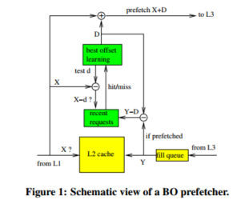
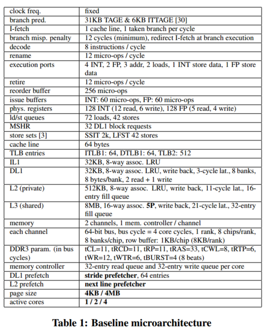
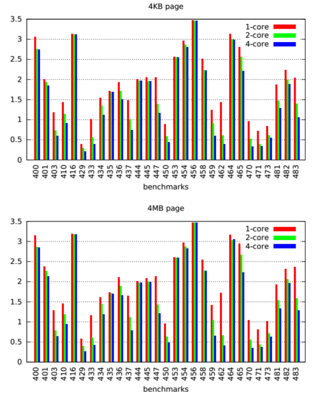
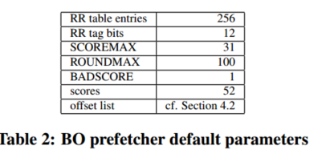

# BOP介绍

主要相对于SandBox有更好的timeliness，

# OFFSET PREFETCHING

offset 预取是next line 的扩展，偏移量预取器预取行X +D，其中D为预取偏移量。情况D = 1对应于下一行预取。本节提供一些示例来说明为什么偏移预取是一种有效的预取技术。下面的示例假设为64字节行。为方便起见，在存储器区域中访问的行用位向量表示，相邻的位表示相邻的行。位值告诉行是否被访问（“1”）或不被访问（“0”）。我们忽略了页面边界的影响，只考虑长访问流的稳定状态。

## 3.1 Example 1: sequential stream

考虑下面的顺序流：111111111111111111…

也就是说，程序访问的行是X、X+1、X+2，等等。在这个示例中，下一行预取器产生100%的预取覆盖率和准确性。但是，在访问X之后为X+1发出预取可能太迟，无法覆盖从最后一级缓存或内存中获取X+1的全部延迟，从而导致延迟预取。延迟预取可能会加快执行速度，但不如及时预取快。偏移量预取器在顺序流上产生100%的预取覆盖率和准确性，就像下一行预取器一样，但是如果偏移量足够大，可以提供及时的预取。

另一个可能降低预取覆盖率的因素是scrambling（乱序访存），即内存访问的时间顺序可能与程序顺序不完全匹配[11]。

一般来说，在长序列流上，对scrambling的容忍度随着偏移量的增大而提高。

## 3.2 Example 2: strided stream

考虑一个加载指令访问一个常量步长为+96字节的数组。对于64字节的缓存行，在内存区域中访问的行是：110110110110110110…

如果在L1处没有步进预取器（或者如果它发出延迟预取），则观察L2访问（如AC/DC[22]）的增量相关预取器将在这里完美地工作，因为行步进序列是周期性的（1,2,1,2，…）。尽管如此，在这个例子中，一个简单的偏移量预取器以3的倍数作为偏移量，可以获得100%的覆盖率和准确性。

通过将偏移量设置为一个周期内跨步的总和或该数字的倍数，理论上，偏移量预取可以在任何周期的行跨步序列上提供100%的覆盖率和准确性。

## 3.3 Example 3: interleaved streams

考虑两个交错的流S1和S2访问不同的内存区域，并具有不同的行为：S1: 101010101010101010…

S2: 110110110110110110…

流S1单独可以用2的倍数作为偏移量完美地预取。流S2单独可以用3的倍数作为偏移量完美地预取。两个流都可以用6的倍数作为偏移量完美地预取。

# BEST-OFFSET (BO) PREFETCHING

图1显示了BO预取器的示意图。

图1中的符号D表示当前预取偏移量，即当前用于预取的偏移量。当对行X的读请求访问L2缓存时，如果这是一个未命中或预取命中（即，设置了预取位），并且如果X和X +D位于同一内存页，则对行X +D的预取请求被发送到L3缓存。

## 4.1 Best-offset learning

预取偏移量D是自动动态设置的，试图适应应用程序的行为，这些行为可能会随着时间的推移而变化。

最佳偏移学习算法试图通过测试几个不同的偏移来找到最佳的预取偏移量。如果在访问行X时，行X - d最近有一次访问，那么偏移量d可能是一个很好的预取偏移量。然而，X - d最近被访问的事实并不足以保证行X会及时预取。我们希望预取在任何可能的情况下都是及时的。也就是说，对于行X来说，d是一个很好的预取偏移量，行X - d必须最近被访问过，但不是太近。

理想情况下，访问行X - d和X之间的时间应该大于完成预取请求的延迟。

我们的解决方案是在最近的请求（RR）表中记录已完成的预取请求的基址。

基址为触发预取请求的地址：预取行为X +D，则基址为X。从插入L2的预取行地址减去当前预取偏移量得到基址。

如果行X−d在RR表中，则表示最近下发了对行X−d + D的预取请求，并且已经完成。因此，如果一个预取请求发出的偏移量是d而不是D，那么它将是当前访问的行X的预取，并且这个预取将是及时的（假设取行X的延迟等于取行X - d + D的延迟）。

> 注：这句话的意思就是偏移量为d的已经预取到X了，也就是D=d

对于RR表有几种可能的实现。在本研究中，我们选择最简单的实现：直接映射RR表，通过哈希函数访问，每个表项都包含一个标签（tag）。标签不需要是完整的地址，部分标签就足够了

除了RR表之外，BO预取器还具有**偏移列表**和**分数表**。分数表将分数与偏移列表中的每个偏移量关联起来。分数值在0到SCOREMAX之间（例如，SCOREMAX=31表示5位分数）。

预取偏移量在每个学习阶段结束时更新。一个学习阶段包括几个回合。在学习阶段开始时，所有分数都重置为0。对于每个符合条件的L2读访问（**未命中或预取命中**），我们从列表中测试偏移量di。如果X−di命中RR表，则增加偏移量di的分数。在一轮中，列表中的每个偏移都测试一次：我们在一轮中第一次访问时测试d1，在下一次访问时测试d2，然后是d3，以此类推。当列表中的所有偏移量都测试完后，当前一轮结束，从偏移量d1再次开始新一轮。

> 注：预取命中就是命中了预取来的块

当前的学习阶段在一轮结束时，当以下两个事件中的任何一个首先发生：其中一个分数等于SCOREMAX，或者轮数等于ROUNDMAX（一个固定参数）。当学习阶段结束时，我们搜索最佳偏移量，即得分最高的偏移量。这个偏移量成为新的预取偏移量，开始一个新的学习阶段。

## 4.2 Offset list

没有什么可以阻止BO预取器使用负偏移值。虽然一些应用程序可能从负偏移中受益，但我们在实验中没有观察到任何好处。因此，我们在本研究中只考虑**正偏移**。有用的偏移量值取决于内存页大小，因为BO预取器不会跨页边界预取。例如，假设4KB页和64B行，一个页包含64行，并且没有必要考虑大于63的偏移值。但是，对于具有超级页面的系统，考虑大于63的偏移量可能是有用的。在偏移列表中包含的偏移量的选择有些随意。例如，一种可能性是包含从1到最大偏移量之间的所有偏移量。然而，这个最大偏移量不能太大，因为较大的偏移量列表意味着较大的分数表和较长的学习阶段。如果我们想让列表包含较大的偏移量，但又不想让列表太大，我们必须采样1和最大偏移量之间的偏移量（这需要将偏移量列表实现为ROM）。使用数千个代表性基准测试的微架构师可能希望对要放在列表中的偏移量进行广泛的探索。我们没有足够的基准来进行这样的探索。

我们提出了一种偏移采样的方法，它是算法的，不是完全任意的：我们在我们的列表中包括所有在1到256之间的偏移，其质因数分解不包含大于5的质数。这给出了以下52个偏移量的列表：12 3 45 6 8 9 10 12 15 16 18 20 24 25 27 30 32 36 40 45 48 50 54 60 64 72 75 80 81 90 96 100 108 120 125 128 135 144 150 160 162 180 192 200 216 225 240 243 250 256。

仅考虑具有小质数因子的偏移量有两个好处：

•小偏移量比大偏移量更具代表性（小偏移量更可能有用）。

•偏移列表比全偏移范围小得多。

此外，这种方法与3.3节的例子是一致的：如果列表中有两个偏移量，那么它们的最小公倍数也是如此（前提是它不是太大）。

## 4.3 Prefetch throttling

BO预取器是一级预取器：每次访问最多发出一次预取。

可以想象一个预取度大于1的偏移预取器。例如，二级偏移量预取器将同时预取两个不同的偏移量，最佳偏移量和次最佳偏移量。这可能会为具有不规则访问模式的应用程序带来一些额外的性能。但是，这将增加预取请求的数量，给内存带宽和缓存标签带来更大的压力，除非实现预取过滤器。不需要带有一级BO预取器的预取过滤器。此外，使用两个偏移量的预取可能会在不规则的内存访问模式下产生许多无用的预取。

> 举例：With two different prefetch offsets D1 and D2, redundant prefetch requests are issued when accessing lines X and X +D1 −D2.

尽管如此，与其他一些预取方法（如跨步预取）相比，BO预取是相对积极的。对不规则访问模式发出的无用预取浪费了能量和内存带宽。在学习阶段结束时获得的最佳分数给出了关于预取准确性的一些信息。如果分数很低，这可能意味着偏移预取失败，我们可能决定关闭预取。我们定义了一个固定的阈值**BADSCORE**，这样当最佳分数不大于BADSCORE时，就会关闭预取。然而，最佳偏移学习永远不会停止，即使在预取关闭时也会继续，因此当应用程序行为发生变化并需要预取时，可以再次打开预取。

图1说明了预取打开的情况：对于插入L2的每个预取行Y，我们写入地址Y−D 4。这将是一个过拟合的情况。由于D1和D2两个不同的预取偏移量，访问线路X和X +D1−D2时会发出冗余预取请求。到RR表中（如果Y和Y−D在同一页）。在预取关闭的学习阶段，在RR表中的插入被修改：对于每个提取的行Y，我们将地址Y写入RR表（即D = 0）。

> 这里也就是预取关闭D一定为0，所以将Y写入D
>

## 4.4 Implementation details

BO预取器具有3个加法器，如图1所示。这些加法器只需要生成页面内一行的位置。例如，对于4MB页面和64B行，每个加法器的宽度为22−6 = 16位。页码位只是简单地从基址X或从预取的行地址Y复制（参见图1）。通过简单的哈希函数访问RR表。例如，对于一个包含256个条目的RR表，我们将最低8位行地址位与次低的8位进行异或，以获得表索引。对于12位标签，我们跳过8个最低有效行地址位并提取接下来的12位。

# BASELINE MICROARCHITECTURE

预取不是独立模型，需要考虑其他微结构影响

首先这是基线模型，然后测试了1，2，4核工作对core0的影响，462程序会大大降低core0 的ipc

他之后的实验工作就是通过固定offset测试BOP的偏移表是否含在内部，同时对比性能
