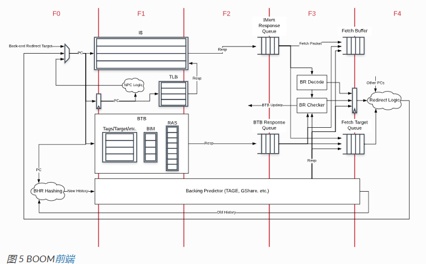

# 前端

可以看到取值4个周期，然后他的ICache不支持跨行读取，而且是阻塞性的Cache，

## 获取压缩指令

前端返回[fetchWidth](https://docs.boom-core.org/en/latest/sections/terminology.html#term-fetch-width) *16 bits的指令包，然后在F3取出指令然后送入Fetch buffer，F3跟踪最后一个指令包的16b、PC和指令边界。这些位与当前指令包合并，并扩展为fetchWidth *32位，用于排队到fetch缓冲区。预先编码决定指令包中每条指令的起始地址，并为指令包缓冲区屏蔽指令包。
Fetch Buffer现在在存储到内存时压缩掉无效或不对齐的指令。

The Fetch Buffer
来自i-cache的Fetch Packet被放入Fetch Buffer，Fetch Buffer将Front-End取指和Back-End执行分离。Fetch Buffer是参数化的，大小可变，并且可以切换是否以flow-through queue实现。

The Fetch Target Queue
Fetch Target Queue保存从i-cache接收的PC以及与该地址关联的分支预测信息，供流水线执行UOP时参考。ROB在指令被commit时将其出队，并在流水线重定向/执行错误时update。
f3阶段还有其他的：
