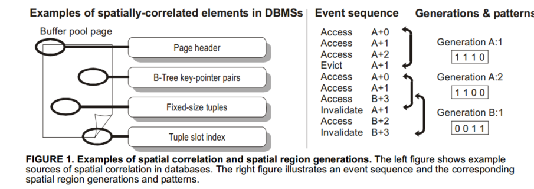
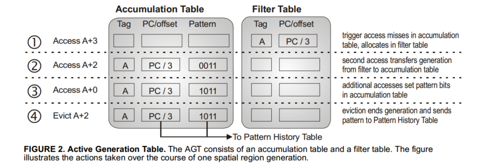
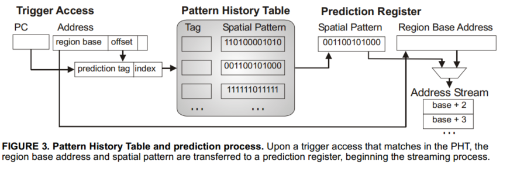
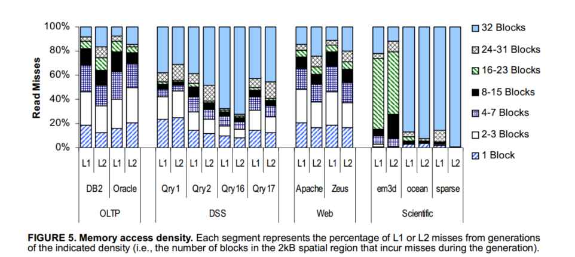
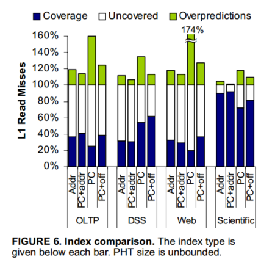
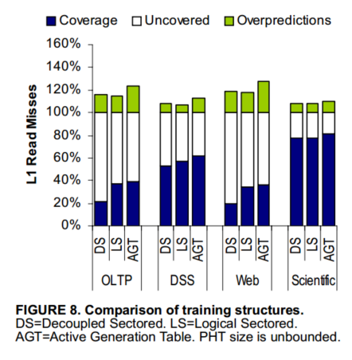

# 摘要

识别编码相关的空间访问模式，然后将这些块预取到Cache

# 介绍

首先得出结论：增加并行性和隐藏访问延迟才是提高服务器性能的关键，商业程序使用重复布局和访问模式的数据结构，例如数据块缓存池页面，或者网络数据包头。当程序访问数据集，访问数据的偏移会出现重复模式，但这些访问通常不连续，并且stride不一，我们使用空间相关性而不思空间局部性来描述访问之间的关系

    SMS可以减少多处理器服务器的主缓存缺失和片外缺失，他利用重复访问模式来预测并预取

这份工作的特点：

1. 高效的空间相关性预测：预测商业负载访问流不需要基于地址的相关性。SMS利用代码和访问模式的相关性来预测模式，甚至是之前没访问的地址，SMS提供的预测覆盖率是其他基于地址的4倍
2. 精确跟踪空间相关性：以前的缓存耦合结构观察空间相关性是次优的，比如交错的访问模式，之前的检测会引起冲突，我们提出解耦结构，可以识别更少更密集的模式，将预测器存储需求减半
3. 增加性能：主要讲了SMS在商业负载的优秀

之后第二节描述SMS，第三节给出硬件细节，第四节评估性能，第五节讨论相关工作

# Spatial Memory Streaming

在选择Cache block，设计者在各种因素中取出最优解，通常最佳的缓存块大小牺牲了利用密集数据结构的空间局部性，以避稀疏结构带来的过多带宽开销，对于简单的数据结构，如数组，空间关系可以通过简单的预取实现，如stride prefetching

商业负载访问模式较为复杂，不适合用 simple prefetching or streaming schemes，然而，这些应用程序中的数据结构经常显示缓存块之间的空间关系。例如，在数据库中，缓冲池中的页面共享公共结构元素，例如页头中的日志序列号和指示页脚中元组偏移量的槽索引，这些元素总是在扫描/修改页面之前被访问。在web服务器中，包头和包尾具有任意复杂但固定的结构。图1（左）显示了更多的示例。尽管这些结构中的访问可能是不连续的，但它们在相对地址中仍然表现出重复的模式。我们称这些访问之间的关系为**空间相关性**

SMS在运行时提取空间相关访问模式，并使用这些模式预测，他在可用带宽和资源允许情况尽快将预测的缓存块放入Cache，从而增加内存并行性并隐藏低级缓存和片外访存延迟

## Spatial Patterns and Generations

我们形式化了空间相关性的概念，类似于先前的空间足迹研究[4,17]。我们将空间区域定义为系统地址空间中固定大小的部分，由多个连续的缓存块组成。A spatial region generation is the time interval over which SMS records accesses within a spatial region，我们把第一次访问这个空间区域称为触发访问，空间模式是表示在a spatial region generation期间访问区域的blocks集合的位向量？？？

定义a spatial region generation精确间隔会显著影响空间格局的精度和覆盖范围，a spatial region generation必须定义以确保，当SMS流在未来触发访问时进入缓存，没有预测的块在使用前被驱除或无效，

因此，我们选择从触发访问到在生成期间访问的任何块通过替换或失效从处理器的主缓存中删除的间隔。对该区域中任何块的后续访问都是对新一代的触发访问。

此定义确保在生成过程中访问的块集同时存在于缓存中。

## Identifying Recurring Spatial Patterns

在触发访问时，SMS预测区域内相关性块子集，于是其关键问题就是找到一个与重复出现的空间模式强相关的预测指数

空间相关性由于数据结构布局和访问模式重复和规律性产生，例如聚合的几个变量经常被一起访问，因此出现空间相关性，**这种情况，空间模式与触发器访问地址相关**，地址标识数据结构，还有一种就是数据结构遍历重复出现或者具有规则结构，在这种情况，空间模式将与执行遍历的代码（pc）相关联，文献中研究了多种预测指标，先前的研究发现当相关表存储无界？？，结合地址和PC构建索引可以提供最准确的预测，也就是PC+addr indexing，当多个代码序列对同一数据结构进行不同遍历，预测器会生成不同的模式，然而，该预测索引需要随数据集大小缩放预测期存储，而且预测覆盖率会随着存储限制而急剧下降

对于SPEC CPU 2000程序，PC+addr可以通过pc+a spatial region offset实现，这个偏移是cache block中与空间区域起始位置的相对地址，也就是相当于这个区域的哪个block，这个偏移允许预测器区分由相同代码片段生成的重复模式，这些重复模式不同支出就是他们相对空间区域边界对其，大大减少预测表存储需求，applications have far fewer distinct miss PCs than miss addresses.

我们观察到这种索引，除了节省内存，还可以消除cold misses，当代码序列在大型数据集重复相同的访问模式，访问序列刚开始时学习的PC相关空间模式为以前从未访问的数据提供准确预测。Database scan and join operations, which dominate the execution of decision support queries 包含着只访问数据以此的唱重复访问模式，这些应用适合这种index方式

# 设计

(终于到自己的SMS设计了)

我们的设计目标是多处理器环境下的高性能商业服务器应用程序，区别：之前的设计针对**decoupled sectored** [22] or **sub-blocked caches.**

预测和缓存集成简化硬件设计，因为空间区域访问的结构可以2和sub-blocks的tag集成，然而，不同空间区域交错访问导致标签冲突，桃枝空间区域碎片化1，降低准确性，所以SMS不使用子块

他包括两个结构

> The pattern history table stores previously-observed spatial patterns, and is accessed at the start of each spatial region generation to predict the pattern of future accesses.

## Observing Spatial Patterns

SMS通过记录在AGT空间区域生成过程中访问的块来学习空间模式，当空间区域生成开始时，SMS在AGT分配一个条目，当cache block被访问，更新AGT记录的模式，当eviction/invalidation of any block accessed during the generation)，AGT将空间模式转移到PHT，然后释放条目

实际AGT有两个内容表，积累表和过滤表，减少搜索难度和总体大小，AGT处理L1数据访问，所以两个表必须都能匹配数据访问带宽

空间模式记录在累积表，累计表条目由空间区域标记来标记，即区域及地址高位，每个条目存储触发访问的PC和空间区域偏移量，以及指示在生成期间访问了哪些块的空间模式位向量

新的空间区域最初在过滤表，过滤表记录tag，pc和offset，用于在当次只有一次访问的空间区域，有很少的区域永远不会访问第二个快，预测这些没有好处，因为唯一的访问是触发访问，将这些限制在过滤表，减少了累计表的空间占用

上图描述了AGT详细操作，每个L1访问，首先搜索累计表，如果匹配，设置所访问块的空间模式位，否则，在筛选表找，如果没找到，这次访问就是触发访问，并在筛选表重新分配条目，如果在筛选表匹配，则比较偏移，如果不同，该快是区域访问的第二个快，将这个条目移到累计表，对该区域其他访问将在模式中设置相应位，这个位代表一个区域有几个block，当有的快被驱除或无效，则结束生成，这时在过滤表和累积表搜索标签，过滤表的条目将被抛弃，累积表的放入模式历史表，如果其中一个表满了，选择一个表项，终止生成，即，从过滤表中删除该表项或从累积表转移到模式历史表中

## Predicting Spatial Patterns

SMS使用模式历史表对空间模式进行存储，并预测在每个区域将访问块的模式，PHT实现和预测如下，其被组织为类似cache的组相连结构，其由预测索引访问，这个索引是PC和空间区域偏移组成，PHT每个条目存储AGT积累的访问模式

在触发访问是,SMS查询PHT来预测访问哪些块，如果找到一个条目，空间区域的基地址和空间模式将被复制到几个预测寄存器的一个，当SMS将模式预测的每个块传输到主缓存，他会清除预测寄存器的位，当预测寄存器整个模式被清除，寄存器释放，如果多个预测寄存器活动，SMS轮训操作，这个流请求类似于缓存一致性协议的读请求

# 结果

## **访问密度**

## indexing

名词：**覆盖率**表示通过SMS消除的L1读错误的比例。

过度预测表示在取出或无效前已获取但未使用的块，也就是一些无用的预取

在OLTP和web应用，大多数空间相关访问都来自频繁访问的代码序列和数据结构，因此数据地址和PC都和空间模式相关，所以除了PC寻址，其他的覆盖率相似，PC不准确，他不能区分相同代码对不同数据结构的访问模式，PC+偏移索引可以根据空间区域偏移量来区分模式，足以捕捉到常见的情况

而DSS基于程序上下文，PC和PC+off较好

对于科学应用，pc+off接近pc+addr

pc+off的第二个优点就是：他的存储需求与代码大小成正比而不是数据集大小，

## 4.3. Decoupled Training

训练十分重要，过早终止空间区域生成，可能导致PHT被污染

可以看到AGT覆盖率最高

## 4.4. Spatial Region Size

> Choosing a spatial region size involves a tradeoff between coverage and storage requirements.

## 4.5. Active Generation Table

a 32-entry filter table and a 64-entry accumulation table are sufficient.
