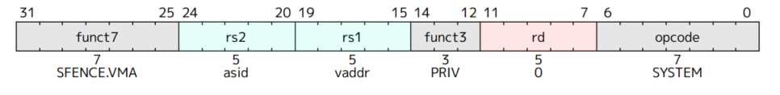

首先将a=satp.ppnxPAGESIZZE,让i=LEVELS-1,SV32是PAGESIZE=4k,LEV=2,有效的模式为S和U,然后pte就是a+va.vpn[i]×PTESIZE.(PTESIZE=4 for SV32)(为什么要xPTEsize呢,vpn存储的是表项的个数,乘size才会变为地址),然后会进行PMP和PMA检查,如果PTE有效,且R=0,X=0这个是指向下一个节点的指针,i=i-1然后a=pte.ppn×PAGESIZE ,接着寻址下一个页表的PTE,如果R=1,X=1,就说明叶子PTE找到了,然后进行PMP  

如果i>0且pte.ppn[i-1:0]≠0,这个是一个superpage并且没有对齐

然后翻译完成:

地址:pa.pgoff = va.pgoff.

如果i>0,这就是一个superpage翻译,pa.ppn[i-1:0] = va.vpn[i-1:0]

pa.ppn[LEVELS-1:i] = pte.ppn[LEVELS-1:i].

**SFENCE.VMA**

当rs1=x0并且rs2=x0时，将刷新TLB所有表项。
当rs1!=x0并且rs2=x0时，将刷新TLB中虚拟页号与rs1中储存的虚拟页号相等的表项。
当rs1=x0并且rs2!=x0时，将刷新TLB中ASID与rs2中储存的ASID相等的表项。
当rs1!=x0并且rs2!=x0时，将刷新TLB中虚拟页号与rs1中储存的虚拟页号相等，并且ASID与rs2中储存的ASID相等的表项。
