# 1. 官方的adder例子

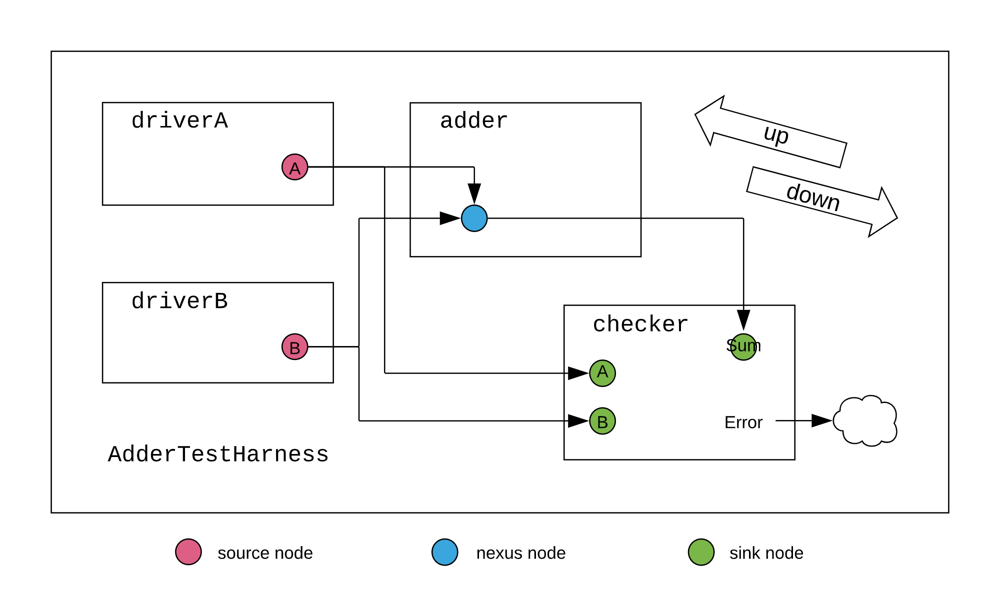

**首先定义参数**

```
case class UpwardParam(width: Int)
case class DownwardParam(width: Int)
case class EdgeParam(width: Int)

```

也即是INT,

**之后实现节点**

```
object AdderNodeImp extends SimpleNodeImp[DownwardParam, UpwardParam, EdgeParam, UInt] {
  def edge(pd: DownwardParam, pu: UpwardParam, p: Parameters, sourceInfo: SourceInfo) = {
    if (pd.width < pu.width) EdgeParam(pd.width) else EdgeParam(pu.width)
  }
  def bundle(e: EdgeParam) = UInt(e.width.W)
  def render(e: EdgeParam) = RenderedEdge("blue", s"width = ${e.width}")
}
```

这个edge的意思就是去协商向上传的参数与向下传的参数,最终取最小值,然后bundle是根据协商参数创建数据类型,

然后就是节点,节点主要有SourceNode,SinkNode和NexusNode,由于 `SourceNode`只沿向外边生成向下流动的参数，节点实现和之前一样。对 `AdderDriverNode`而言，类型为 `Seq[DownwardParam]`的 `widths`表示初始化该节点（`AdderDriver`）的模块时输出的数据宽度，这里使用 `Seq`是因为每个节点可能驱动多个输出，在这个例子中，每个节点会连接到加法器和monitor。SinkNode同理

最后就是Nexus节点,

加法器节点接收两个 `AdderDriverNode`的输入，并把输出传递给monitor，该节点为 `NexusNode`。`dFn`将向内边传来的向下的参数，映射到向外边的向下的参数，`uFn`将向外边的向上的参数，映射到向内边的向上的参数。

(内边可以理解为传入的参数,外边可以理解为向外传的参数)

```
class AdderDriverNode(widths: Seq[DownwardParam])(implicit valName: ValName)
  extends SourceNode(AdderNodeImp)(widths)

/** node for [[AdderMonitor]] (sink) */
class AdderMonitorNode(width: UpwardParam)(implicit valName: ValName)
  extends SinkNode(AdderNodeImp)(Seq(width))

/** node for [[Adder]] (nexus) */
class AdderNode(dFn: Seq[DownwardParam] => DownwardParam,
                uFn: Seq[UpwardParam] => UpwardParam)(implicit valName: ValName)
  extends NexusNode(AdderNodeImp)(dFn, uFn)
```

这个里面有两个模板匹配,然后最终传入的AdderNode的值为(dps和ups的head),最后将输入累加

```
class Adder(implicit p: Parameters) extends LazyModule {
  val node = new AdderNode (
    { case dps: Seq[DownwardParam] =>
      require(dps.forall(dp => dp.width == dps.head.width), "inward, downward adder widths must be equivalent")
      dps.head
    },
    { case ups: Seq[UpwardParam] =>
      require(ups.forall(up => up.width == ups.head.width), "outward, upward adder widths must be equivalent")
      ups.head
    }
  )
  lazy val module = new LazyModuleImp(this) {
    require(node.in.size >= 2)
    node.out.head._1 := node.in.unzip._1.reduce(_ + _)
  }

  override lazy val desiredName = "Adder"
}
```

主要就是设置numoutputs个驱动节点,然后给每个节点分配随机值

```

/** driver (source)
  * drives one random number on multiple outputs */
class AdderDriver(width: Int, numOutputs: Int)(implicit p: Parameters) extends LazyModule {
  val node = new AdderDriverNode(Seq.fill(numOutputs)(DownwardParam(width)))

  lazy val module = new LazyModuleImp(this) {
    // check that node parameters converge after negotiation
    val negotiatedWidths = node.edges.out.map(_.width)
    require(negotiatedWidths.forall(_ == negotiatedWidths.head), "outputs must all have agreed on same width")
    val finalWidth = negotiatedWidths.head

    // generate random addend (notice the use of the negotiated width)
    val randomAddend = FibonacciLFSR.maxPeriod(finalWidth)

    // drive signals
    node.out.foreach { case (addend, _) => addend := randomAddend }
  }

  override lazy val desiredName = "AdderDriver"
}
```

主要就是设置numoperands个监视节点,和一个adder节点,然后对比nodesum节点和nodeseq节点值的区别,送出error

```
class AdderMonitor(width: Int, numOperands: Int)(implicit p: Parameters) extends LazyModule {
  val nodeSeq = Seq.fill(numOperands) { new AdderMonitorNode(UpwardParam(width)) }
  val nodeSum = new AdderMonitorNode(UpwardParam(width))

  lazy val module = new LazyModuleImp(this) {
    val io = IO(new Bundle {
      val error = Output(Bool())
    })

    // print operation
    printf(nodeSeq.map(node => p"${node.in.head._1}").reduce(_ + p" + " + _) + p" = ${nodeSum.in.head._1}")

    // basic correctness checking
    io.error := nodeSum.in.head._1 =/= nodeSeq.map(_.in.head._1).reduce(_ + _)
  }

  override lazy val desiredName = "AdderMonitor"
}
```

最后就是顶层,顶层就是通过高阶函数将每个节点链接起来

```
class AdderTestHarness()(implicit p: Parameters) extends LazyModule {
  val numOperands = 2
  val adder = LazyModule(new Adder)
  // 8 will be the downward-traveling widths from our drivers
  val drivers = Seq.fill(numOperands) { LazyModule(new AdderDriver(width = 8, numOutputs = 2)) }
  // 4 will be the upward-traveling width from our monitor
  val monitor = LazyModule(new AdderMonitor(width = 4, numOperands = numOperands))

  // create edges via binding operators between nodes in order to define a complete graph
  drivers.foreach{ driver => adder.node := driver.node }

  drivers.zip(monitor.nodeSeq).foreach { case (driver, monitorNode) => monitorNode := driver.node }
  monitor.nodeSum := adder.node

  lazy val module = new LazyModuleImp(this) {
    // when(monitor.module.io.error) {
    //   printf("something went wrong")
    // }
  }

  override lazy val desiredName = "AdderTestHarness"
}
```

# 2. 根据rocketchip 搭建一个简单的SOC框架(基于ysyxSoC)

首先我们需要包含freechip库,有两种方法,1.直接从云端下载,2.直接导入本地的库,本实验选择第二种,基于ysyxSoC的build.sc来创建自己的sc文件,导入成功后就可以进行自己的SoC搭建

我们的SoC框架如下所示

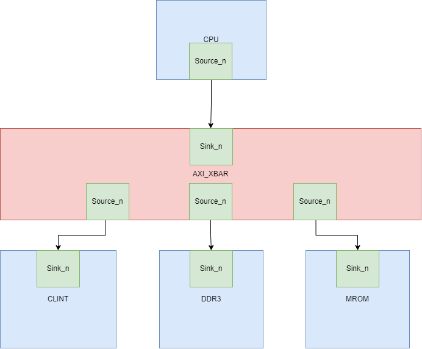

也就是我们CPU需要一个AXI_master节点,clint,SDRAM和MROM各自需要一个AXI_slave节点,然后AXI_XBAR继承于NexusNode,可支持多个输入节点和多个输出节点

然后设备的地址空间安排如下:

| 设备  | 地址空间                |
| ----- | ----------------------- |
| clint | 0x1000_0000-0x1000_ffff |
| SDRAM | 0x8000_0000-0x9fff_ffff |
| MROM  | 0x2000_0000-0x2000_ffff |

首先创建clint的slave节点

```
class AXI4MyCLINT(address: Seq[AddressSet])(implicit p: Parameters) extends LazyModule {
  val beatBytes = 4
  val node = AXI4SlaveNode(Seq(AXI4SlavePortParameters(
    Seq(AXI4SlaveParameters(
        address       = address,
        executable    = true,
        supportsWrite = TransferSizes(1, beatBytes),
        supportsRead  = TransferSizes(1, beatBytes),
        interleavedId = Some(0))
    ),
    beatBytes  = beatBytes)))

  lazy val module = new Impl
  class Impl extends LazyModuleImp(this) {
  }
}
```

可以看到我们首先创建了slvae节点，这个节点里面有一个TransferSizes，来揭示最多可以传多少笔数据，这里是按照四笔来说的，然后在之后的LazyModuleImp有具体的实现，我们可以根据传入的node的信号的地址来读写相应的寄存器，然后SDRAM和MROM比较类似，以SDRAM为主要讲解

```
class AXI4MySDRAM(address: Seq[AddressSet])(implicit p: Parameters) extends LazyModule {
  val beatBytes = 4
  val node = AXI4SlaveNode(Seq(AXI4SlavePortParameters(
    Seq(AXI4SlaveParameters(
        address       = address,
        executable    = true,
        supportsWrite = TransferSizes(1, beatBytes),
        supportsRead  = TransferSizes(1, beatBytes),
        interleavedId = Some(0))
    ),
    beatBytes  = beatBytes)))

  lazy val module = new Impl
  class Impl extends LazyModuleImp(this) {
    val (in, _) = node.in(0)
    val sdram_bundle = IO(new SDRAMIO)

    val msdram = Module(new sdram_top_axi)
    msdram.io.clock := clock
    msdram.io.reset := reset.asBool
    msdram.io.in <> in
    sdram_bundle <> msdram.io.sdram
  }
}
```

SDRAM仍然是先创建slave节点，然后LazyModuleImp中将节点连接到msdram的输入端，这个模块是一个黑盒，这地方的好处就是一般sdram和DDR都使用IP,而现在的IP一般都是verilog,所以包裹一层黑盒

```
class MySoC(implicit p: Parameters) extends LazyModule {
  val xbar = AXI4Xbar()
  val cpu = LazyModule(new CPU(idBits = ChipLinkParam.idBits))
  val lmrom = LazyModule(new AXI4MROM(AddressSet.misaligned(0x20000000, 0x10000)))
  val lclint = LazyModule(new AXI4MyCLINT(AddressSet.misaligned(0x10000000, 0x10000)))
  val sdramAddressSet = AddressSet.misaligned(0x80000000L, 0x2000000)
  val lsdram_axi = Some(LazyModule(new AXI4MySDRAM(sdramAddressSet))) 

  List(lsdram_axi.get.node ,lmrom.node, lclint.node).map(_ := xbar)
  xbar := cpu.masterNode
  
  override lazy val module = new Impl
  class Impl extends LazyModuleImp(this) with DontTouch {

    cpu.module.reset := SynchronizerShiftReg(reset.asBool, 10) || reset.asBool
    cpu.module.slave := DontCare
    val intr_from_chipSlave = IO(Input(Bool()))
    cpu.module.interrupt := intr_from_chipSlave
    val sdramBundle = lsdram_axi.get.module.sdram_bundle
    val sdram = IO(chiselTypeOf(sdramBundle))
    sdram <> sdramBundle
  }
}
```

首先調用xbar创建XBAR,然后为每个设备分配地址空间,最后连线,也就是将slave node和xbar连线,cpu的master node 和xbar连线,之后就是实现部分,主要也是连线逻辑,然后就结束了整个SOC的创建


最后是生成的代码的一部分,可以看到正确链接

# 3.rocketchip 的AXIDelayer解析

```scala
  val node = AXI4AdapterNode()
  require (0.0 <= q && q < 1)
```

首先可以看到他创建了一个AXI4AdapterNode,这个主要就是master原封不动传进来,slave也是原封不动传进来（只可改变参数，但边不可改变）,然后q就是请求延迟的概率

然后在lazymodule定义了一个feed函数

```scala
    def feed[T <: Data](sink: IrrevocableIO[T], source: IrrevocableIO[T], noise: T): Unit = {
      // irrevocable requires that we not lower valid
      val hold = RegInit(false.B)
      when (sink.valid)  { hold := true.B }
      when (sink.fire) { hold := false.B }

      val allow = hold || ((q * 65535.0).toInt).U <= LFSRNoiseMaker(16, source.valid)
      sink.valid := source.valid && allow
      source.ready := sink.ready && allow
      sink.bits := source.bits
      when (!sink.valid) { sink.bits := noise }
    }
```

这个函数就是通过allow来截断sink和source的vaild和ready信号,allow主要有两个信号,一个是hold,另一个是比较电路,假设我们第一次使用这个,那么hold必然为false,只能通过后面的比较电路来决定allow,如果后面的也为false,则会引入噪音,直到后面条件满足,这时控制信号就会通,但是bits仍然是有噪声的

```
    def anoise[T <: AXI4BundleA](bits: T): Unit = {
      bits.id    := LFSRNoiseMaker(bits.params.idBits)
      bits.addr  := LFSRNoiseMaker(bits.params.addrBits)
      bits.len   := LFSRNoiseMaker(bits.params.lenBits)
      bits.size  := LFSRNoiseMaker(bits.params.sizeBits)
      bits.burst := LFSRNoiseMaker(bits.params.burstBits)
      bits.lock  := LFSRNoiseMaker(bits.params.lockBits)
      bits.cache := LFSRNoiseMaker(bits.params.cacheBits)
      bits.prot  := LFSRNoiseMaker(bits.params.protBits)
      bits.qos   := LFSRNoiseMaker(bits.params.qosBits)
    }
```

这个就是给ar和aw通道加noise

```
   (node.in zip node.out) foreach { case ((in, edgeIn), (out, edgeOut)) =>
      val arnoise = Wire(new AXI4BundleAR(edgeIn.bundle))
      val awnoise = Wire(new AXI4BundleAW(edgeIn.bundle))
      val wnoise  = Wire(new  AXI4BundleW(edgeIn.bundle))
      val rnoise  = Wire(new  AXI4BundleR(edgeIn.bundle))
      val bnoise  = Wire(new  AXI4BundleB(edgeIn.bundle))

      arnoise := DontCare
      awnoise := DontCare
      wnoise := DontCare
      rnoise := DontCare
      bnoise := DontCare

      anoise(arnoise)
      anoise(awnoise)

      wnoise.data := LFSRNoiseMaker(wnoise.params.dataBits)
      wnoise.strb := LFSRNoiseMaker(wnoise.params.dataBits/8)
      wnoise.last := LFSRNoiseMaker(1)(0)

      rnoise.id   := LFSRNoiseMaker(rnoise.params.idBits)
      rnoise.data := LFSRNoiseMaker(rnoise.params.dataBits)
      rnoise.resp := LFSRNoiseMaker(rnoise.params.respBits)
      rnoise.last := LFSRNoiseMaker(1)(0)

      bnoise.id   := LFSRNoiseMaker(bnoise.params.idBits)
      bnoise.resp := LFSRNoiseMaker(bnoise.params.respBits)

      feed(out.ar, in.ar, arnoise)
      feed(out.aw, in.aw, awnoise)
      feed(out.w,  in.w,   wnoise)
      feed(in.b,   out.b,  bnoise)
      feed(in.r,   out.r,  rnoise)
```

这一堆主要就是将node in和out的信号和参数分开,然后为w,r,b通道加噪声,最后将这些噪声通过feed传到总线,其实这个模块就是去延迟vaild和ready,在延迟期间bits是noise,在sink为vaild期间就是source的bit

# rocket ICache

一个典型的rocket chip结构

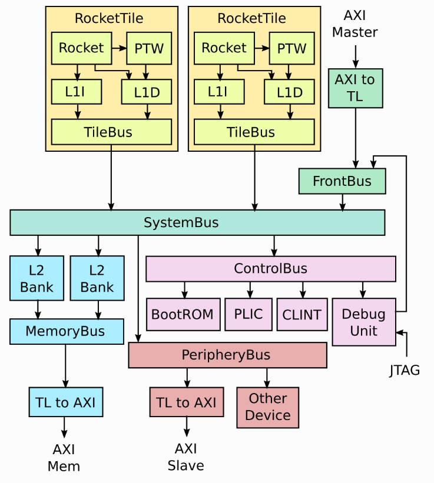

```
  val (tl_out, edge_out) = outer.masterNode.out(0)
```

在看rocket代码中有一个这个语句，masternode的out方法返回了两个变量，一个bundle，另一个是边的参数，这里是outward edge参数

深入挖掘out

```
  def out: Seq[(BO, EO)] = {
    require(
      instantiated,
      s"$name.out should not be called until after instantiation of its parent LazyModule.module has begun"
    )
    bundleOut.zip(edgesOut)
  }
```

发现在diplomacy库中的MixedNode（所有节点都继承了这个类）定义了这个out方法，其注释为将outward的边参数和端口gather起来，只能在LazyModuleImp中使用和访问

```
abstract class MixedNode[DI, UI, EI, BI <: Data, DO, UO, EO, BO <: Data](
  val inner: InwardNodeImp[DI, UI, EI, BI],
  val outer: OutwardNodeImp[DO, UO, EO, BO]
)

```

MixedNode是一个抽象类，只能被继承或作为基类，然后接下来讲解他的参数

DI:从上游传入的Downward-flowing parameters，对于一个InwardNode节点，他的参数由OutwardNode觉得，他可以多个源连接到一起，所以参数是Seq类型

UI:向上传的参数，一般为sink的参数，，对于InwardNode，参数由节点自身决定

EI:描述内边连接的参数，通常是根据协议对sink的一系列例化

BI:连接内边的Bundle type，他是这个sink接口的硬件接口代表真实硬件

DO:向外边传的参数，通常是source的参数对于一个OutwardNode，这个参数由自己决定

UO:外边传入的参数，通常是描述sink节点的参数，对于一个OutwardNode 这个由连接的inwardNode决定，由于这个可以被多个sinks连接，所以他是seq的

EO:描述外边的连接，通常是source节点的特殊的参数

BO:输出IO

接下来回归原题,可以看到有一个edge_out,这个变量有很多tilelink的方法,如检查是否是req等,是否含有data,但AXI的edge就没u,

# rocket ALU

首先ALU继承于下面的抽象类

```
abstract class AbstractALU(implicit p: Parameters) extends CoreModule()(p) {
  val io = IO(new Bundle {
    val dw = Input(UInt(SZ_DW.W))
    val fn = Input(UInt(SZ_ALU_FN.W))
    val in2 = Input(UInt(xLen.W))
    val in1 = Input(UInt(xLen.W))
    val out = Output(UInt(xLen.W))
    val adder_out = Output(UInt(xLen.W))
    val cmp_out = Output(Bool())
  })
}
```

首先dw的含义就是是32位还是64位

重点讲解一下移位操作

```
  // SLL, SRL, SRA
  val (shamt, shin_r) =
    if (xLen == 32) (io.in2(4,0), io.in1)
    else {
      require(xLen == 64)
      val shin_hi_32 = Fill(32, isSub(io.fn) && io.in1(31))
      val shin_hi = Mux(io.dw === DW_64, io.in1(63,32), shin_hi_32)
      val shamt = Cat(io.in2(5) & (io.dw === DW_64), io.in2(4,0))
      (shamt, Cat(shin_hi, io.in1(31,0)))
    }
  val shin = Mux(shiftReverse(io.fn), Reverse(shin_r), shin_r)
  val shout_r = (Cat(isSub(io.fn) & shin(xLen-1), shin).asSInt >> shamt)(xLen-1,0)
  val shout_l = Reverse(shout_r)
  val shout = Mux(io.fn === FN_SR || io.fn === FN_SRA || io.fn === FN_BEXT, shout_r, 0.U) |
              Mux(io.fn === FN_SL,                                          shout_l, 0.U)

```

shamt为移位的位数,我们假设是RV32,shin_r是被移位的数字,shin如果是左移,就将shin_r翻转,如果右移,则不变,shout_r检测是逻辑移位还是算数移位,如果是逻辑移位isSUB为false,也就是最高位符号位为0,,然后转换为有符号数,右移shamt,最后取出低32位,如果是verilog可以设置一个shift_mask(~(32'hffffffff)>>shamt),然后将移位前的符号位和这个mask&,最后或一下移位结果就是算数右移,

为什么逻辑左移可以转换为逻辑右移,将被移位的数字翻转后,最高位变为最低位,我们右移结果,翻转过来就是左移结果

然后就是结果输出模块s

```
  val out = MuxLookup(io.fn, shift_logic_cond)(Seq(
    FN_ADD -> io.adder_out,
    FN_SUB -> io.adder_out
  ) ++ (if (coreParams.useZbb) Seq(
    FN_UNARY -> unary,
    FN_MAX -> maxmin_out,
    FN_MIN -> maxmin_out,
    FN_MAXU -> maxmin_out,
    FN_MINU -> maxmin_out,
    FN_ROL -> rotout,
    FN_ROR -> rotout,
  ) else Nil))
```

这个表默认是shift_logic_cond,然后根据FN类型选择(这里还加入了Zbb扩展)

# rocket DecodeLogic

首先这个逻辑里面定义了两个方法

```
  // TODO This should be a method on BitPat
  private def hasDontCare(bp: BitPat): Boolean = bp.mask.bitCount != bp.width
  // Pads BitPats that are safe to pad (no don't cares), errors otherwise
  private def padBP(bp: BitPat, width: Int): BitPat = {
    if (bp.width == width) bp
    else {
      require(!hasDontCare(bp), s"Cannot pad '$bp' to '$width' bits because it has don't cares")
      val diff = width - bp.width
      require(diff > 0, s"Cannot pad '$bp' to '$width' because it is already '${bp.width}' bits wide!")
      BitPat(0.U(diff.W)) ## bp
    }
  }
```

其中hasDontCare是检查一个Bitpat是否有dontcare位,padBP是将一个bitpat格式的填充到width位

然后定义了好几个apply方法,这里只讲解rocketchip使用的

```
def apply(addr: UInt, default: Seq[BitPat], mappingIn: Iterable[(BitPat, Seq[BitPat])]): Seq[UInt] = {
    val nElts = default.size
    require(mappingIn.forall(_._2.size == nElts),
      s"All Seq[BitPat] must be of the same length, got $nElts vs. ${mappingIn.find(_._2.size != nElts).get}"
    )

    val elementsGrouped = mappingIn.map(_._2).transpose
    val elementWidths = elementsGrouped.zip(default).map { case (elts, default) =>
      (default :: elts.toList).map(_.getWidth).max
    }
    val resultWidth = elementWidths.sum

    val elementIndices = elementWidths.scan(resultWidth - 1) { case (l, r) => l - r }

    // All BitPats that correspond to a given element in the result must have the same width in the
    // chisel3 decoder. We will zero pad any BitPats that are too small so long as they dont have
    // any don't cares. If there are don't cares, it is an error and the user needs to pad the
    // BitPat themselves
    val defaultsPadded = default.zip(elementWidths).map { case (bp, w) => padBP(bp, w) }
    val mappingInPadded = mappingIn.map { case (in, elts) =>
      in -> elts.zip(elementWidths).map { case (bp, w) => padBP(bp, w) }
    }
    val decoded = apply(addr, defaultsPadded.reduce(_ ## _), mappingInPadded.map { case (in, out) => (in, out.reduce(_ ## _)) })

    elementIndices.zip(elementIndices.tail).map { case (msb, lsb) => decoded(msb, lsb + 1) }.toList
  }
```

可以看到他接受三个参数,返回一个seq,addr是要解码的数据,default是解码list的默认格式,rocket的格式为

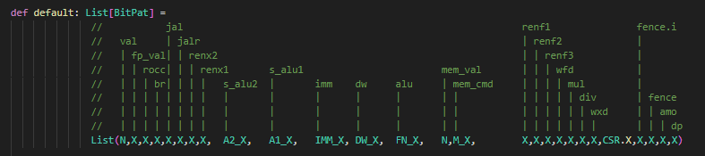

mappin就是传入的decode表


类似于这种

首先我们nElts就是得出这个列表的元素个数,然后一个assert来确保传入的map和default的元素个数一致,然后elementsGrouped将List的各个控制信号分开,这里使用了map(遍历每个元素)和transpose(将元素转置,这样第一个seq就是所有表的val,以此类推),

然后得出每个bitpat的大小,这个elementWidths也就是将default的元素和elementsGrouped配对,然后将default的元素附加到elementsGrouped上,最后算出每个bitpat的大小

resultWidth就是所有bitpat的大小,然后elementIndices就是每个bitpat大小的索引,也就是假如每个bitpat大小为[4,3,2],这个得出的就是[8,4,1,-1]

然后最后哪一行代码就是将上面这个数组转换为(8,5),(4,2),(1,0)在,这样通过decode生成bool信号,然后将这些信号生成list

总体来说,这个模块使用了很多scala的高阶函数:

map:将给定函数作用于每个元素

transpose:将list转置

scan:扫描元组的每个值,并将其进行之后的函数操作,有累积性,比如这里就是给定初值,然后减去其他元素得到新的数组

zip:将两个元素组成一个元组

reduce:将元组的每个元素做相应操作,具有累积性

最后DecodeLogic实现的就是将输入的addr的每部分解码,然后得到解码的信号

# Rocketchip PMA（Physical Memory Attribute）

PMA是一个SOC系统的固有属性,所以直接将其设为硬件实现,PMA是软件可读的,

在平台支持pma的动态重新配置的地方，将提供一个接口，通过将请求传递给能够正确重新配置平台的机器模式驱动程序来设置属性。

例如，在某些内存区域上切换可缓存性属性可能涉及特定于平台的操作，例如缓存刷新，这些操作仅对机器模式可用。

## 3.6.1. 主内存、I/O和空闲区域

给定内存地址范围最重要的特征是它是否符合规则内存，或I/O设备，或为空闲。常规的主存需要有许多属性，如下所述，而I/O设备可以有更广泛的属性范围。不适合常规主存的内存区域，例如设备刮擦板ram，被归类为I/O区域。空区域也被归类为I/O区域，但具有指定不支持访问的属性。

## 3.6.2. Supported Access Type PMAs

访问类型指定支持哪些访问宽度（从8位字节到长多字突发），以及每个访问宽度是否支持不对齐的访问。

> 注:虽然在RISC-V hart上运行的软件不能直接生成内存突发，但软件可能必须对DMA引擎进行编程以访问I/O设备，因此可能需要知道支持哪种访问大小。

主存区域始终支持连接设备所需的所有访问宽度的读写，并且可以指定是否支持读指令。

> 注:有些平台可能要求所有主存都支持指令读取。其他平台可能会禁止从某些主内存区域获取指令。

在某些情况下，访问主存的处理器或设备的设计可能支持其他宽度，但必须能够与主存支持的类型一起工作。

I/O区域可以指定支持哪些数据宽度的读、写或执行访问组合。

对于具有基于页面的虚拟内存的系统，I/O和内存区域可以指定支持哪些硬件页表读和硬件页表写的组合。

> 注:类unix操作系统通常要求所有可缓存的主内存都支持PTW。

## 3.6.3. Atomicity PMAs

原子性pma描述在此地址区域中支持哪些原子指令。对原子指令的支持分为两类：LR/SC和AMOs。有些平台可能要求所有可缓存的主存支持附加处理器所需的所有原子操作。

在AMOs中，有四个级别的支持：AMONone、amosswap、AMOLogical和AMOArithmetic。

AMONone表示不支持AMO操作。AMOSwap表示该地址范围内只支持AMOSwap指令。AMOLogical表示支持交换指令加上所有逻辑AMOs （amoand、amoor、amoxor）。“AMOArithmetic”表示支持所有的RISC-V AMOs。对于每个级别的支持，如果底层内存区域支持该宽度的读写，则支持给定宽度的自然对齐的AMOs。主存和I/O区域可能只支持处理器支持的原子操作的一个子集，或者不支持处理器支持的原子操作。

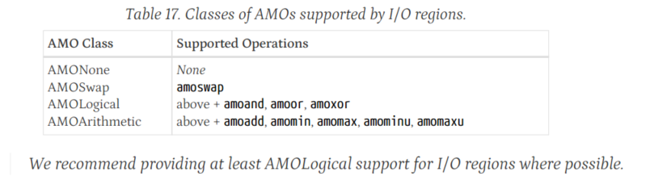

对于LR/SC，有三个级别的支持表示可保留性和可能性属性的组合：RsrvNone、RsrvNonEventual和RsrvEventual。RsrvNone不支持LR/SC操作（位置不可预留）。RsrvNonEventual表示支持这些操作（位置是可保留的），但没有非特权ISA规范中描述的最终成功保证。RsrvEventual表示支持这些操作，并提供最终成功的保证。

> 注:我们建议在可能的情况下为主内存区域提供RsrvEventual支持。
>
> 大多数I/O区域将不支持LR/SC访问，因为它们最方便地构建在缓存一致性方案之上，但有些区域可能支持RsrvNonEventual或RsrvEventual。
>
> 当LR/SC用于标记为RsrvNonEventual的内存位置时，软件应该提供在检测到缺乏进度时使用的替代回退机制。

## 3.6.4. Misaligned Atomicity Granule PMA

Misaligned原子性粒子PMA为失调原子性粒子提供了约束支持。这个PMA（如果存在）指定了不对齐原子颗粒的大小，即自然对齐的2次幂字节数。该PMA的特定支持值由MAGNN表示，例如，MAG16表示不对齐的原子性颗粒至少为16字节。

不对齐的原子性颗粒PMA仅适用于基本isa中定义的AMOs、load和store，以及F、D和Q扩展中定义的不超过MXLEN位的load和store。对于该集中的一条指令，如果所有被访问的字节都位于同一个未对齐的原子颗粒中，则该指令不会因为地址对齐而引发异常，并且该指令将仅出于rvwmo的目的而引发一个内存操作。，它将自动执行。

如果一个未对齐的AMO访问的区域没有指定未对齐的原子性颗粒PMA，或者不是所有访问的字节都位于同一个未对齐的原子性颗粒内，则会引发异常。

对于访问这样一个区域的常规加载和存储，或者并非所有访问的字节都位于同一原子性颗粒内，则会引发异常，或者继续访问，但不保证是原子性的。对于一些不对齐的访问，实现可能会引发访问错误异常，而不是地址不对齐异常，这表明trap处理程序不应该模拟该指令。

> LR/SC指令不受此PMA的影响，因此当不对齐时总是引发异常。向量内存访问也不受影响，因此即使包含在未对齐的原子性颗粒中，也可能以非原子方式执行。隐式访问类似

## 3.6.5. Memory-Ordering PMAs

为了按照FENCE指令和原子指令排序位进行排序，地址空间的区域被分类为主存或I/O。

一个hart对主存区域的访问不仅可以被其他hart观察到，还可以被其他能够在主存系统中发起请求的设备（例如，DMA引擎）观察到。

coherence主存区域总是具有RVWMO或RVTSO内存模型。

非coherence的主存区域有一个实现定义的内存模型。

一个hart对一个I/O区域的访问不仅可以被其他hart和总线控制设备观察到，而且可以被目标I/O设备观察到，并且I/O区域可以以宽松或强顺序访问。其他hart和总线主控设备通常以类似于RVWMO内存区域访问顺序的方式来观察对具有宽松顺序的I/O区域的访问，如本规范第1卷a .4.2节所讨论的那样。相比之下，对具有强顺序的I/O区域的访问通常由其他hart和总线控制设备按照程序顺序观察。

每个强有序I/O区域指定一个编号的排序通道，这是一种在不同I/O区域之间提供排序保证的机制。通道0仅用于表示点对点强排序，其中只有hart对单个关联I/O区域的访问是强排序的。

通道1用于跨所有I/O区域提供全局强排序。hart对与通道1相关联的任何I/O区域的任何访问只能被所有其他hart和I/O设备观察到以程序顺序发生，包括相对于hart对宽松I/O区域或具有不同通道号的强顺序I/O区域的访问。换句话说，对通道1中的区域的任何访问都相当于在该指令之前和之后执行一个栅栏io，io指令。

其他更大的通道号为通过该通道号跨具有相同通道号的任何区域的访问提供程序排序。

系统可能支持在每个内存区域上动态配置排序属性。

强排序可用于改进与遗留设备驱动程序代码的兼容性，或者在已知实现不会重新排序访问时，与插入显式排序指令相比，可以提高性能。

本地强排序（通道0）是强排序的默认形式，因为如果hart和I/O设备之间只有一条有序通信路径，则通常可以直接提供它。

通常，如果不同的强排序I/O区域共享相同的互连路径并且路径不重新排序请求，则它们可以共享相同的排序通道，而无需额外的排序硬件

## 3.6.6. Coherence and Cacheability PMAs

内存区域的可缓存性不应该影响该区域的软件视图，除非在其他pma中反映出差异，例如主存与I/O分类、内存排序、支持的访问和原子操作以及一致性。出于这个原因，我们将**可缓存性**视为仅由机器模式软件管理的平台级设置。

如果平台支持内存区域的可配置缓存设置，则特定于平台的机器模式例程将在必要时更改设置并刷新缓存，因此系统仅在可缓存设置之间的转换期间不一致。较低的特权级别不应该看到这个临时状态

一致性很容易提供一个共享内存区域，它不被任何代理缓存。这样一个区域的PMA将简单地表示它不应该缓存在私有或共享缓存中。

对于只读区域，一致性也很简单，可以由多个代理安全地缓存，而不需要缓存一致性方案。该区域的PMA将表明它可以被缓存，但不支持写操作。

一些读写区域可能只由单个代理访问，在这种情况下，它们可以由该代理私下缓存，而不需要一致性方案。这些区域的PMA将表明它们可以被缓存。数据也可以缓存在共享缓存中，因为其他代理不应该访问该区域。

如果代理可以缓存其他代理可以访问的读写区域，无论是缓存还是非缓存，都需要缓存一致性方案来避免使用过时的值。

在缺乏硬件缓存一致性的区域（硬件非一致性区域），缓存一致性可以完全在软件中实现，但众所周知，软件一致性方案难以正确实现，并且由于需要保守的软件定向缓存刷新，通常会对性能产生严重影响。硬件缓存一致性方案需要更复杂的硬件，并且由于缓存一致性探测可能会影响性能，但对软件来说是不可见的。

对于每个硬件缓存相干区域，PMA将指示该区域是相干的，如果系统有多个相干控制器，则指示使用哪个硬件相干控制器。对于某些系统，一致性控制器可能是一个外部共享缓存，它本身可以分层访问其他外部缓存一致性控制器。

平台中的大多数内存区域将与软件一致，因为它们将被固定为非缓存、只读、硬件缓存一致或仅由一个代理访问。

如果PMA表示不可缓存，那么对该区域的访问必须由内存本身满足，而不是由任何缓存满足。

对于具有可缓存性控制机制的实现，可能会出现程序无法访问当前驻留在缓存中的内存位置的情况。在这种情况下，必须忽略缓存的副本。防止这种约束是必要的去阻止高特权模式的推测缓存重新填充不会影响较少特权模式的不可缓存访问行为。

## 3.6.7. Idempotency PMAs

幂等pma描述对地址区域的读写是否幂等。假定主存储器区域是幂等的。对于I/O区域，读和写的幂等性可以分别指定（例如，读是幂等的，而写不是）。如果访问是非幂等的，即对任何读或写访问都有潜在的副作用，则必须避免推测性访问或冗余访问。

为了定义幂等pma，冗余访问对观察到的内存顺序的改变不被认为是副作用。

虽然硬件应始终设计为避免对标记为非幂等的内存区域进行投机或冗余访问，但也有必要确保软件或编译器优化不会生成对非幂等内存区域的虚假访问。

非幂等区域可能不支持不对齐访问。对这些区域的不对齐访问应该引发访问错误异常，而不是地址不对齐异常，这表明软件不应该使用多个较小的访问来模拟不对齐的访问，这可能会导致意想不到的副作用。

对于非幂等区域，隐式读写不能提前或推测地执行，除了以下例外情况。当执行非推测式隐式读操作时，允许实现在包含非推测式隐式读操作地址的自然对齐的2次幂区域内额外读取任何字节。此外，当执行非推测指令获取时，允许实现额外读取下一个自然对齐的相同大小的2次幂区域内的任何字节（该区域的地址取2XLEN模）。这些额外读取的结果可用于满足后续的早期或推测式隐式读取。这些自然对齐的2次幂区域的大小是由实现定义的，但是，对于具有基于页面的虚拟内存的系统，不能超过所支持的最小页面大小

译者注:这里描述的应该跟预取有关,允许预取特定字节的数据,地址得2的幂次对齐

# 3.7. Physical Memory Protection

为了支持安全处理和包含错误，需要限制运行在硬件上的软件可访问的物理地址。一个可选的物理内存保护（PMP）单元提供每台机器模式控制寄存器，允许为每个物理内存区域指定物理内存访问特权（读、写、执行）。PMP值与第3.6节中描述的PMA检查并行检查。

PMP访问控制设置的粒度是特定于平台的，但是标准PMP编码支持小至4字节的区域。某些区域的特权可以是硬连接的，例如，某些区域可能只在机器模式下可见，而在低特权层中不可见。

PMP检查区域:PMP检查应用于有效特权模式为访问S和U模式的指令读取和数据访问,

当mstatus中的MPRV位被设置，并且mstatus中的MPP字段包含S或u时，m模式下的数据访问也被应用于虚拟地址转换的页表访问，其有效特权模式为S。可选地，PMP检查还可以应用于m模式访问，在这种情况下，PMP寄存器本身被锁定，因此即使m模式软件也不能更改它们，直到hart被重置。实际上，PMP可以授予S和U模式权限（默认情况下没有），还可以从Mmode撤销权限（默认情况下具有完全权限）。

PMP违规总是被捕捉到精确异常

## 3.7.1. Physical Memory Protection CSRs

PMP表项由一个8位配置寄存器和一个mxlen位地址寄存器描述。

一些PMP设置还使用与前一个PMP项相关联的地址寄存器。最多支持64个PMP表项。实现可以实现0、16或64个PMP表项；编号最少的PMP表项必须首先实现。所有PMP CSR字段都是WARL，可以是只读零。PMP csr仅在m模式下可访问。

PMP配置寄存器被密集地打包到csr中，以最小化上下文切换时间。对于RV32, 16个csr， pmpcfg0-pmpcfg15，为64个PMP条目保留配置pmp0cfg-pmp63cfg，如图30所示。对于RV64, 8个偶数csr pmpcfg0、pmpcfg2、…、pmpcfg14保存64个PMP条目的配置，如图31所示。对于RV64，奇数配置寄存器pmpcfg1， pmpcfg3，…，pmpcfg15是非法的。

PMP地址寄存器是命名为pmpaddr0-pmpaddr63的csr。每个PMP地址寄存器为RV32编码34位物理地址的第33-2位，如图32所示。对于RV64，每个PMP地址寄存器编码56位物理地址的第55-2位，如图33所示。并非所有的物理地址位都可以实现，因此pmpaddr寄存器是WARL

> 注:章节10.3中描述的基于Sv32页面的虚拟内存方案支持RV32的34位物理地址，因此PMP方案必须支持RV32的大于XLEN的地址。第10.4节和10.5节中描述的Sv39和Sv48基于页面的虚拟内存方案支持56位物理地址空间，因此RV64 PMP地址寄存器施加了相同的限制。

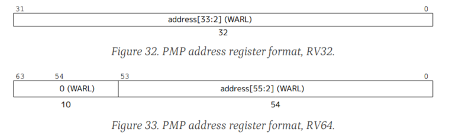

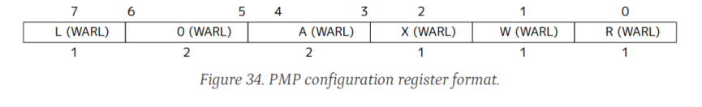

图34显示了PMP配置寄存器的布局。设置R、W和X位时，分别表示PMP项允许读、写和指令执行。当这些位中的一个被清除时，对应的访问类型被拒绝。R、W和X字段形成一个集合的WARL字段，其中保留R=0和W=1的组合。剩下的两个字段A和L将在下面的部分中描述。

尝试从不具有执行权限的PMP区域获取指令将引发指令访问错误异常。试图执行在没有读权限的情况下访问PMP区域内物理地址的加载或负载保留指令会引发加载访问错误异常。试图执行在没有写权限的情况下访问PMP区域内物理地址的存储、存储条件或AMO指令，将引发存储访问错误异常。

### 3.7.1.1. Address Matching

PMP表项配置寄存器中的A字段编码了相关联的PMP地址寄存器的地址匹配模式。这个字段的编码如表18所示。当A=0时，该PMP表项被禁用并且不匹配任何地址。支持另外两种地址匹配模式：自然对齐的2次幂区域（NAPOT），包括自然对齐的四字节区域（NA4）的特殊情况；以及任意范围的上边界（TOR）。这些模式支持四字节粒度

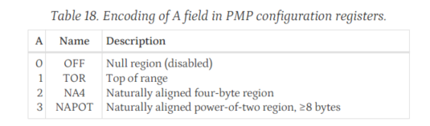

NAPOT范围使用相关地址寄存器的低阶位来编码范围的大小，如表19所示。检测连续1的数目

* 若 `pmpaddr`值为 `yyyy...yy01`，即连续1的个数为1，则该PMP entry所控制的地址空间为从 `yyyy...yy00`开始的16个字节

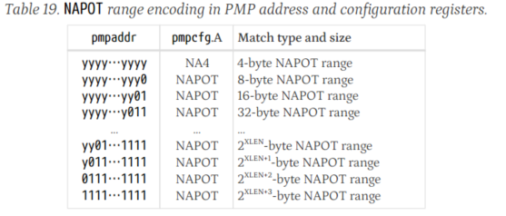

如果选择TOR，则关联的地址寄存器为地址范围的顶部，前面的PMP地址寄存器为地址范围的底部。如果PMP表项i的A字段设置为TOR，则该表项匹配任何地址y，使pmpaddri-1≤y<pmpaddri（与pmpcfgi-1的值无关）。如果PMP条目0的A字段设置为TOR，则使用0作为下界，因此它匹配任何地址y<pmpaddr0。

如果pmpaddri-1≥pmpaddri和pmpcfgi。A=TOR，则PMP表项i不匹配任何地址。

软件可以通过将0写入pmp0cfg，然后将所有1写入pmpaddr0，然后回读pmpaddr0来确定PMP粒度。如果G是最低有效位集的索引，则PMP粒度为2G+2字节。(NAPOT)

> 注意:这里的G是0在paddr的位置

如果当前的XLEN大于MXLEN，为了地址匹配的目的，PMP地址寄存器从MXLEN到XLEN位进行零扩展。

### 3.7.1.2. Locking and Privilege Mode

L位表示PMP表项被锁定。锁定的PMP表项一直处于锁定状态，直到hart被重置。如果PMP表项i被锁定，对pmppfg和pmpaddri的写入将被忽略。此外，如果PMP表项i被锁定并且PMP icfgA被设置为TOR，对pmpadri -1的写入将被忽略。

设置L位锁定PMP表项，即使A字段被设置为OFF。

除了锁定PMP表项外，L位表示是否对m模式访问强制R/W/X权限。当设置L位时，这些权限对所有特权模式强制执行。

当L位清除时，任何匹配PMP表项的m模式访问都将成功；R/W/X权限只适用于S模式和U模式。

### 3.7.1.3. Priority and Matching Logic

PMP表项的优先级是静态的。与访问的任何字节匹配的编号最低的PMP表项决定该访问是成功还是失败。匹配的PMP表项必须匹配访问的所有字节，否则访问失败，无论L、R、W和X位如何。例如，如果将PMP表项配置为匹配4字节范围0xC-0xF，那么假设PMP表项是匹配这些地址的最高优先级表项，那么对0x8-0xF范围的8字节访问将失败。

如果一个PMP表项匹配一次访问的所有字节，那么L、R、W和X位决定这次访问是成功还是失败。如果L位为空，且访问的特权模式为M，则表示访问成功。否则，如果设置了L位或访问的特权模式为S或U，则只有设置了与访问类型对应的R、W或X位，才能访问成功。

如果没有匹配m模式访问的PMP表项，则访问成功。如果没有匹配s模式或u模式访问的PMP表项，但至少实现了一个PMP表项，则访问失败。如果至少实现了一个PMP表项，但是所有PMP表项的A字段都被设置为OFF，那么所有s模式和u模式内存访问都将失败。

访问失败会产生指令、加载或存储访问错误异常。请注意，一条指令可能产生多个访问，这些访问可能不是相互原子的。如果一条指令产生的至少一次访问失败，则会产生访问错误异常，尽管该指令产生的其他访问可能会成功，但会产生明显的副作用。值得注意的是，引用虚拟内存的指令被分解为多个访问。

在某些实现中，不对齐的加载、存储和指令提取也可以分解为多个访问，其中一些访问可能在访问错误异常发生之前成功。特别是，通过PMP检查的未对齐存储的一部分可能变得可见，即使另一部分未通过PMP检查。即使存储地址是自然对齐的，同样的行为也可能出现在大于XLEN位的存储中（例如，RV32D中的FSD指令）。

## 3.7.2. Physical Memory Protection and Paging

物理内存保护机制被设计成与第10章中描述的基于页面的虚拟内存系统相结合。当启用分页时，访问虚拟内存的指令可能导致多次物理内存访问，包括对页表的隐式引用。**PMP检查应用于所有这些访问**。隐式可分页访问的有效特权模式是S。

使用虚拟内存的实现被允许在显式内存访问要求之前推测性地执行地址转换，并被允许将它们缓存在地址转换缓存结构中——包括可能缓存在Bare转换模式和m模式中使用的从有效地址到物理地址的身份映射。结果物理地址的PMP设置可以在地址转换和显式内存访问之间的任何点进行检查（并可能进行缓存）。因此，当修改PMP设置时，m模式软件必须将PMP设置与虚拟内存系统以及任何PMP或地址转换缓存同步。这是通过执行一个SFENCE来完成的。在PMP csr写入后，rs1=x0和rs2=x0的VMA指令。实现虚拟化管理程序扩展时的其他同步要求，请参见18.5.3节。

如果没有实现基于页面的虚拟内存，内存访问将同步检查PMP设置，因此没有SFENCE.VMA是必需的。

# BOOM Decode

首先就是IO,Decode模块的enq是传入的指令,deq是输出的指令,之后是CSR逻辑,和中断,BOOM模块主要就是复用lrocket的decodelogic模块,其他并无特色的地方

```
class DecodeUnitIo(implicit p: Parameters) extends BoomBundle
{
  val enq = new Bundle { val uop = Input(new MicroOp()) }
  val deq = new Bundle { val uop = Output(new MicroOp()) }

  // from CSRFile
  val status = Input(new freechips.rocketchip.rocket.MStatus())
  val csr_decode = Flipped(new freechips.rocketchip.rocket.CSRDecodeIO)
  val interrupt = Input(Bool())
  val interrupt_cause = Input(UInt(xLen.W))
}
```

# BOOM RENAME

boom采用的是统一的PRF结构，

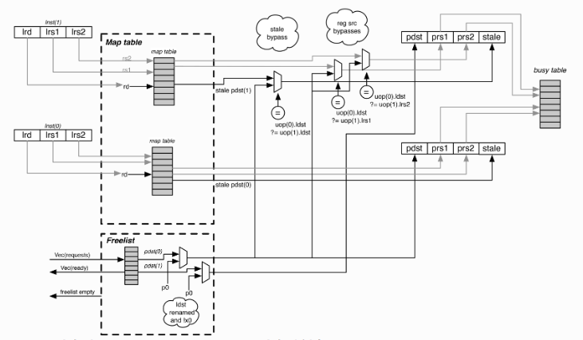

RAT就是图中的map table，busytable揭示每个物理寄存器的忙碌情况，

## Busy table

busytable在唤醒阶段把寄存器设置为空闲，在rename阶段将寄存器设置为忙

首先列出输入输出信号

```
  val io = IO(new BoomBundle()(p) {
    val ren_uops = Input(Vec(plWidth, new MicroOp))
    val busy_resps = Output(Vec(plWidth, new BusyResp))
    val rebusy_reqs = Input(Vec(plWidth, Bool()))

    val wb_pdsts = Input(Vec(numWbPorts, UInt(pregSz.W)))
    val wb_valids = Input(Vec(numWbPorts, Bool()))

    val debug = new Bundle { val busytable = Output(Bits(numPregs.W)) }
  })

```

ren_uops表示查询busytable，busy_reps表示寄存器的忙碌状态，wb前缀的表示写回阶段要更新的寄存器状态，最后一个是debug信号

```
  val busy_table = RegInit(0.U(numPregs.W))
  // Unbusy written back registers.
  val busy_table_wb = busy_table & ~(io.wb_pdsts zip io.wb_valids)
    .map {case (pdst, valid) => UIntToOH(pdst) & Fill(numPregs, valid.asUInt)}.reduce(_|_)
  // Rebusy newly allocated registers.
  val busy_table_next = busy_table_wb | (io.ren_uops zip io.rebusy_reqs)
    .map {case (uop, req) => UIntToOH(uop.pdst) & Fill(numPregs, req.asUInt)}.reduce(_|_)

  busy_table := busy_table_next
```

接下来是主要模块，首先将写回的寄存器unbusy，我们看busy_table_wb，首先看io.wb_pdsts zip io.wb_valids表示将两个作为一个元组，然后使用map函数，对每个院组都进行操作，操作的内容是后面｛｝内容，这个｛首先使用模式匹配case，然后输出的值是=>后面的值，也就是把写回的寄存器变成oh编码，然后把这些元素通过reduce按位或，得到写回寄存器的oh编码，然后取非再&busytable，就相当于释放了写回的寄存器

之后的busy_table_next，就是为寄存器分配忙位

```
  // Read the busy table.
  for (i <- 0 until plWidth) {
    val prs1_was_bypassed = (0 until i).map(j =>
      io.ren_uops(i).lrs1 === io.ren_uops(j).ldst && io.rebusy_reqs(j)).foldLeft(false.B)(_||_)
    val prs2_was_bypassed = (0 until i).map(j =>
      io.ren_uops(i).lrs2 === io.ren_uops(j).ldst && io.rebusy_reqs(j)).foldLeft(false.B)(_||_)
    val prs3_was_bypassed = (0 until i).map(j =>
      io.ren_uops(i).lrs3 === io.ren_uops(j).ldst && io.rebusy_reqs(j)).foldLeft(false.B)(_||_)

    io.busy_resps(i).prs1_busy := busy_table(io.ren_uops(i).prs1) || prs1_was_bypassed && bypass.B
    io.busy_resps(i).prs2_busy := busy_table(io.ren_uops(i).prs2) || prs2_was_bypassed && bypass.B
    io.busy_resps(i).prs3_busy := busy_table(io.ren_uops(i).prs3) || prs3_was_bypassed && bypass.B
    if (!float) io.busy_resps(i).prs3_busy := false.B
  }

  io.debug.busytable := busy_table
```

然后就是读busytable，这个的意思就是先检查写入的新映射关系有没有和src1一样的，有的话就说明这个可能有依赖（也即是RAW），也就是这个寄存器在使用，之后只要busytable和prs1_was_bypassed一个成立，就说明这个寄存器在使用

## Map table

其实就是RAT，首先先把交互信号放上来，以供后续阅读

```
class MapReq(val lregSz: Int) extends Bundle
{
  val lrs1 = UInt(lregSz.W)
  val lrs2 = UInt(lregSz.W)
  val lrs3 = UInt(lregSz.W)
  val ldst = UInt(lregSz.W)
}

class MapResp(val pregSz: Int) extends Bundle
{
  val prs1 = UInt(pregSz.W)
  val prs2 = UInt(pregSz.W)
  val prs3 = UInt(pregSz.W)
  val stale_pdst = UInt(pregSz.W)
}

class RemapReq(val lregSz: Int, val pregSz: Int) extends Bundle
{
  val ldst = UInt(lregSz.W)
  val pdst = UInt(pregSz.W)
  val valid = Bool()
}
```

然后就是Maptable的IO信号了，主要就是映射请求，映射答复，重新映射，保存snapshot，恢复snapshot

```
  val io = IO(new BoomBundle()(p) {
    // Logical sources -> physical sources.
    val map_reqs    = Input(Vec(plWidth, new MapReq(lregSz)))
    val map_resps   = Output(Vec(plWidth, new MapResp(pregSz)))

    // Remapping an ldst to a newly allocated pdst?
    val remap_reqs  = Input(Vec(plWidth, new RemapReq(lregSz, pregSz)))

    // Dispatching branches: need to take snapshots of table state.
    val ren_br_tags = Input(Vec(plWidth, Valid(UInt(brTagSz.W))))

    // Signals for restoring state following misspeculation.
    val brupdate      = Input(new BrUpdateInfo)
    val rollback    = Input(Bool())
  })
```

接下来就是这个模块的主要信号，首先map_table就是这个模块的核心了，存储寄存器映射关系的，然后就是snapshot，这里为什么要remap？就是把最新的寄存器关系写进去，具体需要看重命名过程干了什么（逻辑源寄存器读RAT，目的寄存器在freelist找空闲，目的寄存器读RAT，将读出的值写入ROB，目的寄存器写入RAT，更新新的映射关系）这样其实就理解了设置这些信号的含义，remap_pdsts就是把物理寄存器号提取出来，如果一周期重命名2条，那么这个就是一个大小为2的向量，remap_ldsts_oh就是给每个逻辑寄存器编码，假设两条指令目的寄存器为1，3，那么编码后的就是（32‘b...10,32'b...1000）

```
  // The map table register array and its branch snapshots.
  val map_table = RegInit(VecInit(Seq.fill(numLregs){0.U(pregSz.W)}))
  val br_snapshots = Reg(Vec(maxBrCount, Vec(numLregs, UInt(pregSz.W))))

  // The intermediate states of the map table following modification by each pipeline slot.
  val remap_table = Wire(Vec(plWidth+1, Vec(numLregs, UInt(pregSz.W))))

  // Uops requesting changes to the map table.
  val remap_pdsts = io.remap_reqs map (_.pdst)
  val remap_ldsts_oh = io.remap_reqs map (req => UIntToOH(req.ldst) & Fill(numLregs, req.valid.asUInt))
```

然后弄明白新的每个指令新的映射关系，第一个意思就是把0号寄存器清0，如果不是0号寄存器，就设置一个remapped_row，这个的大小是plwidth的大小，这个之后的意思就是，为每个逻辑寄存器找到他的映射关系是来自RAT还是传入的映射关系,我们首先需要知道scanleft的意思，这个的工作模式如下（从左到右依次是reduce，fold，scan），这个remapped_row干的事情就是先把ldst位提取出来，这表示哪个逻辑寄存器是有更新请求，然后zip pdst形成元组，假设有如下映射ldst1->pdst2,ldst3->pdst4,这里前面是逻辑。后面是物理，假设一周期2条指令，i=1，这个zip形成的元组就是（true，2），（false，2），然后scanleft（有累积性）的初值为map_table（1）,也就是remapped_row第0个元素为来自map的值，然后这句话生成的元组就是（map，pdst2，pdst2），map为来自map-table的物理寄存器，最后把这些赋值给remaptable,然后假如i=3，remapped_row就是（map，map，pdst4），此时remap_table（1）为（0，pdst2，map，map，...）remap（2）为（0，pdst2，map，pdst4，...）所以这里可以看到remaptable的最高索引才是正确的映射关系（巧妙但晦涩难懂的操作）

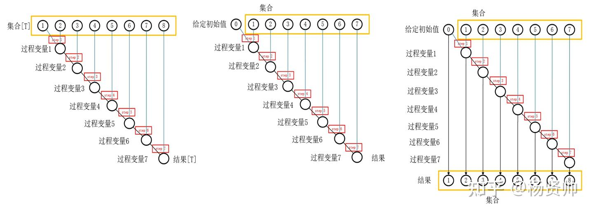

```
  // Figure out the new mappings seen by each pipeline slot.
  for (i <- 0 until numLregs) {
    if (i == 0 && !float) {
      for (j <- 0 until plWidth+1) {
        remap_table(j)(i) := 0.U
      }
    } else {
      val remapped_row = (remap_ldsts_oh.map(ldst => ldst(i)) zip remap_pdsts)
        .scanLeft(map_table(i)) {case (pdst, (ldst, new_pdst)) => Mux(ldst, new_pdst, pdst)}

      for (j <- 0 until plWidth+1) {
        remap_table(j)(i) := remapped_row(j)
      }
    }
  }
```

然后更新新的映射关系，最后就是读map，注意这个处理了读出的映射关系是来自map_table还是remap请求(处理RAW)，当i=0，映射关系来自RAT，（也就是第1条指令，最旧的指令）只讲解i=1情况的prs1，foldleft和scan类似，但只输出最终结果，所以这里就是检查第一条的目的寄存器和这一条指令（也就是第二条）的源寄存器是否相等，如果相等就使用新的映射

```
  when (io.brupdate.b2.mispredict) {
    // Restore the map table to a branch snapshot.
    map_table := br_snapshots(io.brupdate.b2.uop.br_tag)
  } .otherwise {
    // Update mappings.
    map_table := remap_table(plWidth)
  }

  // Read out mappings.
  for (i <- 0 until plWidth) {
    io.map_resps(i).prs1       := (0 until i).foldLeft(map_table(io.map_reqs(i).lrs1)) ((p,k) =>
      Mux(bypass.B && io.remap_reqs(k).valid && io.remap_reqs(k).ldst === io.map_reqs(i).lrs1, io.remap_reqs(k).pdst, p))
    io.map_resps(i).prs2       := (0 until i).foldLeft(map_table(io.map_reqs(i).lrs2)) ((p,k) =>
      Mux(bypass.B && io.remap_reqs(k).valid && io.remap_reqs(k).ldst === io.map_reqs(i).lrs2, io.remap_reqs(k).pdst, p))
    io.map_resps(i).prs3       := (0 until i).foldLeft(map_table(io.map_reqs(i).lrs3)) ((p,k) =>
      Mux(bypass.B && io.remap_reqs(k).valid && io.remap_reqs(k).ldst === io.map_reqs(i).lrs3, io.remap_reqs(k).pdst, p))
    io.map_resps(i).stale_pdst := (0 until i).foldLeft(map_table(io.map_reqs(i).ldst)) ((p,k) =>
      Mux(bypass.B && io.remap_reqs(k).valid && io.remap_reqs(k).ldst === io.map_reqs(i).ldst, io.remap_reqs(k).pdst, p))

    if (!float) io.map_resps(i).prs3 := DontCare
  }
```

然后这个链接对高阶函数做了简单总结：[高级设计](https://zhuanlan.zhihu.com/p/350301092)

## Free list

先列出IO信号

```
  val io = IO(new BoomBundle()(p) {
    // Physical register requests.
    val reqs          = Input(Vec(plWidth, Bool()))
    val alloc_pregs   = Output(Vec(plWidth, Valid(UInt(pregSz.W))))

    // Pregs returned by the ROB.
    val dealloc_pregs = Input(Vec(plWidth, Valid(UInt(pregSz.W))))

    // Branch info for starting new allocation lists.
    val ren_br_tags   = Input(Vec(plWidth, Valid(UInt(brTagSz.W))))

    // Mispredict info for recovering speculatively allocated registers.
    val brupdate        = Input(new BrUpdateInfo)

    val debug = new Bundle {
      val pipeline_empty = Input(Bool())
      val freelist = Output(Bits(numPregs.W))
      val isprlist = Output(Bits(numPregs.W))
    }
  })
```

首先明白free list什么时候分配寄存器，什么时候写入用完的寄存器（分别是重命名阶段，和提交阶段），然后就明白上面信号什么意思了

```
  // The free list register array and its branch allocation lists.
  val free_list = RegInit(UInt(numPregs.W), ~(1.U(numPregs.W)))
  val br_alloc_lists = Reg(Vec(maxBrCount, UInt(numPregs.W)))

  // Select pregs from the free list.
  val sels = SelectFirstN(free_list, plWidth)
  val sel_fire  = Wire(Vec(plWidth, Bool()))

  // Allocations seen by branches in each pipeline slot.
  val allocs = io.alloc_pregs map (a => UIntToOH(a.bits))
  val alloc_masks = (allocs zip io.reqs).scanRight(0.U(n.W)) { case ((a,r),m) => m | a & Fill(n,r) }

  // Masks that modify the freelist array.
  val sel_mask = (sels zip sel_fire) map { case (s,f) => s & Fill(n,f) } reduce(_|_)
  val br_deallocs = br_alloc_lists(io.brupdate.b2.uop.br_tag) & Fill(n, io.brupdate.b2.mispredict)
  val dealloc_mask = io.dealloc_pregs.map(d => UIntToOH(d.bits)(numPregs-1,0) & Fill(n,d.valid)).reduce(_|_) | br_deallocs

  val br_slots = VecInit(io.ren_br_tags.map(tag => tag.valid)).asUInt
```

然后free_list是一个size为物理寄存器个数的寄存器，介绍sels之前先介绍PriorityEncoderOH，这个就是返回第一个为true的oh编码，然后sel是就是找到4个为true的索引，并且为oh编码，然后就是sel_mask,这个就是将sels得到的oh组合起来，dealloc_mask就是从ROB返回的物理寄存器，把他转换为onehot，（这里不管分支预测的snapshot），

```
object PriorityEncoderOH {
  private def encode(in: Seq[Bool]): UInt = {
    val outs = Seq.tabulate(in.size)(i => (BigInt(1) << i).asUInt(in.size.W))
    PriorityMux(in :+ true.B, outs :+ 0.U(in.size.W))
  }
  def apply(in: Seq[Bool]): Seq[Bool] = {
    val enc = encode(in)
    Seq.tabulate(in.size)(enc(_))
  }
  def apply(in: Bits): UInt = encode((0 until in.getWidth).map(i => in(i)))
}
```

然后freelist更新，之后就是读出分配好的寄存器,这里有个sel_fire,注意这里的逻辑有些混乱,

```
  // Update the free list.
  free_list := (free_list & ~sel_mask | dealloc_mask) & ~(1.U(numPregs.W))

  // Pipeline logic | hookup outputs.
  for (w <- 0 until plWidth) {
    val can_sel = sels(w).orR
    val r_valid = RegInit(false.B)
    val r_sel   = RegEnable(OHToUInt(sels(w)), sel_fire(w))

    r_valid := r_valid && !io.reqs(w) || can_sel
    sel_fire(w) := (!r_valid || io.reqs(w)) && can_sel

    io.alloc_pregs(w).bits  := r_sel
    io.alloc_pregs(w).valid := r_valid
  }
```

## RenameStage

直接看链接[重命名](https://zhuanlan.zhihu.com/p/399543947)

其实有个问题：maptable本身支持解决RAW，但在rename模块将bypass给关闭了，然后在rename注册了BypassAllocations检查RAW相关，

还有：

rename有两级；第一级主要进行读RAT，第二阶段写RAT，读出freelist，写busytable（链接认为第一阶段还有读freelsit，但代码内使用的却是ren2_uops，也就是第二级）

其实感觉这里是一个比较逆天的操作,只看黄色框内容,由于r_sel是一个寄存器,在en后下个周期才可以得出新的值,这里虽然en(s2送入的请求)了,但实际上下个周期才会响应这个en,这里读出的还是之前的旧数据,但注意,这个旧寄存器值同样也是空闲的,因为他是由上一条指令读的,且freelist已经标记这个寄存器被分配出去了,非常逆天的操作,使用上个指令请求,然后这条指令正好读出,然后s2阶段就可以进行RAW检查了,这个操作完全可以在s1阶段产生请求,然后s2读出数据,还有下面这行代码,这个得结合流水线看,我们重命名一部分在decode/rename,另一部分在rename/dispatch,s1阶段主要进行读物理源寄存器(RAT),s2阶段读物理目的寄存器,然后把新的映射关系写入RAT,**所以我们不仅要处理组内相关性,还要处理组间相关性**,这句就是处理组间相关性,因为假设B指令的源寄存器和A指令的目的寄存器一样(一周期rename一条,B是新指令),B指令在s1读出的物理源寄存器可能不是最新的映射关系(A指令还没写入RAT),所以需要这行

```
    r_uop := GetNewUopAndBrMask(BypassAllocations(next_uop, ren2_uops, ren2_alloc_reqs), io.brupdate)
```

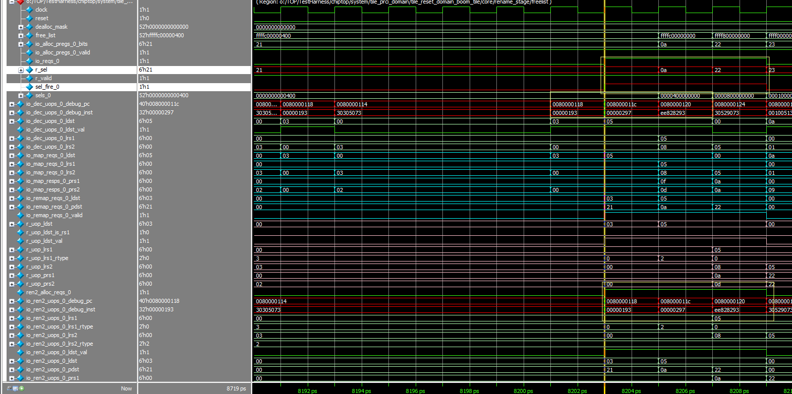

下面简单讲一条指令在这个模块进行了什么操作：

### 读RAT请求和写RAT

```
  for ((((ren1,ren2),com),w) <- (ren1_uops zip ren2_uops zip io.com_uops.reverse).zipWithIndex) {
    map_reqs(w).lrs1 := ren1.lrs1
    map_reqs(w).lrs2 := ren1.lrs2
    map_reqs(w).lrs3 := ren1.lrs3
    map_reqs(w).ldst := ren1.ldst

    remap_reqs(w).ldst := Mux(io.rollback, com.ldst      , ren2.ldst)
    remap_reqs(w).pdst := Mux(io.rollback, com.stale_pdst, ren2.pdst)
  }
```

注意这里map_reqs是ren1传入，也就是从decode传入的，然后写入RAT就是ren2的逻辑和物理寄存器

### 读freelist

```
  // Freelist inputs.
  freelist.io.reqs := ren2_alloc_reqs
  freelist.io.dealloc_pregs zip com_valids zip rbk_valids map
    {case ((d,c),r) => d.valid := c || r}
  freelist.io.dealloc_pregs zip io.com_uops map
    {case (d,c) => d.bits := Mux(io.rollback, c.pdst, c.stale_pdst)}
  freelist.io.ren_br_tags := ren2_br_tags
  freelist.io.brupdate := io.brupdate
  freelist.io.debug.pipeline_empty := io.debug_rob_empty

  assert (ren2_alloc_reqs zip freelist.io.alloc_pregs map {case (r,p) => !r || p.bits =/= 0.U} reduce (_&&_),
           "[rename-stage] A uop is trying to allocate the zero physical register.")

  // Freelist outputs.
  for ((uop, w) <- ren2_uops.zipWithIndex) {
    val preg = freelist.io.alloc_pregs(w).bits
    uop.pdst := Mux(uop.ldst =/= 0.U || float.B, preg, 0.U)
  }
```

可以看到我们请求的前缀为ren2

### 读busytable

```
  busytable.io.ren_uops := ren2_uops  // expects pdst to be set up.
  busytable.io.rebusy_reqs := ren2_alloc_reqs
  busytable.io.wb_valids := io.wakeups.map(_.valid)
  busytable.io.wb_pdsts := io.wakeups.map(_.bits.uop.pdst)

  assert (!(io.wakeups.map(x => x.valid && x.bits.uop.dst_rtype =/= rtype).reduce(_||_)),
   "[rename] Wakeup has wrong rtype.")

  for ((uop, w) <- ren2_uops.zipWithIndex) {
    val busy = busytable.io.busy_resps(w)

    uop.prs1_busy := uop.lrs1_rtype === rtype && busy.prs1_busy
    uop.prs2_busy := uop.lrs2_rtype === rtype && busy.prs2_busy
    uop.prs3_busy := uop.frs3_en && busy.prs3_busy

    val valid = ren2_valids(w)
    assert (!(valid && busy.prs1_busy && rtype === RT_FIX && uop.lrs1 === 0.U), "[rename] x0 is busy??")
    assert (!(valid && busy.prs2_busy && rtype === RT_FIX && uop.lrs2 === 0.U), "[rename] x0 is busy??")
  }
```

同样是在阶段2进行

### 输出结果

```
  for (w <- 0 until plWidth) {
    val can_allocate = freelist.io.alloc_pregs(w).valid

    // Push back against Decode stage if Rename1 can't proceed.
    io.ren_stalls(w) := (ren2_uops(w).dst_rtype === rtype) && !can_allocate

    val bypassed_uop = Wire(new MicroOp)
    if (w > 0) bypassed_uop := BypassAllocations(ren2_uops(w), ren2_uops.slice(0,w), ren2_alloc_reqs.slice(0,w))
    else       bypassed_uop := ren2_uops(w)

    io.ren2_uops(w) := GetNewUopAndBrMask(bypassed_uop, io.brupdate)
  }
```

注意这里检测了一个指令包内的RAW，那我们还有WAW，但其实已经解决了，maptable的scanleft会写入最新的映射关系

## 总结

这里boom用了很多花活，巧妙但晦涩难懂，也体现了chisel的强大之处，本篇解读将分支预测失败的全部略过

# BOOM Dispatch

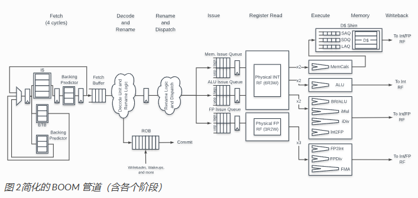

首先上IO.ren_uops由rename传来，然后后面的dis_uops表示送入每个IQ的指令，假设N 个IQ，每个IQ周期每个周期都可以接受dispawidth指令

```
  // incoming microops from rename2
  val ren_uops = Vec(coreWidth, Flipped(DecoupledIO(new MicroOp)))

  // outgoing microops to issue queues
  // N issues each accept up to dispatchWidth uops
  // dispatchWidth may vary between issue queues
  val dis_uops = MixedVec(issueParams.map(ip=>Vec(ip.dispatchWidth, DecoupledIO(new MicroOp))))
```

然后就是boom目前使用的dispatcher,首先是ren_ready,也就是指令已经被写入IQ，这时把他拉高，注意这里所有指令只能去一个IQ，所以有一个reduce，检查所有指令是否都送入这个IQ了，然后就是把ren_uops请求分发到对应IQ，对于Boom，有三个IQ，FP，MEM和ALU，其中IQ和MEM为一个issue unit，每周期轮换，这个有的问题就是如果一周期指令既有MEM，又有INT，会导致某些指令无法全部发出

```
class BasicDispatcher(implicit p: Parameters) extends Dispatcher
{
  issueParams.map(ip=>require(ip.dispatchWidth == coreWidth))

  val ren_readys = io.dis_uops.map(d=>VecInit(d.map(_.ready)).asUInt).reduce(_&_)

  for (w <- 0 until coreWidth) {
    io.ren_uops(w).ready := ren_readys(w)
  }

  for {i <- 0 until issueParams.size
       w <- 0 until coreWidth} {
    val issueParam = issueParams(i)
    val dis        = io.dis_uops(i)

    dis(w).valid := io.ren_uops(w).valid && ((io.ren_uops(w).bits.iq_type & issueParam.iqType.U) =/= 0.U)
    dis(w).bits  := io.ren_uops(w).bits
  }
}
```

接下来为Boom没使用的模块，这个模块是每周期尽可能送入发射队列，也就是没有只能发射到一个IQ的限制，只有在IQ满了才会stall，

这个模块的ren_ready就很清晰，意思和上面的一样，然后循环体内就是主要逻辑,ren大小和ren_ops大小一样(corewidth),然后uses_iq就是指出指令要送去哪个IQ,之后就是为ren_valid赋值,假如这次循环是检测INT的,对于lw,add,sub就是(false,true,true),之后有一个Boom自己的api,Compactor,意思是找出前k个有效的输出,然后将输出链接到dis,最后得出这个IQ是否空闲,如果use_iq为false,就说明空闲,

```
/**
 *  Tries to dispatch as many uops as it can to issue queues,
 *  which may accept fewer than coreWidth per cycle.
 *  When dispatchWidth == coreWidth, its behavior differs
 *  from the BasicDispatcher in that it will only stall dispatch when
 *  an issue queue required by a uop is full.
 */
class CompactingDispatcher(implicit p: Parameters) extends Dispatcher
{
  issueParams.map(ip => require(ip.dispatchWidth >= ip.issueWidth))

  val ren_readys = Wire(Vec(issueParams.size, Vec(coreWidth, Bool())))

  for (((ip, dis), rdy) <- issueParams zip io.dis_uops zip ren_readys) {
    val ren = Wire(Vec(coreWidth, Decoupled(new MicroOp)))
    ren <> io.ren_uops

    val uses_iq = ren map (u => (u.bits.iq_type & ip.iqType.U).orR)

    // Only request an issue slot if the uop needs to enter that queue.
    (ren zip io.ren_uops zip uses_iq) foreach {case ((u,v),q) =>
      u.valid := v.valid && q}

    val compactor = Module(new Compactor(coreWidth, ip.dispatchWidth, new MicroOp))
    compactor.io.in  <> ren
    dis <> compactor.io.out

    // The queue is considered ready if the uop doesn't use it.
    rdy := ren zip uses_iq map {case (u,q) => u.ready || !q}
  }

  (ren_readys.reduce((r,i) =>
      VecInit(r zip i map {case (r,i) =>
        r && i})) zip io.ren_uops) foreach {case (r,u) =>
          u.ready := r}
}

```

接下来介绍**Compactor**,作用就是在n个valid选出k个,首先gen为数据的类型,首先IO为n入k出,如果n=k,就直接把输出连到输入,否则就要去选出前k个,sels得出的是选择哪一个的OH编码,假如in_valid为(0,1,1)

n=3,k=2,sels就为(0010,0100),in_readys的意思就是可以传入数据了,也就是这批指令已经分配完IQ了,这个模块的找前几个有效的数据设置也很巧妙,

# BOOM ROB

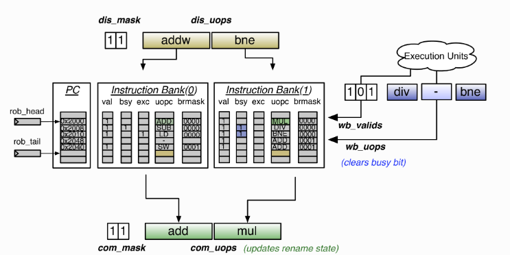

首先先理清,ROB在Dispatch写入指令信息,在提交阶段读出信息,提交总是最旧的指令,这里ROB是W个存储体(W=dispatch长度),每次写入ROB就是一个W宽度的指令信息,ROB仅存储一个指令包的首地址,bank(0)(指令包地址连续),但遇到分支指令就得产生气泡,重新开一行,不然无法读到正确的PC,**运行图就是下图,注意0x0008有问题,跳转地址为0x0028**

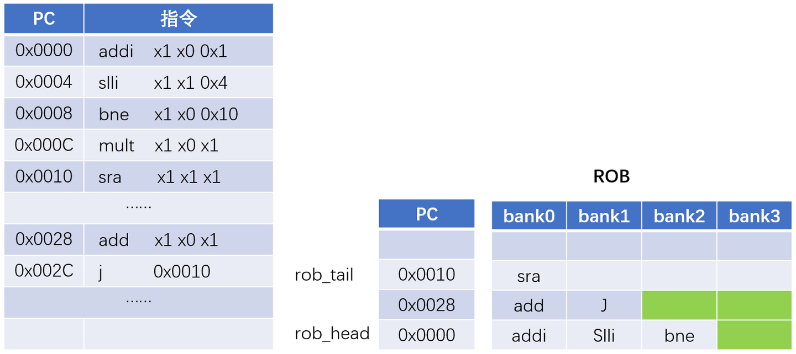


# BOOM V3 ISSUE 模块解析

## issue slot

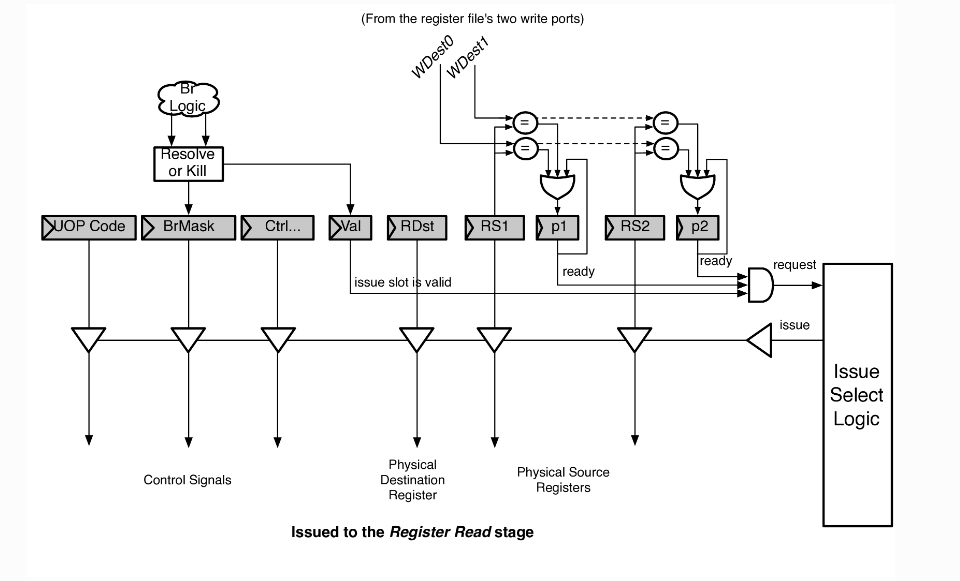

首先明确：这个slot需要能写入东西，能读出东西，控制信号可以改变（唤醒）

写入就是dispatch模块写入，读出就是准备好了可以发射了

然後列出状态机:

```
trait IssueUnitConstants
{
  // invalid  : slot holds no valid uop.
  // s_valid_1: slot holds a valid uop.
  // s_valid_2: slot holds a store-like uop that may be broken into two micro-ops.
  val s_invalid :: s_valid_1 :: s_valid_2 :: Nil = Enum(3)
}
```

可以看到有三个状态

```
  val io = IO(new IssueSlotIO(numWakeupPorts))

  // slot invalid?
  // slot is valid, holding 1 uop
  // slot is valid, holds 2 uops (like a store)
  def is_invalid = state === s_invalid
  def is_valid = state =/= s_invalid

  val next_state      = Wire(UInt()) // the next state of this slot (which might then get moved to a new slot)
  val next_uopc       = Wire(UInt()) // the next uopc of this slot (which might then get moved to a new slot)
  val next_lrs1_rtype = Wire(UInt()) // the next reg type of this slot (which might then get moved to a new slot)
  val next_lrs2_rtype = Wire(UInt()) // the next reg type of this slot (which might then get moved to a new slot)

  val state = RegInit(s_invalid)
  val p1    = RegInit(false.B)
  val p2    = RegInit(false.B)
  val p3    = RegInit(false.B)
  val ppred = RegInit(false.B)

  // Poison if woken up by speculative load.
  // Poison lasts 1 cycle (as ldMiss will come on the next cycle).
  // SO if poisoned is true, set it to false!
  val p1_poisoned = RegInit(false.B)
  val p2_poisoned = RegInit(false.B)
  p1_poisoned := false.B
  p2_poisoned := false.B
  val next_p1_poisoned = Mux(io.in_uop.valid, io.in_uop.bits.iw_p1_poisoned, p1_poisoned)
  val next_p2_poisoned = Mux(io.in_uop.valid, io.in_uop.bits.iw_p2_poisoned, p2_poisoned)

  val slot_uop = RegInit(NullMicroOp)
  val next_uop = Mux(io.in_uop.valid, io.in_uop.bits, slot_uop)
```

接下来为主要信号，next_state這個slot的下一個狀態,之后这些next前缀的都是这个意思,他们是去构造压缩式队列使用的,然后state是这个slot的状态,p1,p2,p3表示操作数是否准备好了,ppred涉及到load的推测唤醒,但目前他们文档说不支持,下面的p1_poisoned表示推测唤醒失败,需要将这个p1给置为false,next_p1_poisoned是指输入的bit的p1是否被poisoned,slot_uop保存这个slot内容,然后next_uop,仍然用于压缩队列

```
  //-----------------------------------------------------------------------------
  // next slot state computation
  // compute the next state for THIS entry slot (in a collasping queue, the
  // current uop may get moved elsewhere, and a new uop can enter

  when (io.kill) {
    state := s_invalid
  } .elsewhen (io.in_uop.valid) {
    state := io.in_uop.bits.iw_state
  } .elsewhen (io.clear) {
    state := s_invalid
  } .otherwise {
    state := next_state
  }

```

然后就是下一个slot状态计算,kill表示冲刷流水线,clear表示slot被移到其他的地方了,如果输入的uop.valid有效,就把state置为输入uop的state,否则就为next_state

```
  //-----------------------------------------------------------------------------
  // "update" state
  // compute the next state for the micro-op in this slot. This micro-op may
  // be moved elsewhere, so the "next_state" travels with it.

  // defaults
  next_state := state
  next_uopc := slot_uop.uopc
  next_lrs1_rtype := slot_uop.lrs1_rtype
  next_lrs2_rtype := slot_uop.lrs2_rtype

  when (io.kill) {
    next_state := s_invalid
  } .elsewhen ((io.grant && (state === s_valid_1)) ||
    (io.grant && (state === s_valid_2) && p1 && p2 && ppred)) {
    // try to issue this uop.
    when (!(io.ldspec_miss && (p1_poisoned || p2_poisoned))) {
      next_state := s_invalid
    }
  } .elsewhen (io.grant && (state === s_valid_2)) {
    when (!(io.ldspec_miss && (p1_poisoned || p2_poisoned))) {
      next_state := s_valid_1
      when (p1) {
        slot_uop.uopc := uopSTD
        next_uopc := uopSTD
        slot_uop.lrs1_rtype := RT_X
        next_lrs1_rtype := RT_X
      } .otherwise {
        slot_uop.lrs2_rtype := RT_X
        next_lrs2_rtype := RT_X
      }
    }
  }

  when (io.in_uop.valid) {
    slot_uop := io.in_uop.bits
    assert (is_invalid || io.clear || io.kill, "trying to overwrite a valid issue slot.")
  }
```

当冲刷流水线,就把next_state设置为无效,当grant为高,可以并且状态为v1(s_valid_1),或者是v2,且操作数准备好了,就说明可以发射了,如果没有遇到load推测唤醒失败,就把next_state设置为s_invalid,假如state为v2并且grant,如果没发生load推测唤醒失败,就把next_state设置为v1,然后看准备好的是数据还是地址,分别被uopc赋值为相应类型,如果in_uop.valid,就把slot更新为io.in_uop.bits

```
  // Wakeup Compare Logic

  // these signals are the "next_p*" for the current slot's micro-op.
  // they are important for shifting the current slot_uop up to an other entry.
  val next_p1 = WireInit(p1)
  val next_p2 = WireInit(p2)
  val next_p3 = WireInit(p3)
  val next_ppred = WireInit(ppred)

  when (io.in_uop.valid) {
    p1 := !(io.in_uop.bits.prs1_busy)
    p2 := !(io.in_uop.bits.prs2_busy)
    p3 := !(io.in_uop.bits.prs3_busy)
    ppred := !(io.in_uop.bits.ppred_busy)
  }

  when (io.ldspec_miss && next_p1_poisoned) {
    assert(next_uop.prs1 =/= 0.U, "Poison bit can't be set for prs1=x0!")
    p1 := false.B
  }
  when (io.ldspec_miss && next_p2_poisoned) {
    assert(next_uop.prs2 =/= 0.U, "Poison bit can't be set for prs2=x0!")
    p2 := false.B
  }

  for (i <- 0 until numWakeupPorts) {
    when (io.wakeup_ports(i).valid &&
         (io.wakeup_ports(i).bits.pdst === next_uop.prs1)) {
      p1 := true.B
    }
    when (io.wakeup_ports(i).valid &&
         (io.wakeup_ports(i).bits.pdst === next_uop.prs2)) {
      p2 := true.B
    }
    when (io.wakeup_ports(i).valid &&
         (io.wakeup_ports(i).bits.pdst === next_uop.prs3)) {
      p3 := true.B
    }
  }
  when (io.pred_wakeup_port.valid && io.pred_wakeup_port.bits === next_uop.ppred) {
    ppred := true.B
  }

  for (w <- 0 until memWidth) {
    assert (!(io.spec_ld_wakeup(w).valid && io.spec_ld_wakeup(w).bits === 0.U),
      "Loads to x0 should never speculatively wakeup other instructions")
  }

  // TODO disable if FP IQ.
  for (w <- 0 until memWidth) {
    when (io.spec_ld_wakeup(w).valid &&
      io.spec_ld_wakeup(w).bits === next_uop.prs1 &&
      next_uop.lrs1_rtype === RT_FIX) {
      p1 := true.B
      p1_poisoned := true.B
      assert (!next_p1_poisoned)
    }
    when (io.spec_ld_wakeup(w).valid &&
      io.spec_ld_wakeup(w).bits === next_uop.prs2 &&
      next_uop.lrs2_rtype === RT_FIX) {
      p2 := true.B
      p2_poisoned := true.B
      assert (!next_p2_poisoned)
    }
  }
```

接下来是唤醒逻辑,首先定义了四个next前缀的信号,这些信号用于压缩队列,然后就是如果输入有效数据,检查输入的rs1,rs2,rs3是否busy,也就是是否被写入prf(在Busytable没表项),如果推测唤醒失败,就把p1置为false,其他同理,然后检查每个wakeupport,如果有port有效,并且pdst等于slot的src,就把该寄存器ready,然后是推测唤醒逻辑:

TODO

```
  // Request Logic
  io.request := is_valid && p1 && p2 && p3 && ppred && !io.kill
  val high_priority = slot_uop.is_br || slot_uop.is_jal || slot_uop.is_jalr
  io.request_hp := io.request && high_priority

  when (state === s_valid_1) {
    io.request := p1 && p2 && p3 && ppred && !io.kill
  } .elsewhen (state === s_valid_2) {
    io.request := (p1 || p2) && ppred && !io.kill
  } .otherwise {
    io.request := false.B
  }

```

接下来为req逻辑,只要p1,p2,p3准备好就可以req了,由于大部分指令为两个src,所以p3一般为默认值,也就是true,最后就是一些连线逻辑

## Issue Unit

```
/**
 * Abstract top level issue unit
 *
 * @param numIssueSlots depth of issue queue
 * @param issueWidth amoutn of operations that can be issued at once
 * @param numWakeupPorts number of wakeup ports for issue unit
 * @param iqType type of issue queue (mem, int, fp)
 */
abstract class IssueUnit(
  val numIssueSlots: Int,
  val issueWidth: Int,
  val numWakeupPorts: Int,
  val iqType: BigInt,
  val dispatchWidth: Int)
  (implicit p: Parameters)
  extends BoomModule
  with IssueUnitConstants
{
  val io = IO(new IssueUnitIO(issueWidth, numWakeupPorts, dispatchWidth))

  //-------------------------------------------------------------
  // Set up the dispatch uops
  // special case "storing" 2 uops within one issue slot.

  val dis_uops = Array.fill(dispatchWidth) {Wire(new MicroOp())}
  for (w <- 0 until dispatchWidth) {
    dis_uops(w) := io.dis_uops(w).bits
    dis_uops(w).iw_p1_poisoned := false.B
    dis_uops(w).iw_p2_poisoned := false.B
    dis_uops(w).iw_state := s_valid_1

    if (iqType == IQT_MEM.litValue || iqType == IQT_INT.litValue) {
      // For StoreAddrGen for Int, or AMOAddrGen, we go to addr gen state
      when ((io.dis_uops(w).bits.uopc === uopSTA && io.dis_uops(w).bits.lrs2_rtype === RT_FIX) ||
             io.dis_uops(w).bits.uopc === uopAMO_AG) {
        dis_uops(w).iw_state := s_valid_2
        // For store addr gen for FP, rs2 is the FP register, and we don't wait for that here
      } .elsewhen (io.dis_uops(w).bits.uopc === uopSTA && io.dis_uops(w).bits.lrs2_rtype =/= RT_FIX) {
        dis_uops(w).lrs2_rtype := RT_X
        dis_uops(w).prs2_busy  := false.B
      }
      dis_uops(w).prs3_busy := false.B
    } else if (iqType == IQT_FP.litValue) {
      // FP "StoreAddrGen" is really storeDataGen, and rs1 is the integer address register
      when (io.dis_uops(w).bits.uopc === uopSTA) {
        dis_uops(w).lrs1_rtype := RT_X
        dis_uops(w).prs1_busy  := false.B
      }
    }

    if (iqType != IQT_INT.litValue) {
      assert(!(io.dis_uops(w).bits.ppred_busy && io.dis_uops(w).valid))
      dis_uops(w).ppred_busy := false.B
    }
  }

  
```

我们这个抽象类,主要参数有issue queue大小,一次可以发射多少,唤醒port,issue的类型(mem,int,fp),然后创建了一个dis_uops,将来自dispatch的信号传入,然后将dip_uops初始化为dispatch数据,状态设置为v1(代表一般指令,),然后根据iq类型来分别进一步初始化,对于int类型的之后将prs3置为空闲,而mem不仅置为空闲,还检查是STA对state初始化为v2

```
  //-------------------------------------------------------------
  // Issue Table

  val slots = for (i <- 0 until numIssueSlots) yield { val slot = Module(new IssueSlot(numWakeupPorts)); slot }
  val issue_slots = VecInit(slots.map(_.io))

  for (i <- 0 until numIssueSlots) {
    issue_slots(i).wakeup_ports     := io.wakeup_ports
    issue_slots(i).pred_wakeup_port := io.pred_wakeup_port
    issue_slots(i).spec_ld_wakeup   := io.spec_ld_wakeup
    issue_slots(i).ldspec_miss      := io.ld_miss
    issue_slots(i).brupdate         := io.brupdate
    issue_slots(i).kill             := io.flush_pipeline
  }

  io.event_empty := !(issue_slots.map(s => s.valid).reduce(_|_))

  val count = PopCount(slots.map(_.io.valid))
  dontTouch(count)
```

接下来就是创建slot,连线,

## IssueUnitStatic

然后讲解非压缩队列

```
  val entry_wen_oh = VecInit(Seq.fill(numIssueSlots){ Wire(Bits(dispatchWidth.W)) })
  for (i <- 0 until numIssueSlots) {
    issue_slots(i).in_uop.valid := entry_wen_oh(i).orR
    issue_slots(i).in_uop.bits  := Mux1H(entry_wen_oh(i), dis_uops)
    issue_slots(i).clear        := false.B
  }
```

首先是表项写使能,这个entry_wen_oh会在后面赋值,这个是dispatch传来的,然后将数据传入issue slot,这里使用one hot 编码,这个会在之后讲解,将clear设置为false

```
  //-------------------------------------------------------------
  // Dispatch/Entry Logic
  // find a slot to enter a new dispatched instruction

  val entry_wen_oh_array = Array.fill(numIssueSlots,dispatchWidth){false.B}
  var allocated = VecInit(Seq.fill(dispatchWidth){false.B}) // did an instruction find an issue width?

  for (i <- 0 until numIssueSlots) {
    var next_allocated = Wire(Vec(dispatchWidth, Bool()))
    var can_allocate = !(issue_slots(i).valid)

    for (w <- 0 until dispatchWidth) {
      entry_wen_oh_array(i)(w) = can_allocate && !(allocated(w))

      next_allocated(w) := can_allocate | allocated(w)
      can_allocate = can_allocate && allocated(w)
    }

    allocated = next_allocated
  }

```

这是分发逻辑,首先创建一个entry_wen_oh_array,记录每个slot是否有dispatch的指令,然后allocated表示这个指令已经被分配了,然后进入两重循环,最底层循环就是看看这个slot是否空闲,如果空闲就将使能信号写入进去,然后把这个表项锁住,也就是将can_allocate置低,举例:

假设dispatch为4位使用一个四位变量allocate=(0,0,0,0)表示指令都没分发出去,假设指令0,找到了一个空slot,我们就可以把这个空槽占据了,然后next_allocate=(1,0,0,0)然后can_allocate由于allocated为false,所以置低,最后第一次循环完,next_allocate为(1,0,0,0),can_allocate=false,这个slot接受不到其他的指令了,已经被指令0占据了,内层循环完毕,把next_allocate赋值给allocate

```
  // if we can find an issue slot, do we actually need it?
  // also, translate from Scala data structures to Chisel Vecs
  for (i <- 0 until numIssueSlots) {
    val temp_uop_val = Wire(Vec(dispatchWidth, Bool()))

    for (w <- 0 until dispatchWidth) {
      // TODO add ctrl bit for "allocates iss_slot"
      temp_uop_val(w) := io.dis_uops(w).valid &&
                         !dis_uops(w).exception &&
                         !dis_uops(w).is_fence &&
                         !dis_uops(w).is_fencei &&
                         entry_wen_oh_array(i)(w)
    }
    entry_wen_oh(i) := temp_uop_val.asUInt
  }

  for (w <- 0 until dispatchWidth) {
    io.dis_uops(w).ready := allocated(w)
  }

```

这段代码将上面得出的wen信号进一步处理,然后将wen赋值给一开始的entry_wen_oh,这样最上面的代码就可以找到哪个slot这次会被写入了,并且这个也得出了是那一条指令占据了哪个slot,假设有4个slot,dis大小也是4,最后这个entry_wen_oh可能是(1,0,0,0),(0,1,0,0),(0,0,1,0),(0,0,0,1),也就是得到了每条指令要写入哪个slot的信息,完成分配的信号就是allocate对应位为1,

```
  for (w <- 0 until issueWidth) {
    io.iss_valids(w) := false.B
    io.iss_uops(w)   := NullMicroOp
    // unsure if this is overkill
    io.iss_uops(w).prs1 := 0.U
    io.iss_uops(w).prs2 := 0.U
    io.iss_uops(w).prs3 := 0.U
    io.iss_uops(w).lrs1_rtype := RT_X
    io.iss_uops(w).lrs2_rtype := RT_X
  }
```

接下来为仲裁逻辑,首先对issue信号初始化

```
// TODO can we use flatten to get an array of bools on issue_slot(*).request?
  val lo_request_not_satisfied = Array.fill(numIssueSlots){Bool()}
  val hi_request_not_satisfied = Array.fill(numIssueSlots){Bool()}

  for (i <- 0 until numIssueSlots) {
    lo_request_not_satisfied(i) = issue_slots(i).request
    hi_request_not_satisfied(i) = issue_slots(i).request_hp
    issue_slots(i).grant := false.B // default
  }

  for (w <- 0 until issueWidth) {
    var port_issued = false.B

    // first look for high priority requests
    for (i <- 0 until numIssueSlots) {
      val can_allocate = (issue_slots(i).uop.fu_code & io.fu_types(w)) =/= 0.U

      when (hi_request_not_satisfied(i) && can_allocate && !port_issued) {
        issue_slots(i).grant := true.B
        io.iss_valids(w)     := true.B
        io.iss_uops(w)       := issue_slots(i).uop
      }

      val port_already_in_use     = port_issued
      port_issued                 = (hi_request_not_satisfied(i) && can_allocate) | port_issued
      // deassert lo_request if hi_request is 1.
      lo_request_not_satisfied(i) = (lo_request_not_satisfied(i) && !hi_request_not_satisfied(i))
      // if request is 0, stay 0. only stay 1 if request is true and can't allocate
      hi_request_not_satisfied(i) = (hi_request_not_satisfied(i) && (!can_allocate || port_already_in_use))
    }

    // now look for low priority requests
    for (i <- 0 until numIssueSlots) {
      val can_allocate = (issue_slots(i).uop.fu_code & io.fu_types(w)) =/= 0.U

      when (lo_request_not_satisfied(i) && can_allocate && !port_issued) {
        issue_slots(i).grant := true.B
        io.iss_valids(w)     := true.B
        io.iss_uops(w)       := issue_slots(i).uop
      }

      val port_already_in_use     = port_issued
      port_issued                 = (lo_request_not_satisfied(i) && can_allocate) | port_issued
      // if request is 0, stay 0. only stay 1 if request is true and can't allocate or port already in use
      lo_request_not_satisfied(i) = (lo_request_not_satisfied(i) && (!can_allocate || port_already_in_use))
    }
  }
```

首先把低级req和高级req从issue slot读出来,将grant置为低(初始化),然后进入仲裁逻辑,首先检查高优先级的req,首先有一个can_allocate信号,也就是匹配FU,如果匹配到FU,并且有高优先级请求,并且port_issue没有置为高,就发出grant信号,表示可以发射了,将slot的uop读出来,然后将这个port_issued置为高,接下来重新赋值低位请求,必须没有高位请求,低位请求才生效,如果有高级请求,但FU没匹配成功或者这个FU在用,就一直置为高位请求,接下来就是低级请求,其和高级请求的思路类似

## IssueUnitCollapsing

```
  //-------------------------------------------------------------
  // Figure out how much to shift entries by

  val maxShift = dispatchWidth
  val vacants = issue_slots.map(s => !(s.valid)) ++ io.dis_uops.map(_.valid).map(!_.asBool)
  val shamts_oh = Array.fill(numIssueSlots+dispatchWidth) {Wire(UInt(width=maxShift.W))}
  // track how many to shift up this entry by by counting previous vacant spots
  def SaturatingCounterOH(count_oh:UInt, inc: Bool, max: Int): UInt = {
     val next = Wire(UInt(width=max.W))
     next := count_oh
     when (count_oh === 0.U && inc) {
       next := 1.U
     } .elsewhen (!count_oh(max-1) && inc) {
       next := (count_oh << 1.U)
     }
     next
  }
  shamts_oh(0) := 0.U
  for (i <- 1 until numIssueSlots + dispatchWidth) {
    shamts_oh(i) := SaturatingCounterOH(shamts_oh(i-1), vacants(i-1), maxShift)
  }
```

首先定义最大位移的数字maxshift,然后vacants就是把issue slot和要写入的看看是不是有效的,之后讲解SaturatingCounterOH方法,这个方法定义了每个位置要位移多少,首先最底部的绝对不用位移,之后的位置位移取决于下面的是否是空的,如果是空的,就在下面的一个位置位移的基础上左移一位(one hot编码),如果不是one hot,只要在下面位置位移的基础+1即可,然后我们经过这个循环就得到了每一项要位移的数(one hot),

> 不太明白这个maxshift为什么要以dispatchwidth为最大值,不该为issuewidth吗

```
  //-------------------------------------------------------------

  // which entries' uops will still be next cycle? (not being issued and vacated)
  val will_be_valid = (0 until numIssueSlots).map(i => issue_slots(i).will_be_valid) ++
                      (0 until dispatchWidth).map(i => io.dis_uops(i).valid &&
                                                        !dis_uops(i).exception &&
                                                        !dis_uops(i).is_fence &&
                                                        !dis_uops(i).is_fencei)

  val uops = issue_slots.map(s=>s.out_uop) ++ dis_uops.map(s=>s)
  for (i <- 0 until numIssueSlots) {
    issue_slots(i).in_uop.valid := false.B
    issue_slots(i).in_uop.bits  := uops(i+1)
    for (j <- 1 to maxShift by 1) {
      when (shamts_oh(i+j) === (1 << (j-1)).U) {
        issue_slots(i).in_uop.valid := will_be_valid(i+j)
        issue_slots(i).in_uop.bits  := uops(i+j)
      }
    }
    issue_slots(i).clear        := shamts_oh(i) =/= 0.U
  }

```

这几段代码主要讲的就是issue和dispatch的表项是否在下个周期还有效,也就是他是否发射出去了或者被清除了,然后循环内主要就是对slot移位,就是设置一个小循环,这个小循环检测是哪个移位进来的,

举例:

假设我们有四个slot,然后slot(0)是空的,其他都有数据,那么shamt(0)=0,shamt(1)=01,shamt(2)=01,shamt(3)=01,所以我们移位后就是3->2,2->1,1->0,假设i=0,小循环第一次进入when,此时j=1,这就完成了1->0的操作,由于slot(1)不是空的,所以这个循环只会进入一次when,最后出小循环将slot(0)的clear根据shamt(0)置为false

> 最后一步的clear对移位后有数据的没什莫影响,因为in_valid优先级大于clear,但对高位置的slot有影响,比如这里就是对3有影响(假设没有指令dispatch进来)

```
  //-------------------------------------------------------------
  // Dispatch/Entry Logic
  // did we find a spot to slide the new dispatched uops into?

  val will_be_available = (0 until numIssueSlots).map(i =>
                            (!issue_slots(i).will_be_valid || issue_slots(i).clear) && !(issue_slots(i).in_uop.valid))
  val num_available = PopCount(will_be_available)
  for (w <- 0 until dispatchWidth) {
    io.dis_uops(w).ready := RegNext(num_available > w.U)
  }
```

这段代码就是检测dispatch的指令是否写进来,will_be_available检查空的slot并且之后还被移入数据,然后num_available得到空slot的数目,如果num_available大于dispatchwidth,就说明分发好了,这里也就是空的slot大于分发的数目,注意,这里不保证每个都写进去,

```

  //-------------------------------------------------------------
  // Issue Select Logic

  // set default
  for (w <- 0 until issueWidth) {
    io.iss_valids(w) := false.B
    io.iss_uops(w)   := NullMicroOp
    // unsure if this is overkill
    io.iss_uops(w).prs1 := 0.U
    io.iss_uops(w).prs2 := 0.U
    io.iss_uops(w).prs3 := 0.U
    io.iss_uops(w).lrs1_rtype := RT_X
    io.iss_uops(w).lrs2_rtype := RT_X
  }

  val requests = issue_slots.map(s => s.request)
  val port_issued = Array.fill(issueWidth){Bool()}
  for (w <- 0 until issueWidth) {
    port_issued(w) = false.B
  }

  for (i <- 0 until numIssueSlots) {
    issue_slots(i).grant := false.B
    var uop_issued = false.B

    for (w <- 0 until issueWidth) {
      val can_allocate = (issue_slots(i).uop.fu_code & io.fu_types(w)) =/= 0.U

      when (requests(i) && !uop_issued && can_allocate && !port_issued(w)) {
        issue_slots(i).grant := true.B
        io.iss_valids(w) := true.B
        io.iss_uops(w) := issue_slots(i).uop
      }
      val was_port_issued_yet = port_issued(w)
      port_issued(w) = (requests(i) && !uop_issued && can_allocate) | port_issued(w)
      uop_issued = (requests(i) && can_allocate && !was_port_issued_yet) | uop_issued
    }
  }
```

最后是仲裁逻辑,首先将issue信息初始化,然后找slot的req,之后去寻找可以issue的项,这里和非压缩类似,

## 总结

无论是压缩还是非压缩,issue都使用相同的slot,而且仲裁逻辑都是一样的,也就是从低slot扫描到高slot,直到凑齐发射指令
