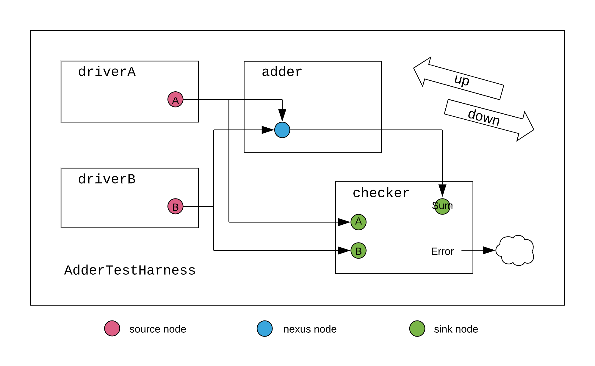
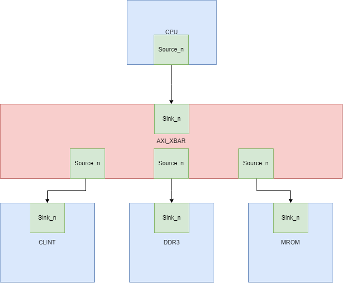
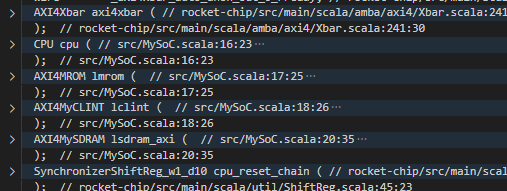

# 1. 官方的adder例子



**首先定义参数**

```
case class UpwardParam(width: Int)
case class DownwardParam(width: Int)
case class EdgeParam(width: Int)

```

也即是INT,

**之后实现节点**

```
object AdderNodeImp extends SimpleNodeImp[DownwardParam, UpwardParam, EdgeParam, UInt] {
  def edge(pd: DownwardParam, pu: UpwardParam, p: Parameters, sourceInfo: SourceInfo) = {
    if (pd.width < pu.width) EdgeParam(pd.width) else EdgeParam(pu.width)
  }
  def bundle(e: EdgeParam) = UInt(e.width.W)
  def render(e: EdgeParam) = RenderedEdge("blue", s"width = ${e.width}")
}
```

这个edge的意思就是去协商向上传的参数与向下传的参数,最终取最小值,然后bundle是根据协商参数创建数据类型,

然后就是节点,节点主要有SourceNode,SinkNode和NexusNode,由于 `SourceNode`只沿向外边生成向下流动的参数，节点实现和之前一样。对 `AdderDriverNode`而言，类型为 `Seq[DownwardParam]`的 `widths`表示初始化该节点（`AdderDriver`）的模块时输出的数据宽度，这里使用 `Seq`是因为每个节点可能驱动多个输出，在这个例子中，每个节点会连接到加法器和monitor。SinkNode同理

最后就是Nexus节点,

加法器节点接收两个 `AdderDriverNode`的输入，并把输出传递给monitor，该节点为 `NexusNode`。`dFn`将向内边传来的向下的参数，映射到向外边的向下的参数，`uFn`将向外边的向上的参数，映射到向内边的向上的参数。

(内边可以理解为传入的参数,外边可以理解为向外传的参数)

```
class AdderDriverNode(widths: Seq[DownwardParam])(implicit valName: ValName)
  extends SourceNode(AdderNodeImp)(widths)

/** node for [[AdderMonitor]] (sink) */
class AdderMonitorNode(width: UpwardParam)(implicit valName: ValName)
  extends SinkNode(AdderNodeImp)(Seq(width))

/** node for [[Adder]] (nexus) */
class AdderNode(dFn: Seq[DownwardParam] => DownwardParam,
                uFn: Seq[UpwardParam] => UpwardParam)(implicit valName: ValName)
  extends NexusNode(AdderNodeImp)(dFn, uFn)
```

这个里面有两个模板匹配,然后最终传入的AdderNode的值为(dps和ups的head),最后将输入累加

```
class Adder(implicit p: Parameters) extends LazyModule {
  val node = new AdderNode (
    { case dps: Seq[DownwardParam] =>
      require(dps.forall(dp => dp.width == dps.head.width), "inward, downward adder widths must be equivalent")
      dps.head
    },
    { case ups: Seq[UpwardParam] =>
      require(ups.forall(up => up.width == ups.head.width), "outward, upward adder widths must be equivalent")
      ups.head
    }
  )
  lazy val module = new LazyModuleImp(this) {
    require(node.in.size >= 2)
    node.out.head._1 := node.in.unzip._1.reduce(_ + _)
  }

  override lazy val desiredName = "Adder"
}
```

主要就是设置numoutputs个驱动节点,然后给每个节点分配随机值

```

/** driver (source)
  * drives one random number on multiple outputs */
class AdderDriver(width: Int, numOutputs: Int)(implicit p: Parameters) extends LazyModule {
  val node = new AdderDriverNode(Seq.fill(numOutputs)(DownwardParam(width)))

  lazy val module = new LazyModuleImp(this) {
    // check that node parameters converge after negotiation
    val negotiatedWidths = node.edges.out.map(_.width)
    require(negotiatedWidths.forall(_ == negotiatedWidths.head), "outputs must all have agreed on same width")
    val finalWidth = negotiatedWidths.head

    // generate random addend (notice the use of the negotiated width)
    val randomAddend = FibonacciLFSR.maxPeriod(finalWidth)

    // drive signals
    node.out.foreach { case (addend, _) => addend := randomAddend }
  }

  override lazy val desiredName = "AdderDriver"
}
```

主要就是设置numoperands个监视节点,和一个adder节点,然后对比nodesum节点和nodeseq节点值的区别,送出error

```
class AdderMonitor(width: Int, numOperands: Int)(implicit p: Parameters) extends LazyModule {
  val nodeSeq = Seq.fill(numOperands) { new AdderMonitorNode(UpwardParam(width)) }
  val nodeSum = new AdderMonitorNode(UpwardParam(width))

  lazy val module = new LazyModuleImp(this) {
    val io = IO(new Bundle {
      val error = Output(Bool())
    })

    // print operation
    printf(nodeSeq.map(node => p"${node.in.head._1}").reduce(_ + p" + " + _) + p" = ${nodeSum.in.head._1}")

    // basic correctness checking
    io.error := nodeSum.in.head._1 =/= nodeSeq.map(_.in.head._1).reduce(_ + _)
  }

  override lazy val desiredName = "AdderMonitor"
}
```

最后就是顶层,顶层就是通过高阶函数将每个节点链接起来

```
class AdderTestHarness()(implicit p: Parameters) extends LazyModule {
  val numOperands = 2
  val adder = LazyModule(new Adder)
  // 8 will be the downward-traveling widths from our drivers
  val drivers = Seq.fill(numOperands) { LazyModule(new AdderDriver(width = 8, numOutputs = 2)) }
  // 4 will be the upward-traveling width from our monitor
  val monitor = LazyModule(new AdderMonitor(width = 4, numOperands = numOperands))

  // create edges via binding operators between nodes in order to define a complete graph
  drivers.foreach{ driver => adder.node := driver.node }

  drivers.zip(monitor.nodeSeq).foreach { case (driver, monitorNode) => monitorNode := driver.node }
  monitor.nodeSum := adder.node

  lazy val module = new LazyModuleImp(this) {
    // when(monitor.module.io.error) {
    //   printf("something went wrong")
    // }
  }

  override lazy val desiredName = "AdderTestHarness"
}
```

# 2. 根据rocketchip 搭建一个SOC框架(基于ysyxSoC)

首先我们需要包含freechip库,有两种方法,1.直接从云端下载,2.直接导入本地的库,本实验选择第二种,基于ysyxSoC的build.sc来创建自己的sc文件,导入成功后就可以进行自己的SoC搭建

我们的SoC框架如下所示



也就是我们CPU需要一个AXI_master节点,clint,SDRAM和MROM各自需要一个AXI_slave节点,然后AXI_XBAR继承于NexusNode,可支持多个输入节点和多个输出节点

然后设备的地址空间安排如下:

| 设备  | 地址空间                |
| ----- | ----------------------- |
| clint | 0x1000_0000-0x1000_ffff |
| SDRAM | 0x8000_0000-0x9fff_ffff |
| MROM  | 0x2000_0000-0x2000_ffff |

首先创建clint的slave节点

```
class AXI4MyCLINT(address: Seq[AddressSet])(implicit p: Parameters) extends LazyModule {
  val beatBytes = 4
  val node = AXI4SlaveNode(Seq(AXI4SlavePortParameters(
    Seq(AXI4SlaveParameters(
        address       = address,
        executable    = true,
        supportsWrite = TransferSizes(1, beatBytes),
        supportsRead  = TransferSizes(1, beatBytes),
        interleavedId = Some(0))
    ),
    beatBytes  = beatBytes)))

  lazy val module = new Impl
  class Impl extends LazyModuleImp(this) {
  }
}
```

可以看到我们首先创建了slvae节点，这个节点里面有一个TransferSizes，来揭示最多可以传多少笔数据，这里是按照四笔来说的，然后在之后的LazyModuleImp有具体的实现，我们可以根据传入的node的信号的地址来读写相应的寄存器，然后SDRAM和MROM比较类似，以SDRAM为主要讲解

```
class AXI4MySDRAM(address: Seq[AddressSet])(implicit p: Parameters) extends LazyModule {
  val beatBytes = 4
  val node = AXI4SlaveNode(Seq(AXI4SlavePortParameters(
    Seq(AXI4SlaveParameters(
        address       = address,
        executable    = true,
        supportsWrite = TransferSizes(1, beatBytes),
        supportsRead  = TransferSizes(1, beatBytes),
        interleavedId = Some(0))
    ),
    beatBytes  = beatBytes)))

  lazy val module = new Impl
  class Impl extends LazyModuleImp(this) {
    val (in, _) = node.in(0)
    val sdram_bundle = IO(new SDRAMIO)

    val msdram = Module(new sdram_top_axi)
    msdram.io.clock := clock
    msdram.io.reset := reset.asBool
    msdram.io.in <> in
    sdram_bundle <> msdram.io.sdram
  }
}
```

SDRAM仍然是先创建slave节点，然后LazyModuleImp中将节点连接到msdram的输入端，这个模块是一个黑盒，这地方的好处就是一般sdram和DDR都使用IP,而现在的IP一般都是verilog,所以包裹一层黑盒

```
class MySoC(implicit p: Parameters) extends LazyModule {
  val xbar = AXI4Xbar()
  val cpu = LazyModule(new CPU(idBits = ChipLinkParam.idBits))
  val lmrom = LazyModule(new AXI4MROM(AddressSet.misaligned(0x20000000, 0x10000)))
  val lclint = LazyModule(new AXI4MyCLINT(AddressSet.misaligned(0x10000000, 0x10000)))
  val sdramAddressSet = AddressSet.misaligned(0x80000000L, 0x2000000)
  val lsdram_axi = Some(LazyModule(new AXI4MySDRAM(sdramAddressSet))) 

  List(lsdram_axi.get.node ,lmrom.node, lclint.node).map(_ := xbar)
  xbar := cpu.masterNode
  
  override lazy val module = new Impl
  class Impl extends LazyModuleImp(this) with DontTouch {

    cpu.module.reset := SynchronizerShiftReg(reset.asBool, 10) || reset.asBool
    cpu.module.slave := DontCare
    val intr_from_chipSlave = IO(Input(Bool()))
    cpu.module.interrupt := intr_from_chipSlave
    val sdramBundle = lsdram_axi.get.module.sdram_bundle
    val sdram = IO(chiselTypeOf(sdramBundle))
    sdram <> sdramBundle
  }
}
```

首先調用xbar创建XBAR,然后为每个设备分配地址空间,最后连线,也就是将slave node和xbar连线,cpu的master node 和xbar连线,之后就是实现部分,主要也是连线逻辑,然后就结束了整个SOC的创建



最后是生成的代码的一部分,可以看到正确链接

# 3.rocketchip 的AXIDelayer解析

```scala
  val node = AXI4AdapterNode()
  require (0.0 <= q && q < 1)
```

首先可以看到他创建了一个AXI4AdapterNode,这个主要就是master原封不动传进来,slave参数也是原封不动传进来,然后q就是请求延迟的概率

然后在lazymodule定义了一个feed函数

```scala
    def feed[T <: Data](sink: IrrevocableIO[T], source: IrrevocableIO[T], noise: T): Unit = {
      // irrevocable requires that we not lower valid
      val hold = RegInit(false.B)
      when (sink.valid)  { hold := true.B }
      when (sink.fire) { hold := false.B }

      val allow = hold || ((q * 65535.0).toInt).U <= LFSRNoiseMaker(16, source.valid)
      sink.valid := source.valid && allow
      source.ready := sink.ready && allow
      sink.bits := source.bits
      when (!sink.valid) { sink.bits := noise }
    }
```

这个函数就是通过allow来截断sink和source的vaild和ready信号,allow主要有两个信号,一个是hold,另一个是比较电路,假设我们第一次使用这个,那么hold必然为false,只能通过后面的比较电路来决定allow,如果后面的也为false,则会引入噪音,直到后面条件满足,这时控制信号就会通,但是bits仍然是有噪声的

```
    def anoise[T <: AXI4BundleA](bits: T): Unit = {
      bits.id    := LFSRNoiseMaker(bits.params.idBits)
      bits.addr  := LFSRNoiseMaker(bits.params.addrBits)
      bits.len   := LFSRNoiseMaker(bits.params.lenBits)
      bits.size  := LFSRNoiseMaker(bits.params.sizeBits)
      bits.burst := LFSRNoiseMaker(bits.params.burstBits)
      bits.lock  := LFSRNoiseMaker(bits.params.lockBits)
      bits.cache := LFSRNoiseMaker(bits.params.cacheBits)
      bits.prot  := LFSRNoiseMaker(bits.params.protBits)
      bits.qos   := LFSRNoiseMaker(bits.params.qosBits)
    }
```

这个就是给ar和aw通道加noise

```
   (node.in zip node.out) foreach { case ((in, edgeIn), (out, edgeOut)) =>
      val arnoise = Wire(new AXI4BundleAR(edgeIn.bundle))
      val awnoise = Wire(new AXI4BundleAW(edgeIn.bundle))
      val wnoise  = Wire(new  AXI4BundleW(edgeIn.bundle))
      val rnoise  = Wire(new  AXI4BundleR(edgeIn.bundle))
      val bnoise  = Wire(new  AXI4BundleB(edgeIn.bundle))

      arnoise := DontCare
      awnoise := DontCare
      wnoise := DontCare
      rnoise := DontCare
      bnoise := DontCare

      anoise(arnoise)
      anoise(awnoise)

      wnoise.data := LFSRNoiseMaker(wnoise.params.dataBits)
      wnoise.strb := LFSRNoiseMaker(wnoise.params.dataBits/8)
      wnoise.last := LFSRNoiseMaker(1)(0)

      rnoise.id   := LFSRNoiseMaker(rnoise.params.idBits)
      rnoise.data := LFSRNoiseMaker(rnoise.params.dataBits)
      rnoise.resp := LFSRNoiseMaker(rnoise.params.respBits)
      rnoise.last := LFSRNoiseMaker(1)(0)

      bnoise.id   := LFSRNoiseMaker(bnoise.params.idBits)
      bnoise.resp := LFSRNoiseMaker(bnoise.params.respBits)

      feed(out.ar, in.ar, arnoise)
      feed(out.aw, in.aw, awnoise)
      feed(out.w,  in.w,   wnoise)
      feed(in.b,   out.b,  bnoise)
      feed(in.r,   out.r,  rnoise)
```

这一堆主要就是将node in和out的信号和参数分开,然后为w,r,b通道加噪声,最后将这些噪声通过feed传到总线,其实这个模块就是去延迟vaild和ready,在延迟期间bits是noise,在sink为vaild期间就是source的bit
