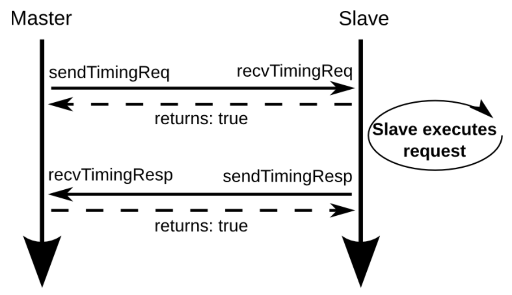
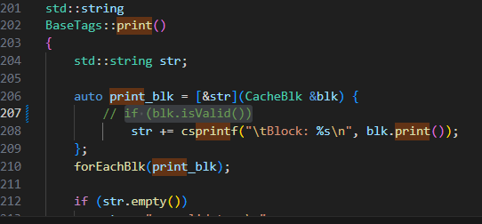
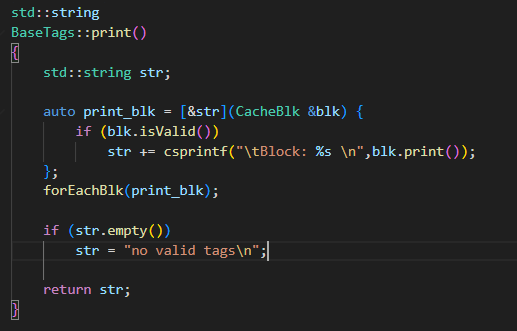

* [X] event programming
* [X] new config
* [X] debug flags
* [ ] out of order

**在GEM5退出时，Dump cache中所有的line的地址和内容， 参考[Event-driven programming](https://www.gem5.org/documentation/learning_gem5/part2/events/)， 但是退出的event callback和这里展示的例子不完全一样，需要自己去阅读相关代码。**

首先我使用的CPU类型为TimeSimpleCPU,直接找他与Cache如何交互,也即是下图



然后找到了tags,这里可以打印所有的blk

在cache/tags/base.cc,可以打印所有的blk



registerExitCallback注意这个函数



这个是tag/base.cc

这个如何实现遍历:

```
    void forEachBlk(std::function<void(CacheBlk &)> visitor) override {
        for (CacheBlk& blk : blks) {
            visitor(blk);
        }
    }


```

首先将输入参数变为函数,接受一个blk参数,然后这个blks是blk的集合,存了所有blk,然后进行遍历

这个是base_set_assoc.h

所以可以在结束时调用这个函数,这样就可打印全部内容

```
BaseTags::BaseTags(const Params &p)
    : ClockedObject(p), blkSize(p.block_size), blkMask(blkSize - 1),
      size(p.size), lookupLatency(p.tag_latency),
      system(p.system), indexingPolicy(p.indexing_policy),
      warmupBound((p.warmup_percentage/100.0) * (p.size / p.block_size)),
      warmedUp(false), numBlocks(p.size / p.block_size),
      dataBlks(new uint8_t[p.size]), // Allocate data storage in one big chunk
      stats(*this)
{
    // registerExitCallback([this]() { cleanupRefs(); });
    registerExitCallback([this]() { DPRINTF(DumpCache,"%s",print()); });
}

```

具体就是在这个函数内会注册退出时的回调函数,只需要将里面函数换为print就行

## NUMA

非统一内存访问架构的特点是：被共享的内存物理上是分布式的，所有这些内存的集合就是全局[地址空间](https://zh.wikipedia.org/wiki/%E5%9C%B0%E5%9D%80%E7%A9%BA%E9%97%B4 "地址空间")。所以处理器访问这些内存的时间是不一样的，显然访问本地内存的速度要比访问全局共享内存或远程访问外地内存要快些。另外，NUMA中内存可能是分层的：本地内存，群内共享内存，全局共享内存。

## SMT


### 1、SMT为什么能提升并行性能（多线程性能）？

SMT技术虽然是提升多线程下表现的性能，但SMT实际上是提升CPU单核性能大背景下的“副产品”。 一个单核单线程任务，在CPU的视角上，可以被看作是执行一连串连续的指令。比如说是下面这个例子里，假设执行的就是一个包含10个指令的任务：

```cobol
任务1 = A1 A2 B1 C1 D1 A3 A4 D2 C2 B2
```

我们先看最简单的场景，CPU执行这些任务最直接的办法就是一个指令一个指令的执行，假设这些指令的执行周期都是N，那么执行完这些指令，就需要10N个周期。那么CPU的速度就只和CPU的频率相关了，显然这也不符合我们的认知，不同CPU在相同频率下的性能显然不一样。

除了频率以外，要提升CPU的单核性能，第一个常见手段就是尽可能的缩短每个指令执行的周期，不过在我们假设的这个场景中和SMT关系不大，这里就不说了。第二个常见手段就是指令级并行（ILP）。虽然说这个任务1理论上是得一个指令接着一个指令的执行，但实际上这些指令并一定只能这么顺序执行，只要两个指令之间没有相互依赖和冲突，那么就可以并发执行（一起执行），从而缩短总的执行时间。 例如在上面这个例子中，我将指令分组成A B C D四组，组内必须顺序执行，组间的指令完全没有依赖（彼此不依赖对方执行后的数据）和冲突（不共享资源，不是一类操作），那么我们就可以并发执行这些指令。

```cobol
任务1A：A1 A2 A3 A4
任务1B：B1 B2
任务1C：C1 C2
任务1D：D1 D2
```

那么我们还是假设每个任务的执行周期是N，可以看到只要我们按照上述分组执行代码，那么整体的执行时间就只取决于最长的一组任务1A，也就是执行时间可以缩短到4N，速度提升到2.5倍。

显然，如果说要在一个CPU核心里同时执行上述几组任务，那么CPU自然得具备至少4组执行端口，这里我们也简化成PA、PB、PC和PD，分别执行上述的1A 1B 1C 1D。所以现代的CPU要提升单核性能，都会尽可能的把后端的执行端口数目变多，并且尽可能的在单位时间内读入更多指令，从而促进指令间的并发。

但是，实际的任务里，指令之间的依赖冲突关系是错综复杂的，不可能完美的将指令均匀的分组到每一个端口上。 就比如说我们上面这个例子里，在并发执行后虽然时间缩短为了4N个周期，但是实际上只有端口PA是一直在工作的，而PB PC PD都会在中途闲下来。


以Skylake为例子，后端执行端口EU不只一个

随着单核性能的不断提升，后端执行资源也越来越丰富，这种执行端口闲置的情况就会越来越明显，造成资源浪费。这时候，为了将这些资源物尽其用，同步多线程SMT就应运而生了。SMT的思路是这样的，既然一个任务填不满后端的资源，那么我们就找不只一个任务来填就好了，不同任务之间的相互依赖和冲突情况很低，放到一起来执行正合适去填满后端资源。

我们接着举例子，假设现在有一个新的任务2，同样是10个指令，同样按照端口分组：

```cobol
任务2 = B‘1 A’1 B‘2 C’1 C‘2 D'1 D’2 D‘3 C’3 A‘2
任务2A = A’1 A’2
任务2B = B’1 B’2
任务2C = C’1 C’2 C’3
任务2D = D'1 D’2 D‘3 
```

那么在指令级并发的情况下，这个任务的执行时间就是3N。


那么如果把任务1和任务2在单核CPU上分别执行，它们的执行时间就是4N+3N=7N。这时，如果我们引入SMT技术，虚拟出两个核心来，让他们同样在一个核心内执行，依然使用ABCD来表示互相不冲突的指令：

```cobol
PA：A1 A2 A3 A4 A’1 A’2
PB：B1 B2 B’1 B’2
PC：C1 C2 C’1 C’2 C’3
PD：D1 D2 D'1 D’2 D‘3 
```

那么这时候整个执行时间就变成了6N，比起之前的7N又提升16.7%的速度。

前端有两组维护不同任务上下文的单元就可以
