目录式协议(directory)----物理存储器中数据块的共享状态被保存在一个称为目录的地方。目录式协议的实现开销比监听式协议的稍微大一些,但可用于实现更大规模的多处理机。
监听式协议(snooping)----当物理存储器中的数据块被调入 Cache 时，其共享状态信息与该数据块一起放在该 Cache 中。系统中没有集中的状态表。这些 Cache 通常连在共享存储器的总线上。当某个 Cache 需要访问存储器时,它会把请求放到总线上广播出去,其他各个 Cache 控制器通过监听总线(它们一直在监听)来判断它们是否有总线上请求的数据块。如果有,就进行相应的操作。

无论是MSI还是MESI,MOESI,都差不多按照以下思路分析:r_hit,r_miss,w_hit,w_miss讨论状态机实现,其中每个transaction对应3,4,5个状态(MSI->MESI->MOESI),且都要考虑本地cache和其他cache,如右图所示

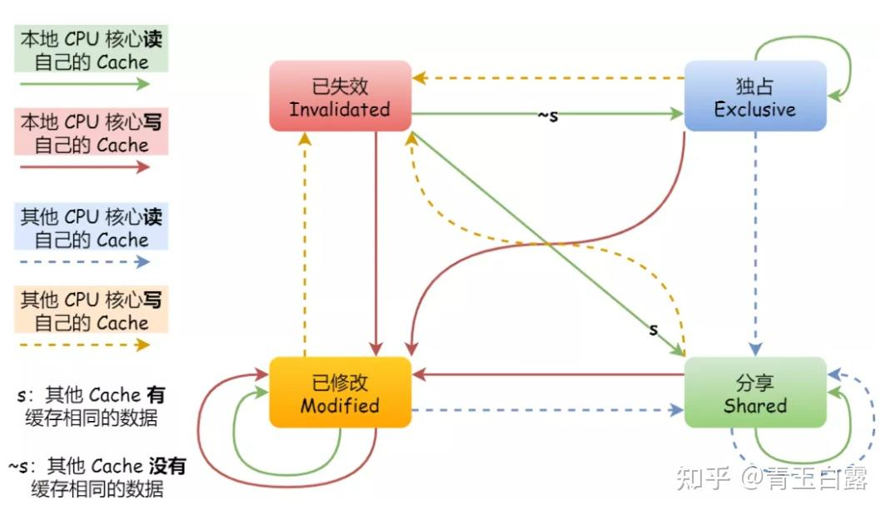

* M，modified，表示该数据已修改，即上述所说的“脏”数据，需要在合适的时机写回内存；
* E，Exclusive，表示该数据独占，意指此时该数据只存在某个核中，其他核没有该数据，于是就不需要所谓的广播给其他的核，也就没有缓存一致性的问题；
* S，Shared，表示数据共享，是从**数据独占**状态转移过来的。意指多个核中都有该数据，这个时候就会存在缓存一致性的问题；
* I，Invalidated，表示数据已失效，可以丢弃掉Cache Block的数据了（高并发情况下可能出现两个CPU同时修改变量a，并同时向总线发出将各自的缓存行更改为M状态的情况， **此时总线会采用相应的裁决机制进行裁决** ，将其中一个置为M状态，另一个置为I状态，且I状态的缓存行修改无效）；

MESI四种状态标志是存储在Cache Line中的

# **内存模型**

## SC

所有线程访存一定能构成全局序

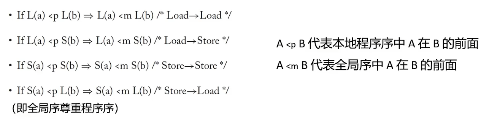

所有load结果都是全局序中最近的同地址store值

  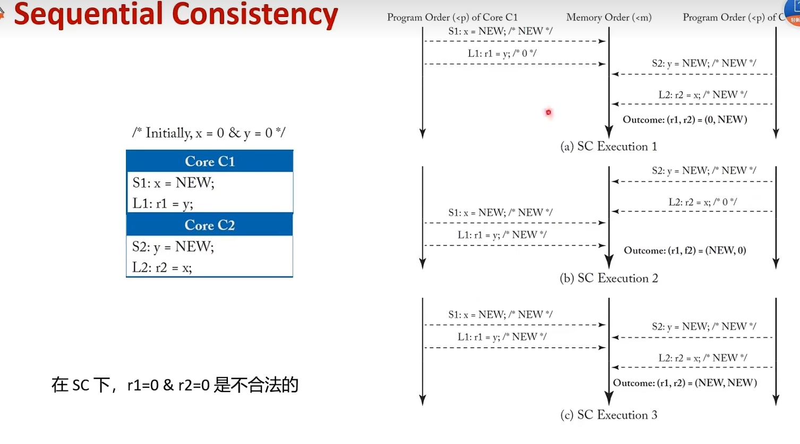 

## TSO

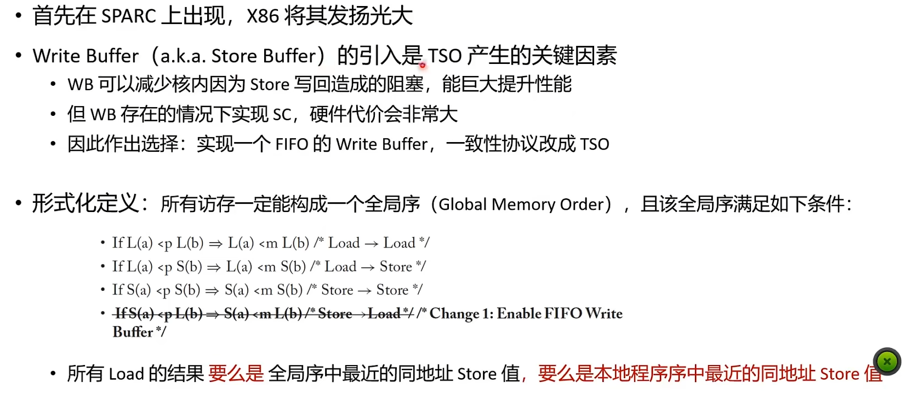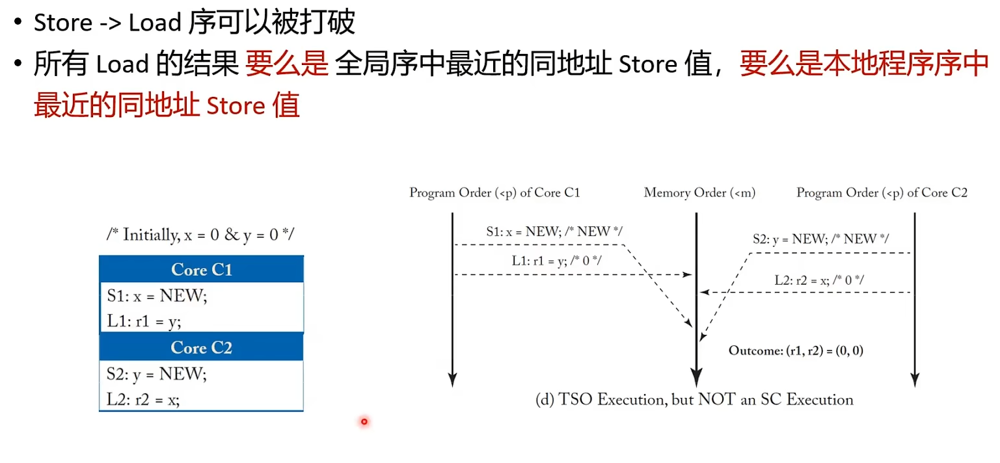

## RVWMO

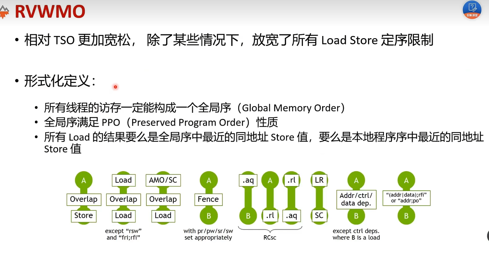

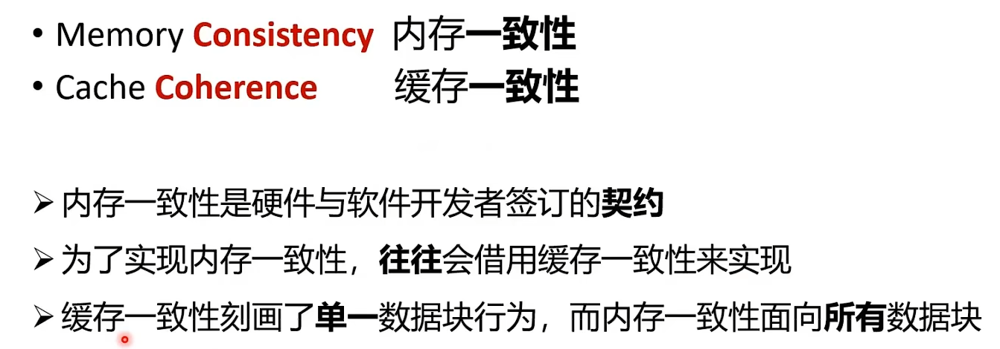

## 香山乱序访存

数据也会存到SQ

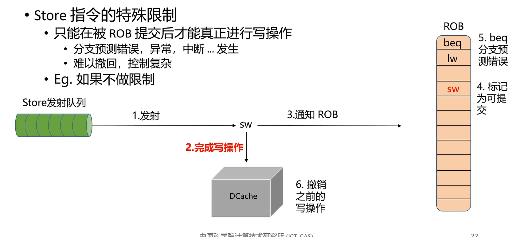

设置一个SQ,在派遣时将进入SQ,FIFO结构,当指令

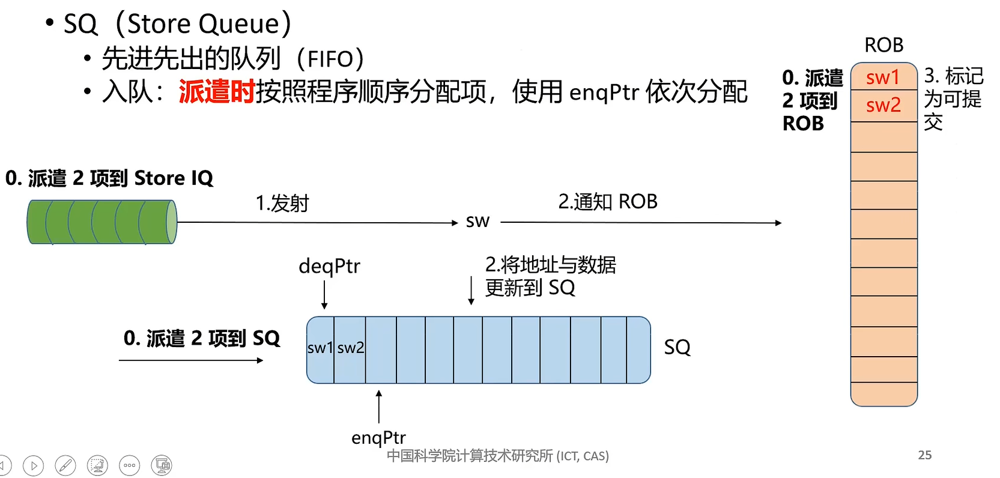

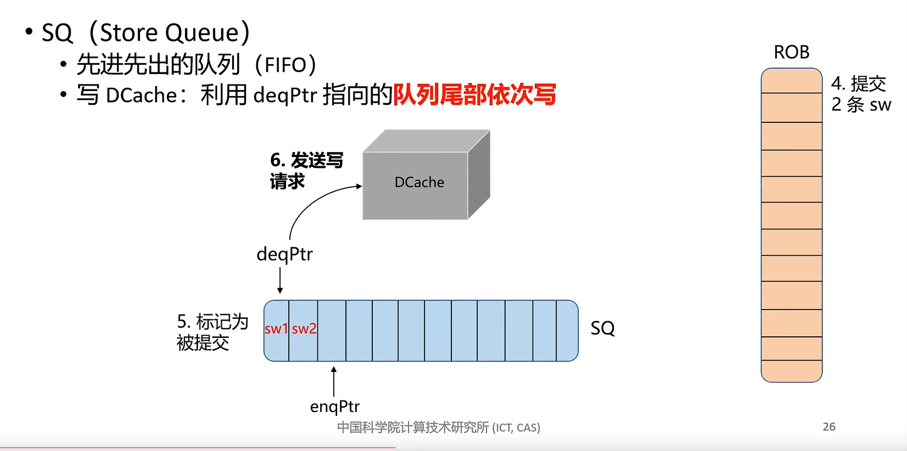

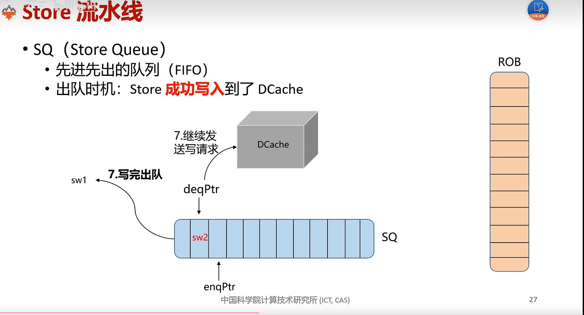

当**sw遇到TLBmiss** 让她退出流水,然后在SQ标记重发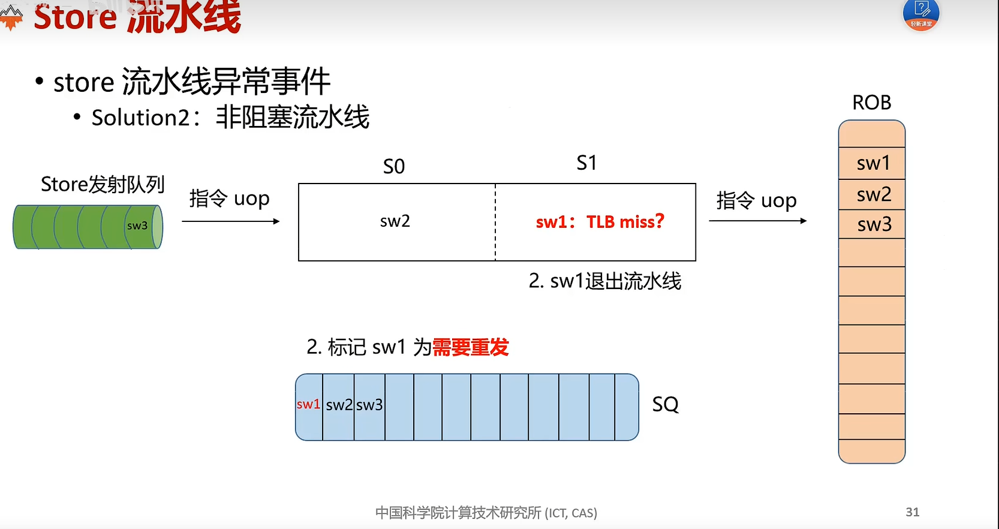

**load流水线**

load指令一方面数据来自DCache,另一方面来自SQ,而且SQ优先级更高,在读数据要对SQ和DCache的数据合并

**Store/load违例:load先于store执行**

1.阻塞,load得等,等到之前的store指令地址计算完,算是部分乱序

2.检测:检测到了违例,直接从lw之后把指令刷掉,(一种是ROB,但ROB太大)

所以可以设置一个LQ,FIFO,是ROB子集只用存LW指令,dispatch入队,sw指令会检测是否有比其更年轻的load(ROB地址值作为age)已经执行完了,从lw下面指令全部刷了.重新取

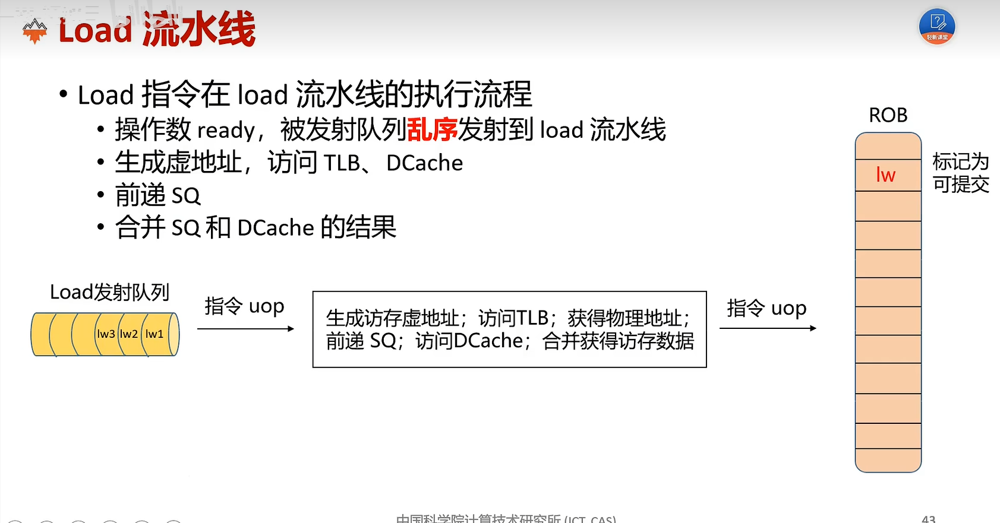

load异常事件:

TLBmiss

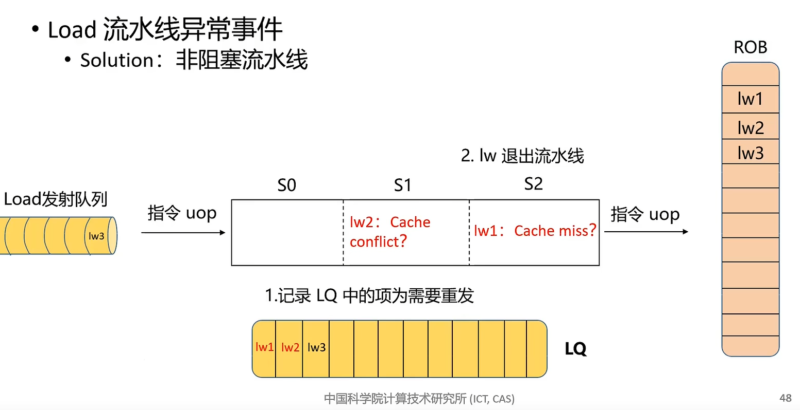

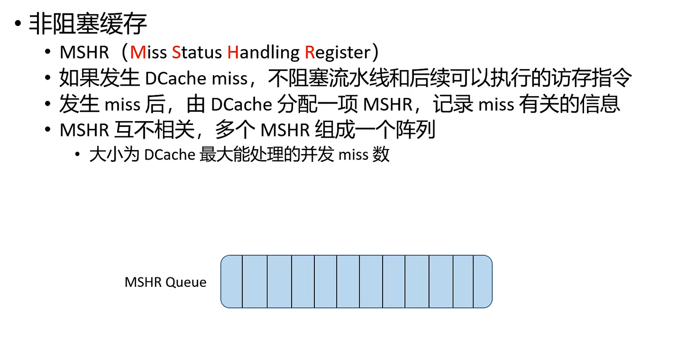

取回数据然后对唤醒LQ的指令
