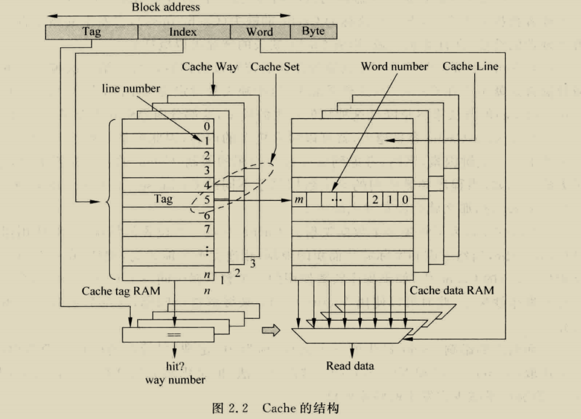
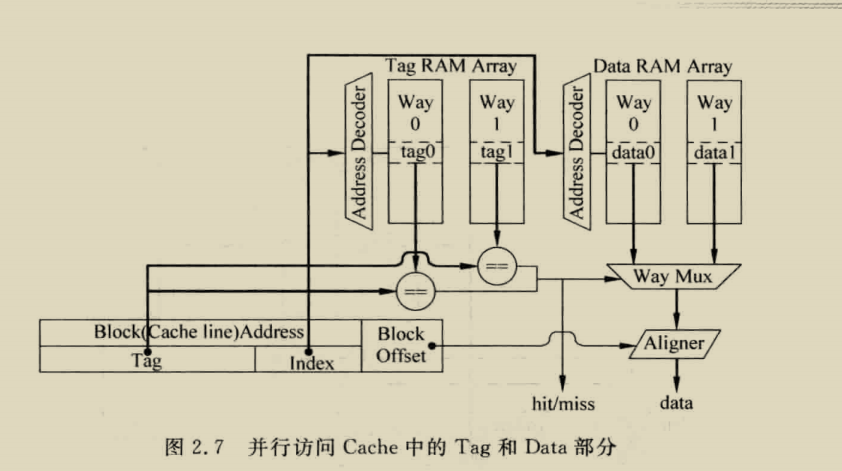
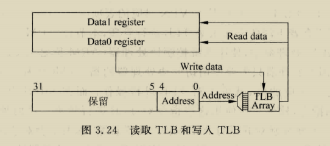
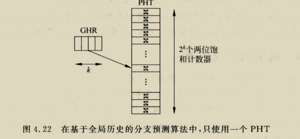
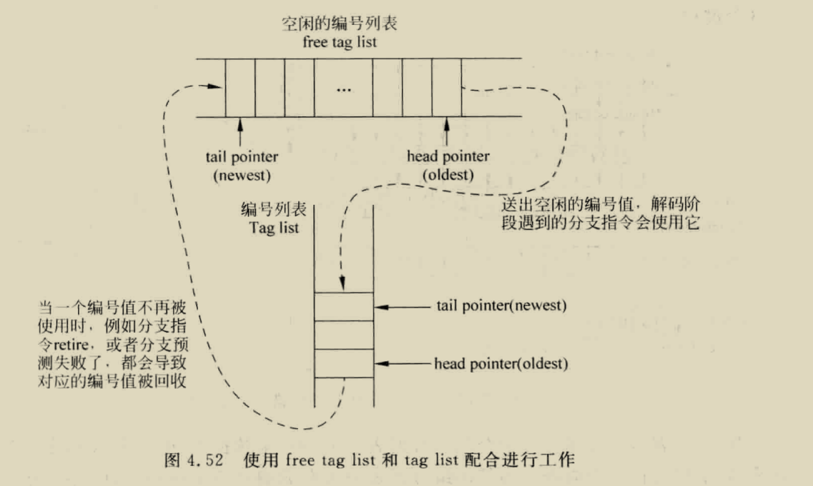
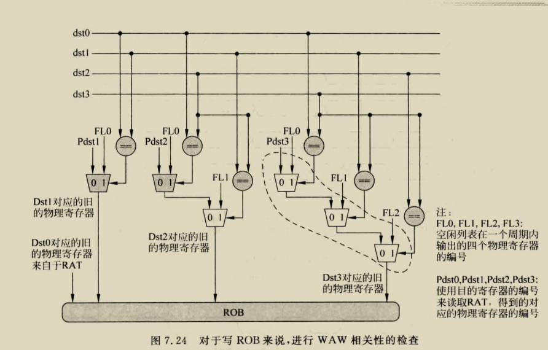
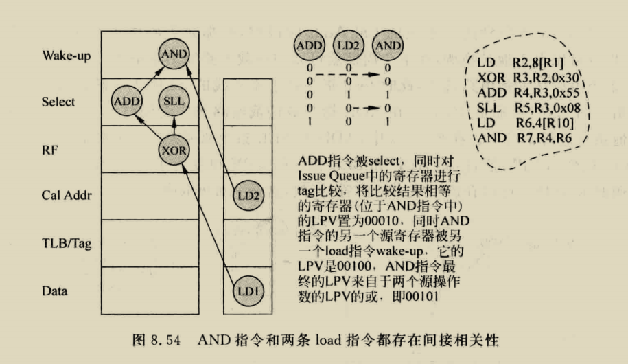
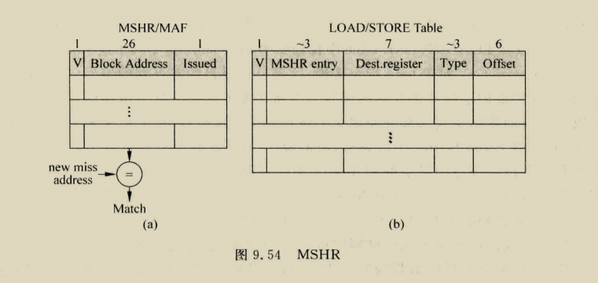

# Cache

## 一般设计

1.时间相关性:被访问的数据将来很有可能再次被访问

2.空间相关性:一个数据被访问,其周围空间的数据也有可能被访问

Cache主要由两部分:TAG和DATA

### Cache术语

Cache line:一个tag和他对应的数据组成,其中的data部分称为data block

Cache set:一个index对应多个cache line 这些line组成cache set

### cache实现方式

1. 直接映射:物理内存中数据,在cache中只有一个地方可以存放

特点:缺失率相对高,但延迟低

2. 组相联:物理内存中数据,在cache中有多个地方可以存放

特点:

延迟比直接的大,但缺失率低

3. 全相连:物理内存中数据,在cache中任意地方都可以存放

特点:

相当于只有一个index的组相连

灵活度高,缺失率低,但延迟大(一次访存要比较大量内容),所以设计时大小不会太大

### 流水线设计

1. 并行访问tag和data

   
2. 

   这是一个四级流水的并行访问结构,第一个周期将addr分为tag,index,offset,第二个周期访问data和tag ram,第三个周期进行hit判断,并选出数据,第四个周期输出数据

   特点:低时钟频率,高功耗
3. 串行访问tag和data

这个主要与并行的区别体现在234周期,第二个周期只发出tag ram请求,第三个周期判断hit,然后发出data ram请求,第四个周期得出数据送入第五个周期,第五个周期通过offset选出相应数据

特点:频率高,但处理器性能可能降低

## Cache写入

### 当发生写入时

* write through:数据写入Dcache同时也写入下级存储器
* write back:数据写入DCache,但不写入下级存储器,这时给这个写入的cache line设置 dirty位,当这个cacheline被替换时,将这个脏数据写入下级存储

### 当发生写缺失时

* write allocate:首先从下级存储器取出缺失行的数据,然后将写入DCache的数据合并到这个数据块中,最后将这个数据块写入DCache
* write non-allocate:将数据直接写入下级存储器,而不写入DCache

### 两种常见配合方法

* write non-allocate + write through

  
* write allocate + write back

  

### Cache替换策略

* PLRU
  实现方式通常为二叉树,每次更新(hit or miss)都是对从叶节点一直更新到根节点

  
* Random

  随机找一个行替换
* SRRIP

  抗扫描

  
* DRRIP

  抗抖动+扫描,主要实现方式是通过set dueling来选择到底是SRRIP还是BRRIP

  BRRIP就是小概率在RRPV=2替换,大概率在RRPV=3替换

  参考文献:

  High Performance Cache Replacement Using Re-Reference Interval Prediction (RRIP)

## 一些提高cache性能的方法

### 写缓存

对于write back:dirty数据被替换,存入write buf,然后就可以在下级存储读出数据了,这个write buf数据空闲时写入下级存储

对于write through:数据写入DCache同时写入write buf

但cache发生缺失,不仅要在下级存储寻找数据,还要在write buf 寻找数据,而且写缓存的数据为最新数据,如果同时读出write buf和下级存储的数据,采用writebuf 的数据

### 流水线

load在hit情况只需要一个周期,但store指令在hit时,第一个周期比较,第二个中秋选择是否写入数据,假如store后紧接着load,这时load的数据可能在delayed store data中,需要做一个bypass,但其实这个有一个问题,也就是假如发生load aft store,这样会导致两个指令竞争addr端口,必须对两个指令进行调度,或者使用双端口cache

### 多级结构

inclusive:L2包含L1全部内容,且要求L2相连度大于L1(便于cache一致性管理,检查数据只需要检查l2cache的数据,l2含有,那就置为无效,l2没有那么l1必然没有)

当L1 miss时,访问L2cache,如果L2 miss,会找到替换的line,并将该line对应的l1cache 的line无效,然后返回数据

exclusive:L2与l1数据不同

### Victim Cache

和write buf 较为相似(他是保存被替换的数据)

### 预取

#### 硬件预取

* 总是取出下一行

#### 软件预取

### 多端口Cache

#### True Multi-port

需要对TAG和DATA  SRAM进行复制,改变的是SRAM

#### Multiple Cache Copies

不需要改变SRAM,写时候,同时写入两个SRAM,一个cache 替换,另一个也得替换

#### Multi-banking

将Cache 的DATA分为多个bank,每个bank都有一个端口,如果一个周期内,多个端口访问的地址位于不同bank,不会引起任何问题,如果位于相同bank,会引起bank冲突,这种可以采用多个bank来缓解这个问题

下图是AMD Opteron 处理器的cache,其参数如下

total size:64KB

two way

Data block size:64B

故offset:[5:0]

index[14:6]

而由于采用了bank,所以offset的高三位[5:3]是寻址bank的

这是一个VIPT的结构,使用虚拟的index寻址,物理的tag做对比,每个端口都含有一个TLB和TAG RAM,但DATA RAM大小不变

# 虚拟存储器

本章假设页大小为4K

## 本章术语

VA;虚拟地址

VPN:虚拟页

PT:页表

PTR:页表寄存器

PTE:页表表项

PA:物理地址

## 多级页表组织方式

下图为三级页表组织方式,在riscv中64位至少为3级页表(SV39,SV48,SV57),RV32的是SV32

下面讲解RISCV的组织方式,RISCV使用SATP这个csr寄存器来保存第一级页表在物理内存的基地址,而第一级页表基地址+VA给的偏移地址就组成了这个地址在第一级PT的位置,然后第一级页表读出的地址为第二级页表的基地址,以此类推

所以含有三级页表的CPU执行LW或SW指令,要访问4次物理内存(3次页表访问,一次数据访问)

## Page Fault

如果发生页缺失,且物理内存无空间,此时OS会对一个页进行替换,覆盖这个页之前,需要将他内容写入硬盘,所以在每个PTE上加一个脏位,一个页内某个地址被写入,这个页对应的PTE脏位为1

硬件上需要做到:

1. 发现 page fault,生成异常,跳转到相应地址
2. 当store指令指令,需要将PTE的脏位置为1
3. 当访问物理内存,需要将PTE的USE位置为1

## 程序保护

计划讲解RISCV的PMP和PMA(目前还不太了解)

## 加入TLB和Cache

### TLB设计

为了减少TLB缺失(只有时间相关性),一般采用全相联来组织TLB,现代处理器一般采用两级TLB,第一级私有,第二级共享

如果送入的地址和TLB其中一个VPN相等,则TLB命中,送出PFN,如果没有,则发生TLB缺失,要去物理内存访问页表:

1. 假设物理内存找到的PTE有效,那么直接从页表得到这个地址,同时写回TLB
2. 假设未找到,这样应该产生Page Fault,操作系统从硬盘将相应页搬移到物理内存,将他在物理内存的首地址放在页表对应的PTE,将PTE内容写入TLB

#### TLB缺失

##### 缺失的一些情况

1. 虚拟地址对应的页不在物理内存,此时页表没有对应PTE,而TLB内容来自页表,所以必然缺失
2. 虚拟地址对应的页在物理内存,但这个PTE并未放入TLB
3. 虚拟地址对应的页在物理内存,这个PTE被替换掉了

解决TLB缺失的本质是找到映射关系,然后将映射关系写入TLB,这个过程称为**PTW,目前的两种方式:**

1. 软件:一旦TLB缺失,硬件吧产生tlb缺失的虚拟地址保存到一个特殊寄存器,然后产生TLB缺失异常,软件通过这个寄存器内容寻址页表,找到对应的PTE,写回TLB(处理器需要有支持TLB的指令)
2. 硬件:由MMU完成

##### TLB写入

加入tlb后,处理器送出的地址首先会访问tlb,如果命中,从tlb得出物理地址,如果tlb采用写回.那么dirty的页表不会立马从tlb写回到页表,导致页表的状态为可能是过时的,,操作系统可以认为tlb记录的页都是要被使用的,操作系统可以得知哪些pte被放到了tlb中,

操作系统在page fault时如果从物理内存选出要替换的页是脏的,首先将这个页写入硬盘,然后再覆盖,但如果使用了dcache,若dcache的内容保留着这个页的数据,那麽dcache的数据也得写入硬盘

当TLB缺失时,需要从页表中将一个新的pte写入tlb，如果tlb此时已经满了那么就要替换掉tlb的表项，但假如被替换的表项数据存在于dcache，那么就需要操作系统可以控制dcache，从而使得最新内容在物理内存

##### TLB控制

tlb是页表的子集，如果页的映射关系在页表不存在，那么在tlb也不该存在，需要有可以对tlb表项无效的指令

1. 进程结束，进程的指令数据堆栈占用的表项就要无效，此时需要将ITLB和DTLB的相关表项全部无效，如果无ASID，就直接无效整个TLB，如果有，只需无效对应asid的表项
2. 进程占用物理空间太大，操作系统就会将一些不常用的写入硬盘，这样这些页在页表的映射关系应该置为无效，页需要将TLB对应表项置为无效

对TLB进行管理需要以下：

1. 能将TLB（包含ITLB和DTLB）所有表项置为无效
2. 能将TLB某个ASID对应表项置为无效
3. 能将VPN对应表项置为无效

**arm风格TLB管理**

1. arm在协处理器CP15提供了ITLB控制寄存器

   1. 将TLB的VPN匹配的表项置为无效，还需满足以下条件：
      如果一个表项的Global无效，则需要ASID相等
      如果Global有效，无需比较ASID

      
   2. 将TLB的ASID对应表项无效，但有global位的不受影响

      
   3. 将TLB没有锁定的表项无效，为了加快处理器关键程序的执行时间，将tlb一些表项设为锁定，这些内容不会被替换
2. DTLB控制寄存器（和ITLB一样）
3. 可写入和读出TLB的寄存器

   

   由于TLB一个表项大于32位，使用两个寄存器对对应一个表项，读TLB，TLB内容放入这两个寄存器，写TLB，这两个寄存器内容写入TLB

总的来说，ARM的TLB管理主要由协处理器实现，只需要访问协处理器的指令就行

**MIPS的tlb管理**

主要由专门的TLB指令完成

**RISCV的TLB管理**

有粗粒度的sfence.vma,还有细粒度的Svinval扩展

### Cache设计

#### Virtual Cache

使用TLB+物理cache，这样CPU先访问TLB，地址转换后才可以访问cache，增加了LOAD延迟

所以可以直接使用虚拟cache，直接通过虚拟地址访问Cache，如果没有在Cache找到数据，那么就会在TLB进行地址转换然后从下级存储取出数据

但会存在两个问题：

同义问题：多个不同的虚拟地址对应同一个物理地址，如printf

如图，当执行store指令向虚拟地址VA1写入数据时，虚拟cache中的VA1改变，但如果之后有load读取VA2，那么会得到过时数据

这个问题取决于Cache的大小和页的大小，对于大小为4K的页，虚拟地址低12位不会变，如果有一个直接相连的Cache，这个Cache小于4K，那么index不会大于12位，即使两个虚拟地址对应同一位置，他们寻址Cache的地址也是相同的，只有Cache大于4K，才会出现同义问题

可以使用bank解决（8K，直接相连）

1. 读取cache时，两个bank都会被读取，然后送到多路选择器，通过PA[12]选择数据
2. 写Cache，通过PA[12]选择bank写入（提交的时候才会被写入，此时物理地址早就知道了，同名问题对应的物理地址一样，所以使用物理地址选择bank可以选出唯一的bank）

同名问题：相同虚拟地址对应不同物理位置

这个只需要在TLB设置ASID就可以

#### 对Cache控制

主要对以下情况控制

1. DMA从外界搬运数据到物理内存的一个地址，这个地址在dcache被缓存，这样需要将dcache内容无效
2. DMA将数据搬运到外界，这个地址在DCache被缓存，需要先将DCache的新数据写入物理内存
3. 发生page fault，需要从硬盘读取一个页写入物理内存，如果物理内存被覆盖的页是脏的，并且这个页的内容一部分存在于Dcache，需要将DCache的内容写入物理内存，然后进行覆盖
4. 处理器的自修改指令，将修改的指令写入DCache，然后写入物理内存，ICache清空，将物理内存对应指令写入ICache

也就是需要以下操作

1. 将ICache无效
2. 将ICache的某个line无效
3. 将DCache所有line clean
4. 将DCache的某个line clean
5. 将DCache所有line clean，然后无效
6. 将DCache的某个line clean，然后无效

对于ARM，仍然使用协处理器实现，MIPS使用Cache指令实现，RISCV使用zifence扩展（粗粒度）实现

## TLB和Cache放入流水线

### PIPT

完全串行了TLB和Cache访问，但有以下优化方案，直接使用虚拟地址的offset寻址Cache（VIPT的一种情况）

### VIPT

1.2的情况不会出现同义问题，实际上相当于图3.36的设计，但是会严重显示Cache容量大小，要严格控制一个WAY大小小于页的大小

所以将1.2归为情况一，3归为情况2

重点讲解情况2

此时不能保证VA1和VA2寻址Cache的index是相同的，他们位12可能不同，于是他们可能放在不同的cache set，造成空间浪费，之前有bank可以解决

还可以采用让这些重名的虚拟地址只有一个存在于Cache，其他不允许存在，可以使用L2Cache实现，L2包含L1全部内容

下面是一种实现方法，L2cache中保存着a的部分

### VIVT

**小结**

# 分支预测

## 方向预测

### 局部历史

每个BHT中的BHR都有自己的PHT，由于上图方法使用PC的一部分，所以会有重名问题，各分支相互干扰，而且PHT的表还很大，占用大量空间

一种极端就是所有分支只使用一个PHT，此时不需要使用PC寻址PHTs，BHT所有的BHR来寻址这个PHT，但会发生两个不同指令的BHR相等，这样会寻址到同一个PHT表项，产生干扰导致预测精确率下降

其实每个BHR只会使用PHT的少数表项，所以多个BHR可以分别使用PHT的不同部分，但一定会有冲突发生：

1. 两条指令的PC的k部分相等，这样会干扰PHT表项
2. 两条分支对对应不同的BHR，但BHR内容一样，这样也会索引到PHT同一表项

为了避免这种情况，可以对PC和对应的BHR做处理，下图是对PC做哈希处理

一般处理有两种方法，如下图所示

### 全局历史

所有分支都使用一个BHR，BHR索引PHTs的具体表项，PC进行HASH处理索引PHTs，还可以只使用一个PHT，节省空间，但这样导致两条不同指令对于GHR相等的话造成冲突

所以采用以下方法解决

基本的2-Level Predictor的方式，BHR是每个branch各自有的，而PHT是使用的branch是使用同一个，所以这样可以称之为per-address BHR - global PHT的方式，简写为PAg[2]。除了per-address BHR，global BHR的方式之外，[2]中提到了一种set的方式，即在per-address和global中间的一种折中的方式，使用来自一个set的branchs的分支历史。除了BHR是否使用global的，还是per-address的，还是set的方式，PHT也将其分为了global，per-address和set三种方式，这样组合下来，就有9中的组合方式，分别简写为 GAg, GAp, GAs, PAg, PAp, PAs, SAg, SAp 和SAs。比如per-address BHR的示意图如下：

### TAGE

结构和PPM大致相似,特点:更新策略不同;

更新策略:1.更新u计数器,u计数器为2bit计数器,provider component的u计数器在alpred和其预测不同时递减,否则递增;并且该计数器会周期性重置,当预测失败时,首先更新provider component的pred计数器,其次如果provider component不是最长的历史.那么分配表项(分支历史大于provider component的),如果存在i<j<M,且u=0,直接分配该项,其他u计数器全部递减(i<j<M);假如有多个u=0,分配概率大的(一般历史短的)，最后初始化表项(u置为0,pred计数置为弱跳转)

## 分支预测更新

对于方向预测，需要更新的有BHR和PHT的饱和计数器

1. 更新BHR
   在全局历史分支预测：

   1. 取指阶段分支预测，然后根据预测结果直接更新GHR
   2. 当实际方向计算出来，此时更新BHR
   3. 提交阶段，离开流水线时，更新GHR

   使用方法3最为保守，最为安全，但会降低性能，其他分支也不会享受这个分支的结果

BR2-BR5使用的都不是最新的GHR值，会对准确度造成影响

使用方法2更新提前了很多，但对于超标量处理器影响较大，乱序执行阶段分支预测可能会位于预测失败路径，导致结果不一定对

使用方法1，其根本原因是分支预测准确率较高，预测失败需要对GHR进行修复：

1. 提交阶段修复法：提交阶段放一个GHR，当分支指令退休时，将结果写入GHR
   
   这种缺点是造成分支预测失败的惩罚增大
2. checkpoint修复法，对前端GHR更新时将旧的GHR保存起来，保存的值为checkpoint GHR，一旦这条分支结果被计算出来，就可以检查预测正误，如果预测正确，继续执行，预测失败，将checkpoint ghr恢复到前端，请从正确PC取指令

上图有一个存储器保存所有的GHR，由于新指令结果从GHR右侧移入，此时将预测方向相反的值写入就行，前端是顺序的，所以按照FIFO写入就行，而后端如果是乱序的，那么执行阶段得到的结果也有可能是错的（预测失败路径或者异常），此时仍然需要在提交阶段检查，提交阶段仍然需要RGHR

而对于基于局部历史的，可以在退休阶段更新，因为他只在乎一条跳转指令的行为，如果训练完成，预测正确率较高，少一次结果不会影响大局

## 目标预测

### PC-relative

#### BTB

不发生跳转：target=pc+sizeof(fetch group)

发生跳转：target = pc + signed(imm)

我们可以保存下来BTA，然后预测成功时，取出BTA，但这样得保存整个pc地址，可以采用下面的方法

这个是缩短pc位数，但缩短位数就会导致冲突，不同的pc寻址到相同BTB表项，这样其实概率不高，况且之后还可以对其进行修复

也可以采用异或的方法

通过这种方式，既降低PC位数，又避免重名问题

#### BTB缺失处理

1. 停止执行，直到指令被计算出来，这个时候会导致有较多的气泡
2. 继续执行，使用顺序的PC取指令，如果后续执行发现地址和计算的PC不同，则将分支指令之后的全部抹除

### 间接跳转

#### CALL/RETURN指令

CALL指令的目的地址比较固定，所以采用BTB

return指令返回地址为上一次CALL指令调用的PC，所以使用RAS保存

整个过程如下操作

首先当遇到CALL指令，需要将其下一条PC写入RAS，然后读BTB得到TARGET，当遇到return指令，要弹出RAS，然后得到target
所以要得知指令是否为CALL还是return指令，但指令直到解码才会被得出，这可以通过在BTB添加指令类型，call、return、其他类型，再遇到这个指令，通过查询BTB就可以得出类型

假如RAS满了，该如何进行操作，

1. 不对最新的call指令压栈，这样下一次执行return必然预测失败，而且RAS地址不能改变
2. 继续写入，这样最旧的会被覆盖，所以也会出现一条预测失败，但考虑到递归这种情况，会增加正确率，但递归会大量消耗RAS空间，所以可以弄一个计数器，检测本次call是否跟上次一样，如果一样，那么只增加计数器，如果不一样，进行压栈，弹栈的时候，首先看计数器是否为0，如果不为0，计数器-1，然后不改变RAS指针，直到计数器为0，才可以改变RAS指针

#### 其他预测方法

target cache

## 分支预测失败恢复

在流水线很多阶段可以对分支预测是否正确进行检查，

1. 解码阶段，可以检查出直接跳转类型的指令，还可以得到这个指令地址
2. 读取物理寄存器时，读到寄存器值，就可以对间接跳转进行检查
3. 执行阶段，所以类型指令都可以得到结果，对分支预测是否正确做出检查

分支预测失败可以使用ROB来解决，暂停取指令，但仍然执行流水线，当分支变为最旧的时候，将整个流水线清除，这种方法的缺点就是分支预测惩罚大，

另一种就是使用checkpiont恢复，也就是发现分支指令，在分支指令改变CPU state之前，先保存CPU state，包括RAT,PC等，预测失败，直接把checkpoint的搬运过来，使用这种方法需要识别哪条指令位于错误路径，这可以对每个指令进行标号（解码阶段），所有在分支指令之后的都会得到这个编号，直到下一个分支指令

所有在流水线的分支指令都会得到编号，编号保存在FIFO，他的容量就是流水线可以最多支持的分支指令，一旦满了，如果再解码出指令，就必须stall流水线，

一般性的设计方法可以是一个表格存没使用的编号，另一个存被使用的编号（和rename的RAT差不多），解码时刻对分支指令编号，之后的非分支指令均有这个编号，这两个表格本质就是FIFO

前面说过，解码时刻也可以检查分支预测，如果预测失败，也要对其进行分配编号，因为其之前有可能有预测失败的指令

当分支指令在执行预测失败，需要抹除之后的所有指令

1. 发射阶段前的全部被清除，
2. 发射阶段后的使用编号列表清除，这样不一定会在一个周期完成

如何使用编号列表找到指令呢？

如果ROB存储了编号，编号列表就可以进行广播，ROB中所有的指令将自己的编号与广播值比较，如果相等，进行无效，假如一个有32个表项的编号列表，最坏情况ROB需要与32个编号比较，其实可以每周期只广播一个或几个值，当编号不是很多，几个周期就可以完成，必须状态恢复才可以允许新指令进入发射阶段

但其实在流水线解码阶段，最多解码1，2条导致FIFO浪费，所以可以只允许一个周期解码一条分支指令，如果多条，那么第二条指令及之后的无法进入解码阶段

还有一个问题就是，在执行阶段如何得知预测的目标地址，可以把目标地址写入缓存PTA

## 超标量分支预测

要对指令组进行预测，就需要得到预测非跳转的PC，但这种不容易被接受，因为一个周期取出四条分支情况很少，大部分情况只会使用一个，而且一般为PC-relative，所以可以取出直接进行计算目标地址，也可以预解码，提前得知目标地址信息

多端口可以使用交叠，下面给出PHT的做法

# 寄存器重命名

程序中存在很多相关性：

1. 数据相关性

   1. WAW：两条指令都写入同一寄存器
   2. WAR:一条指令目的寄存器和他前面某条指令的源寄存器是一样的
   3. RAW:一条指令源寄存器来自他前面某条指令计算结果
2. 存储器数据相关性
   load和store指令WAW,WAR,RAW
3. 控制相关性
4. 结构相关性
   指令必须等到功能器件可以使用的时候才可以执行

数据相关性的三种类型，只有RAW是真相关，其他两种可以通过使用不同寄存器名字解决

所以这两种相关性称为假的相关性：

1. 有限个数寄存器
2. 程序中循环体，假如一直向R1写入值，那么就会产生大量WAW
3. 代码重用，很小的函数被频繁调用，原理同2

总之就是寄存器有限，所以引入寄存器重命名，处理器中实际存在但寄存器个数要多于指令集定义的寄存器，指令集定义的寄存器被称逻辑寄存器，处理器实际存在的称为物理寄存器

上图使用寄存器重命名解决WAW和WAR

## 寄存器重命名方式

一般有三种：

1. 将ARF扩展实现重命名
2. 使用统一的PRF
3. 使用ROB

一般实现寄存器重命名，要考虑

1. 什么时候占用寄存器，来自哪里
2. 什么时候释放，去往何处
3. 分支预测失败如何解决
4. 异常如何解决

### ROB进行重命名

当一条指令被写入ROB中,ROB的表项就是这个指令目的寄存器对应的寄存器，这样就完成了一条指令目的寄存器重命名过程，如果一条指令离开流水线，另一条指令执行也使用了相同但目的寄存器，那么ARF就不是最新值了，需要重命名映射表指示逻辑寄存器值是位于ROB还是ARF

图7.5中如果一个逻辑寄存器位于ROB，那么重命名映射表也会给出这个逻辑寄存器在ROB的编号，指令计算完毕，存储到ROB对应空间，指令离开流水线将结果从ROB搬出送入ARF，位置变动信息需要更新到重命名映射表，这个方法缺点如下：

1.很多指令无目的寄存器，但仍占用ROB表项

2.对于一条指令，他既可以在ROB取操作数，也可以在ARF取操作数，所以会需要ROB和ARF读端口变多

### ARF扩展

很明显，这个是ROB的延伸，原理与ROB类似

### 使用统一的PRF寄存器

这统一的PRF，没有和指令产生映射关系的都是空闲，会使用free list 记录PRF哪各处于空闲，当一条指令被寄存器重命名，并且存在目的寄存器，他就会占据PRF一个寄存器，这个寄存器会经历值没有被计算，值被计算但没退休，退休三个过程，

图7.7的free list可以使用FIFO实现，所有空闲的物理寄存器编号都位于其中，对于一个4-way，需要每周期最多可以读出4个值，每周期可以退休也是4条，最多有4个空闲编号送入这个free lsit（交叠）

一条指令在寄存器重命名时，需要对源寄存器和目的寄存器都处理，源寄存器查询RAT，目的寄存器就在free list找出一个空闲的，如果空闲列表空了，那么就要暂停重命名及其之前流水线，直到指令有退休的释放

还需要一个退休RAT，每当指令退休，把映射关系写入RAT，外界查找这个寄存器，就可以得到逻辑寄存器对应的物理寄存器

一个物理寄存器被占用后，何时变成空闲？当后边指令不再使用这个物理寄存器就可以，只要最后使用这个物理寄存器的退休，那么就可以变空闲，但不容易获得谁是最后一个使用的指令，所以处理器采用以下方法

当一条指令和之后的指令都写同一个目的寄存器时，后面指令退休，那么前边指令对应的物理寄存器就没作用了，为了实现这个，在ROB除了记录逻辑寄存器对应的物理寄存器，还需要记录之前对应的物理寄存器，以便在退休时，将旧的映射关系释放

## 重命名映射表

一种是基于SRAM，一种是基于CAM，

SRAM的方法相对比较常用，每次新写入sRAT的值会覆盖原来的值，将原来的写入ROB，但cRAT也不错，他checkpoint只需要保存V位，不需要保存整个cRAT，只需要保存V位，易于状态保存（之前有个疑问是，如果映射关系变了呢，但显然映射关系不会改变）

## 超标量寄存器重命名

一条指令重命名过程：

1. RAT找到src1和src2的映射关系
2. 从Free list找到空闲寄存器
3. 将之前的映射关系写入ROB，将映射关系写入RAT，这样就完成了重命名

对于超标量4-WAY，需要RAT 至少12R4W

但其实这只是一小部分，还需要解决WAW,WAR,RAW

A指令和B指令存在RAW，那么B的源寄存器的r0应该来自P30，而不是RAT

A,B,D存在WAW，但实际寄存器重命名消除不了相关性：

1. 写入RAT，只需将一个逻辑寄存器最新映射写入RAT就行，所以一个周期重命名的寄存器，只需将最新的指令映射关系写入即可
2. 当将旧的映射关系写到ROB，关系不止来自RAT，还来自WAW相关指令

所以需要进行WAW检查

B,D存在WAR，B读r0，D写r0，这个可以消除

所以超标量设计需要考虑RAW和WAW，

### 解决RAW

如果指令存在RAW相关性，对于R5=R6XR1，源寄存器R1对应的物理寄存器来自第一条指令，所以他的映射关系来自空闲列表读出的P31，而不是RAT读出的P25，其一般性电路如下

### 解决WAW

主要就是检查写RAT和ROB

**写RAT**

**写ROB**

选择写入ROB的旧映射关系是RAT还是freelist得出的值

## 寄存器重命名恢复

三种一般性恢复方法：

1. 使用Checkpoint恢复
2. 使用WALK对RAT恢复
3. 使用ARCH state对RAT恢复

### 使用checkpoint

随机访问的一个周期完成，串行的慢一些

### 使用WALK

可用ROB恢复，每条指令ROB都存了他之前对应的物理寄存器，当分支预测失败，通过这个分支编号将所有相关指令抹除，暂停流水线，从ROB底部开始逐条将每条指令之前对应的映射关系写到RAT，这个过程被称为WALK，这个过程慢，但消耗硬件少

### 使用Arch state

在统一PRF重命名中，处理器提交阶段也有一个RAT，称为aRAT，这个信息必然正确，当执行阶段发现分支预测失败，不立马进行RAT状态恢复，而是等分支指令变为最旧指令，这时候对sRAT进行恢复，但这个可能会加大分支预测惩罚（，其之前还有load导致的cache缺失）

# 发射

## 集中VS分布

总结来说集中式从储量庞大的指令寻找到几条可以执行的指令，这些指令还需要唤醒其他相关指令，增加了选择电路和唤醒电路的面积和延迟，分布式为每一个FU配备一个发射队列，所以每个发射队列容量小，简化选择电路设计，但当一个发射队列满了，即使其他发射队列还有空间，也不能继续向其中写入新的指令，需要暂停流水线，所以现代处理器一般结合两种，使得某种FU共同使用一个发射队列

## 数据捕捉VS非数据捕捉

数据捕捉：在发射前读取寄存器，这种方式设计重命名后读取寄存器，然后将读取的值写入发射队列，如果有些寄存器没被计算出来，就把编号写入以此供唤醒电路使用，他会被标记为无法获得，之后通过bypass获得值（一般结合ROB重命名）

非数据捕捉：

被重命名的指令不会去读取物理寄存器堆，而是在发射队列被选中后，将读取值送入FU执行，不需要payloadRAM，省空间（一般结合统一PRF）

## 压缩VS非压缩

压缩队列优点：分配电路简单，选择电路简单，但面积大，功耗大

非压缩：写入空闲位置即可，但空闲位置随机，一个周期找到多个空闲位置也不简单

这种电路：

要实现old-first，需要更复杂的电路

分配电路负载，需要扫描所有空间写入发射队列

## 发射阶段流水线

简单介绍，之后着重介绍每个流水线要操作的事情

非数据捕捉

数据捕捉

## 分配

对于4-way，需要每周期找到四个空闲位置，首先扫描空间找到四个空闲表项，为了更快，也可以按照下面的设计

但缺点就是如果一个段有空间，但其他段有空间，仍然无法使用其他的段，而且如果最老的A写入不了指令队列，之后的BCD也写入不了

## 仲裁

### 1-of-M仲裁

对于非数据捕捉，要实现old-first需要ROB的帮助，可以通过读取ROB的指针来得出年龄，然后作为指令年龄信息，ROB本质就是FIFO，如果直接使用指针，无法得出正确值，需要加入一个指针位，具体就是下面情况

这样就实现了old-first基础，分发阶段，将重命名之后的指令写入ROB和发射队列，然后一并将地址信息写入发射队列，然后就有年龄信息了，就可以仲裁选择最老指令，实际要考虑以下情况：

如何屏蔽发射队列没准备好的指令？

将其年龄信息设置为无限大，但无限大不现实，可以采用下面方法，当两个ready为1，进行年龄比较，只有一个ready为1，选择ready为·1的那条

如何根据年龄值找到指令呢

### N-of-M仲裁

这种方案整个延迟就是1-of-M，但无法实现理想功能，如下图，本周期有五条准备好的指令，每个FU对应的仲裁电路只能选择一个属于他的指令，所以本周期只能选择三条，可以增加FU数量，但又引入该分配到那个ALU，一种实现就是轮换分配，本周期ALU0，下周期ALU1

## 唤醒

### 单周期唤醒

唤醒电路如下，

单周期指令唤醒主要：

1. 被仲裁电路选中的指令将目的寄存器送入对应总线
2. 总线跟发射队列所有源寄存器对比，如果相等，将这个源寄存器设置为准备好
3. 当发射队列指令所有操作数准备好了，并且没有向仲裁电路发过请求，他就可以发送请求
4. 如果有更高优先级发出了请求信号，则这条指令不会得到响应，等下个周棋继续发，如果已经选中，就会标记为ISSUED，表示已经选中，但不离开
5. 发射队列指令收到响应信号，将目的寄存器送入对应总线，唤醒其他指令

## 多周期唤醒

唤醒其实就是将被选中的指令的目的寄存器编号送到总线上，然后将总线值与源寄存器对比，所以要将唤醒延迟，就有两种方法：

延迟唤醒和延迟广播，

延迟广播如下图，如果发现被仲裁电路选中指令执行数大于1（N），就延迟N-1周期，然后唤醒

但这可能会导致其他指令也使用这个总线，导致冲突

可以增加tag bus解决，但情况多的时候，需要大量bus，如果不加总线，就要记录每个指令执行周期，后续被选中的指令如果发现冲突，不会送入FU

上图做法访问表格和仲裁同事工作，座椅即使B被仲裁选中，也可能被表格给毙了，然后下个周期参加仲裁，接下来讲延迟唤醒，被仲裁指令会正常的将目的寄存器送往总线，但比较相等的寄存器不一定马上置为准备好的状态，而是根据这条指令执行周期，进行相应的延迟，然后再改变发射队列的源寄存器状态，这种方法不会出现总线竞争，如下图，延迟唤醒本质就是在ready位前➕延迟寄存器，其中一种实现如下：

采用移位寄存器，解码阶段可得知指令执行周期数，将执行周期进行编码，称为DELAY，然后每条存在的目的寄存器分配一个物理寄存器，每个物理寄存器含有一个DELAY值，每次写发射队列，这个DELAY也会写入

## 推测唤醒

主要针对执行周期不确定的，如load和一些可以early out的CPU，一种最简单的方法就是等指令执行完再进行其他指令唤醒，Cache命中率一般较高，所以可以先推测load指令命中，这样就可以按照下面的方式执行

但一旦A缺失，B就不能通过旁路网络获得操作数，也就无法在FU中执行，而且B还不能停，一停下来FU无法接受其他指令了，最好的方法就是把B重新放回发射队列，等到从L2得到数据，再对其进行唤醒

假设load缺失，就要进行恢复，此时被唤醒的寄存器重新变为未准备好，还有的已经出去发射队列了，需要在流水线抹掉，然后放入发射队列，然后load预测L2周期唤醒

不同结构的DCache对于推测唤醒的过程是有影响的，假设流水线结构如下，load电路被仲裁电路选中后，需要等待两个周期才可以唤醒，这两个周期可以放一些无相关性的指令称为IW，然后后面两个周期是load从唤醒其他指令到检测到自身是否缺失，而且SW窗口的指令不一定和load有相关性，IW也不一定和load无关，因为他可能是其他load的SW

下图就是Load1和Load3的IW窗口重合了，这两个周期被仲裁电路选中的指令未必可以获得操作数，取决于load1是否命中，当发现缺失，load的SW窗口指令就要被抹除，被抹除的指令会重新回到发射队列

不同DCache结构的IW和SW结构不同，但处理方式相似

这种方法主要两种：

**Issue Queue Based Replay**

这种指令被选中后不会立马离开发射队列，只有等指令被确定正确执行，才可以离开发射队列，这也就是之前的issued位

前文介绍的load指令的DCache缺失只是replay的一种情况，比如DCache的bank冲突，store、load违例，load、load违例

，只有指令执行正确才可以离开，对于load、store完全乱序，即使load命中，甚至load执行完毕，但只要没有离开流水线，就有可能被送回去，而部分乱序和完全顺序则不会出现这个问题,此时只有和load相关的才会被replay，跟精确说就是SW内的指令才可能被replay，这种方法缺点就是造成发射队列的可用容量减少，所以要进行tradeoff

可以只对load指令采取基于发射队列的replay，一旦load指令在执行阶段得到了DCache的结果，就可以将发射队列相关指令释放，但对于store、load违例等，如果发生，那些被刷去的指令可能回不去发射队列（满了），这时，可以将需要replay指令抹除，重新取指令

load的replay仍然需要replay：

一种方法就是将所有在load指令之后被仲裁电路选中的指令全部放回发射队列。这种方法不会发生错误，但可以改进，比如IW内指令与该load无关，SW有的也无关，所以可以non-selective REPLAY，他是无差别选指令

假设DATA阶段，得到DCache是否命中，那么如果没有命中，将Data和wake-up阶段全部抹除，但只有OR和SUB和load有相关性，改进：IW窗口中cal和TLB阶段不需要抹除，只需抹除SW窗口的，将所有和load有相关性的放回发射队列置为not ready，其他不用关心，他们仍然准备好了，可在下周其参与仲裁，这要求可以识别相关性，

一是直接相关性，也即是OR，二是间接相关性，也即是SUB，可以采用一个load-vector来实现这个位数表示流水线最多可以存在几条指令

每个物理寄存器都有一个这个，非load存在目的寄存器，他的向量值就是两个源寄存器向量值异或的结果，load指令，除了来自源寄存器，他还会占用向量一个新的位，这样可以得到目的寄存器的向量值，更新到表格，指令被重命名，就可以将每个源寄存器的向量值写入发射队列，每当laod缺失，就根据这条指令在向量中对应位，找出有相关性的指令，这个适合流水线浅的，深的话需向量宽度增加，不然经常暂停

load指令只有在SW窗口的才和他有相关性，为了识别相关性，使用一个5位的值，表示load位于哪一位值,称为LPV，每当load被选中，LPV为10000，表示load处于select，这个周期进行唤醒（延迟唤醒），然后所有比较结果相等的都会获得这个值，每个周期，发射队列LPV右移一位

为了识别相关性，每条指令被选中后，唤醒其他指令都会讲LPV赋值给被唤醒的寄存器，这样就可以识别那个和load有相关性，当load到data阶段发现缺失，直接将LPV最低位为1的送入发射队列

注意上图需要注意：AND指令的LPV是两个源寄存器或

如果直接清除SW，然后选择性清除LPV最低为1的指令，就是non-selective，如果SW窗口的也选择性清除LPV最低为1，则是selective

这个方法适合数据捕捉，因为replay指令少

**Replay Queue Based Replay**

指令被选中，立刻离开发射队列，进入RQ，当一个指令退休时，就可以将RQ指令退出，如果发生访存违例，抹去指令，将RQ相关指令唤醒并向仲裁电路发出申请，而且RQ优先级高，这样可以将replay指令重新送回FU执行（他们更老）适合非数据捕捉，S-》E时间长，replay指令多

# 执行

执行阶段最主要的就是旁路网络设计和存储指令加速

## 旁路网络

当处理器只有两个FU，其旁路网络如下

但当FU个数较多，就会出现下面情况

而且会出现，乘法32个周期，但逻辑操作只需要1个周期，那么就是可能会在一个周期同时想用这个旁路网，导致冲突，也就是下面情况

这种情况该如何处理呢，最简单的方法就是按照推测唤醒讲解的思路，先假设不会冲突，然后按正常流程唤醒和仲裁，一条指令到FU，首先检查FU是否空闲，比如FU接受了latency=3的，本周期就不能接收2的，如果本周期是2的就要返回到IQ

假设一个仲裁电路对应的FU可以计算3种类型的指令，延迟分别为1，2，3

则：

在发射队列每个表项增加两个信号，分别指示它其中的指令latency的值是1还是2

这种设计可以执行延迟为1，2，3的三种指令，但只需要对延迟为1，2的指令请求处理：

1. 本周期选中延迟为3的，下周期无法选择延迟为2的，下下周期无法选择延迟为1的，所以下周期需要将仲裁电路对应的寄存器设置为10，这个寄存器每周期向右移位，下下周期为01，表示不允许执行周期为1的进入,如果本周期选择延迟3的下周起还选择延迟3的，那么

2. 本周期选择的是2的，下周起不允许选择延迟为1的，在下周期设置控制寄存器为01
3. 本周期选择的1的，只需设置控制寄存器为00

### 复杂设计的旁路网络

这种流水线如下图

旁路网络如下图

下图更直观

下图情况是两条指令相邻和相差一个周期

当相差两个周期时，这个阶段只能在Write back到Source Drive

实际上，并不需要所有FU设置旁路网络，比如load的AGU和普通指令的，AGU会使用ALU结果，但ALU不会使用AGU结果，所以旁路只需要ALU到AGU，而store都不需要旁路

## 操作数选择

使用scoreboard

记录了两个内容：

#FU：从哪个FU计算出来

R：物理寄存器已经计算出来并且写入PRF

在流水线加入这个scoreboard

这个是将读取scoreboard放在执行阶段，如果对频率要求高可能不太行，可以放在读寄存器阶段

这种方法虽然减少对于处理器时间影响，但却引入了新的问题，

指令C本应该从PRF得出结果，但可看出，此时scoreboard还没更新，所以会认为需要从旁路网络获得操作数，导致出错，这时就需要在scoreboard加上检测模块，主要就是当读取和写入的寄存器一样，就将控制信号设置为从PRF获得操作数，这个随着流水线复杂度增高，会越来越复杂

一种更简单的方法就是在FU计算出一条指令结果，送入旁路网络同时，对目的寄存器进行广播，此时可以在每个FU输入添加比较电路，将比较结果作为控制信号

## Cluster

这种东西的诞生就是因为流水线越来越复杂，多端口器件导致处理器面积功耗显著增大

### Cluster IQ

采用这种结构优点：

减少每个队列的端口数

每个队列的仲裁电路只需要从少量指令仲裁，仲裁电路小

而且由于容量小，所以唤醒快

但缺点就是被选中的指令唤醒其他IQ需要更长时间，需要额外的周期

这种数据捕捉的方式就需要研究指令分配问题

### Cluster Bypass

集中式的旁路网络复杂度很高，所以需要分布式

但这个有些缺点：就是两条相关指令在同一个FU，就可以背靠背执行，但如果不在同一个，那么得等一个周期，由于复杂度降低，所以Source Drive和Result Drive可以去掉

如果两指令在同一个Cluster，那么就可以背靠背执行，如果不在同一个Cluster，那么只能通过寄存器来读，需要间隔一个周期

## 存储器指令加速

### Memory Disambiguation

**完全顺序执行**

最保守，但性能不保证

**部分乱序**

store按照顺序执行，但处于store之间的load可以乱序，当store被仲裁选中，他后面的load就可以参与仲裁了（直到下一个store），使得load尽可能先执行

，这种方法的本质就是当store指令所携带的地址被计算出来后，之后的load就可以判断RAW了，每个load将地址与store比较，这个需要Store Buffer保存这些已经被仲裁电路选中，但没有退出流水线的store指令，如果load发现地址相等的store，直接从缓存取出数据，如果没有发现地址相等指令，load需要访问DCache

这种方法的store就像一扇门，store地址计算出或者被仲裁电路选中，就可以打开门

这种执行会出现当B,D被仲裁选中，store buffer除了前面的A，还有了他们后面的E，当B或D与E地址相等他们也没有RAW相关性，所以需要知道哪些store在自己前面，哪些在自己后面因此需要对load和store标号：

1. PC值，但store之后有一个向前跳指令，这个就不好判断了

2. ROB编号，这个可以，但ROB只有一部分是load，不需要全部加编号，浪费面积
3. 解码阶段，为每个load和store分配编号，类似于分支指令

**完全乱序**

store按照制定顺序，但load乱序执行，只要load操作数准备好，就可以出去，这两个类型指令可以共用一个IQ，也可以分开，共用一个的话，需要相互独立的仲裁电路，store要in-order的，load要采用old-first，按照乱序方式选择

两个也可以使用不同的IQ，这样store只用FIFO结构

完全乱序执行load，load指令操作数只要准备好了，就可以参与仲裁，这样可以尽快唤醒其他指令

上图是发生了store/load违例，需要预测这种情况，这种算法称为LOAD/STORE相关性预测，一旦发现LOAD和之前的store存在RAW，就记录下来，之后再次遇到就不能让他提前执行

### 非阻塞Cache

要支持非阻塞Cache，需要使用一个MSHR

而load/stroe table有五项内容：

1. V：表示一个表项是否被占用，无论首次缺失还是再次缺失
2. MSHR entry，表示一条缺失的指令属于MSHR哪个表项，可能许多产生缺失位于同一line，他们在MSHR占用一个表项，但在这个表占用不同表项
3. dest.reg：对于load，这部分记录目的寄存器的编号，对于store，存储store在Store Buffer的编号

   
4. Type：记录是SW,LW,SB等
5. offset：在数据块位置，64位就是6位

发生缺失时，首先查找MSHR本体：

如果有相同表项，表示这个缺失正在处理，只需将这次缺失写入LOAD/store Table

如果没发现，则还需写入MSHR

如果这两个表任意一个满了，就暂停流水线

需要注意的是，在超标量中，由于乱序，导致有些load位于分支预测失败路径，这样从下级存储得出的数据就不能写入目的寄存器

### 关键字优先

### 提前开始

# 提交

## 主要就是ROB

一种一般结构

如果需要为分支预测设置编号，这里面还会有编号信息

这个看书上例子，大概就可以
